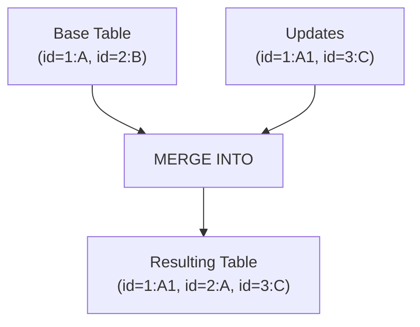
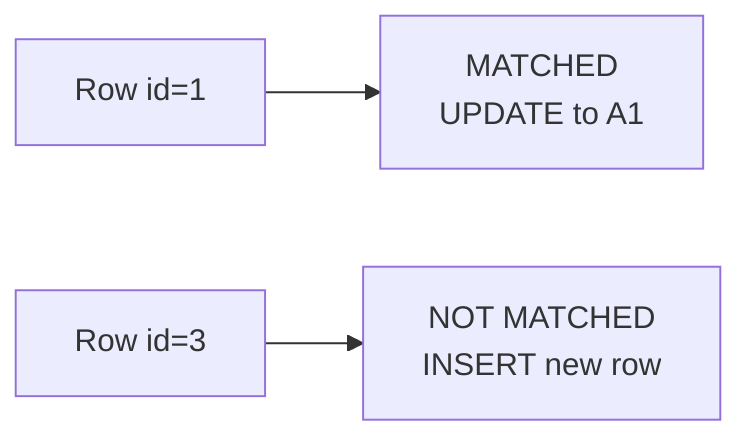
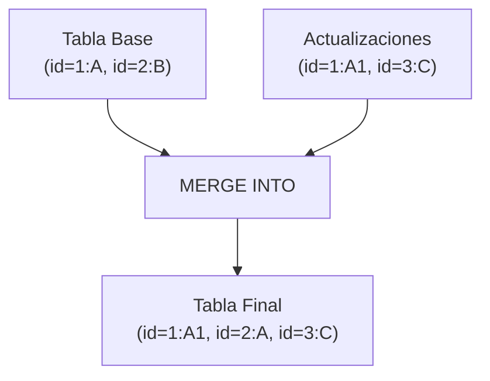
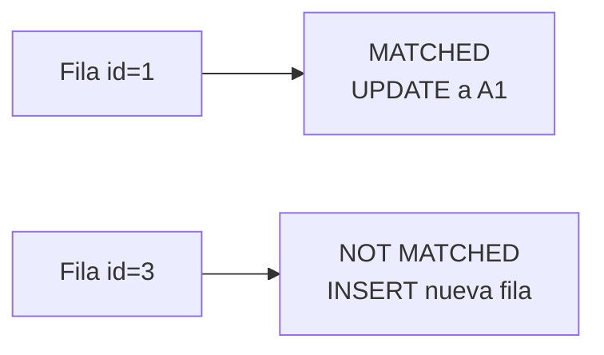

# 🔄 Exercise 4 — Delta Lake MERGE INTO  
## Bilingual Version (English + Spanish)  
## GitHub‑Safe Mermaid Diagrams

This document explains Exercise 4: how to perform a **Delta Lake MERGE INTO** operation in Databricks Free Edition using **Volumes + Unity Catalog**.  
English version first, Spanish version after.

---

# 🇺🇸 ENGLISH VERSION

# 1. Overview

This exercise demonstrates how to:

- Create a Delta table using `saveAsTable()`  
- Prepare an updates DataFrame  
- Execute a `MERGE INTO` operation  
- Validate the results  

Because Databricks Free Edition does **not** allow `CREATE TABLE ... LOCATION`, we use `saveAsTable()` to create and register the table in Unity Catalog.

---

# 2. Step 1 — Create Base Delta Table

```python
data = [(1, "A"), (2, "B")]
df = spark.createDataFrame(data, ["id", "value"])

df.write.format("delta") \
    .mode("overwrite") \
    .saveAsTable("workspace.default.merge_demo")
```

This creates:

- Delta files in a managed Volume  
- A registered Unity Catalog table: `workspace.default.merge_demo`

---

# 3. Step 2 — Create Updates DataFrame

```python
updates = [(1, "A1"), (3, "C")]
df_upd = spark.createDataFrame(updates, ["id", "value"])
df_upd.createOrReplaceTempView("updates")
```

---

# 4. Step 3 — Execute MERGE INTO

```sql
MERGE INTO workspace.default.merge_demo AS t
USING updates AS u
ON t.id = u.id
WHEN MATCHED THEN UPDATE SET value = u.value
WHEN NOT MATCHED THEN INSERT *
```

This performs:

- **UPDATE** on id = 1  
- **INSERT** for id = 3  

---

# 5. Step 4 — Validate the MERGE

### ✔ Basic validation  
```sql
SELECT * FROM workspace.default.merge_demo;
```

Expected result:

| id | value |
|----|--------|
| 1 | A1 |
| 2 | A |
| 3 | C |

### ✔ Check row count  
```sql
SELECT COUNT(*) FROM workspace.default.merge_demo;
```

### ✔ Check specific row  
```sql
SELECT * FROM workspace.default.merge_demo WHERE id = 1;
```

### ✔ Delta History  
```sql
DESCRIBE HISTORY workspace.default.merge_demo;
```

---

# 6. Mermaid Diagrams (GitHub‑Safe)

## 🔷 MERGE Flow



---

## 🔷 MERGE Logic Breakdown



---

# 🇲🇽 VERSIÓN EN ESPAÑOL

# 1. Descripción General

Este ejercicio muestra cómo:

- Crear una tabla Delta con `saveAsTable()`  
- Preparar un DataFrame de actualizaciones  
- Ejecutar un `MERGE INTO`  
- Validar los resultados  

En Free Edition no se puede usar `CREATE TABLE ... LOCATION`, por lo que usamos `saveAsTable()`.

---

# 2. Paso 1 — Crear la Tabla Delta Base

```python
data = [(1, "A"), (2, "B")]
df = spark.createDataFrame(data, ["id", "value"])

df.write.format("delta") \
    .mode("overwrite") \
    .saveAsTable("workspace.default.merge_demo")
```

Esto crea:

- Archivos Delta en un Volume administrado  
- Una tabla registrada en Unity Catalog  

---

# 3. Paso 2 — Crear el DataFrame de Cambios

```python
updates = [(1, "A1"), (3, "C")]
df_upd = spark.createDataFrame(updates, ["id", "value"])
df_upd.createOrReplaceTempView("updates")
```

---

# 4. Paso 3 — Ejecutar MERGE INTO

```sql
MERGE INTO workspace.default.merge_demo AS t
USING updates AS u
ON t.id = u.id
WHEN MATCHED THEN UPDATE SET value = u.value
WHEN NOT MATCHED THEN INSERT *
```

Esto realiza:

- **UPDATE** para id = 1  
- **INSERT** para id = 3  

---

# 5. Paso 4 — Validar el MERGE

### ✔ Validación básica  
```sql
SELECT * FROM workspace.default.merge_demo;
```

Resultado esperado:

| id | value |
|----|--------|
| 1 | A1 |
| 2 | A |
| 3 | C |

### ✔ Conteo  
```sql
SELECT COUNT(*) FROM workspace.default.merge_demo;
```

### ✔ Validación por fila  
```sql
SELECT * FROM workspace.default.merge_demo WHERE id = 1;
```

### ✔ Historial Delta  
```sql
DESCRIBE HISTORY workspace.default.merge_demo;
```

---

# 6. Diagramas Mermaid (Compatibles con GitHub)

## 🔷 Flujo del MERGE



---

## 🔷 Lógica del MERGE



---

# 🏁 Conclusion

- `saveAsTable()` is required in Free Edition  
- MERGE works only on existing tables  
- Validation can be done with SELECT, COUNT, filters, and DESCRIBE HISTORY  


---
