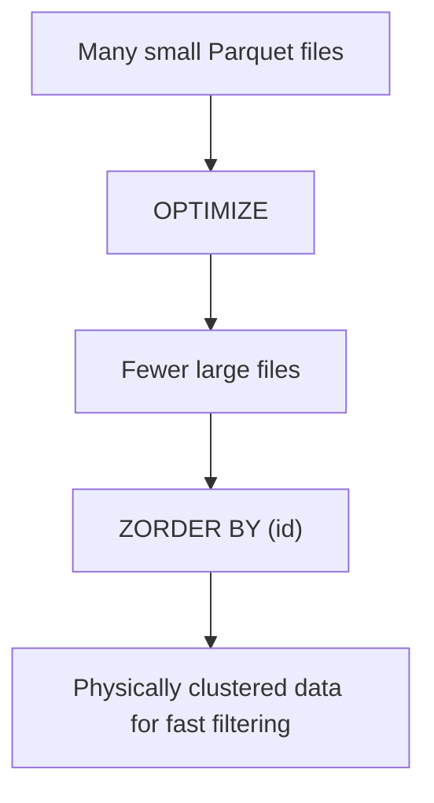
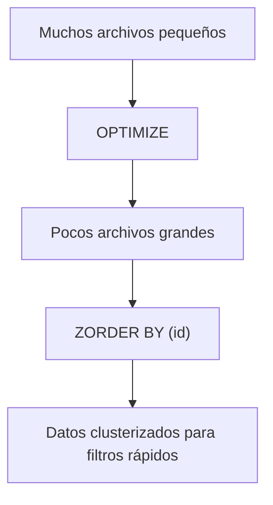

---

# 🧩 Exercise 5 — Delta Lake Optimization (OPTIMIZE + ZORDER)  
## Bilingual (English + Spanish)

This exercise applies **OPTIMIZE** and **ZORDER** to the Delta tables created in Exercises 1, 2, and 4.  
These commands improve performance by compacting small files and clustering data for faster filtering.

---

# 🇺🇸 ENGLISH VERSION

# 1. Overview

Delta tables created through streaming (`.writeStream.table()`) or batch (`.saveAsTable()`) are **managed tables in Unity Catalog**, which means:

- They support **OPTIMIZE**  
- They support **ZORDER**  
- They support **VACUUM**  
- They support **DESCRIBE DETAIL** and **DESCRIBE HISTORY**

In this exercise, we optimize:

- `workspace.default.streaming_demo`  
- `workspace.default.streaming_demo_transformed`  
- `workspace.default.merge_demo`

---

# 2. Why OPTIMIZE?

`OPTIMIZE` compacts many small Parquet files into fewer large files.

Benefits:

- Faster reads  
- Fewer metadata operations  
- Better performance for queries and pipelines  

---

# 3. Why ZORDER?

`ZORDER BY (column)` physically clusters data inside files.

Benefits:

- Faster filtering  
- Spark can skip entire file ranges  
- Ideal for columns used in `WHERE` clauses  

Example:

```sql
OPTIMIZE table_name
ZORDER BY (id);
```

---

# 4. Validate Table Eligibility

Before optimizing, confirm each table is a **managed Delta table**:

```sql
DESCRIBE DETAIL workspace.default.streaming_demo;
DESCRIBE DETAIL workspace.default.streaming_demo_transformed;
DESCRIBE DETAIL workspace.default.merge_demo;
```

You should see:

- `"format": "delta"`
- `"location": ""` (empty → managed table)
- `"tableType": "MANAGED"`

---

# 5. Apply OPTIMIZE + ZORDER

## 5.1 Optimize Exercise 1 Table  
### `streaming_demo`

```sql
OPTIMIZE workspace.default.streaming_demo;

OPTIMIZE workspace.default.streaming_demo
ZORDER BY (id);
```

---

## 5.2 Optimize Exercise 2 Table  
### `streaming_demo_transformed`

```sql
OPTIMIZE workspace.default.streaming_demo_transformed;

OPTIMIZE workspace.default.streaming_demo_transformed
ZORDER BY (id);
```

---

## 5.3 Optimize Exercise 4 Table  
### `merge_demo`

```sql
OPTIMIZE workspace.default.merge_demo;

OPTIMIZE workspace.default.merge_demo
ZORDER BY (id);
```

This table benefits the most because MERGE operations often create many small files.

---

# 6. Validate Optimization Results

After each OPTIMIZE, run:

```sql
DESCRIBE DETAIL table_name;
```

Look for:

- `numFiles` → should decrease  
- `sizeInBytes` → may increase (bigger compacted files)  

---

# 7. Visual Diagram — What OPTIMIZE + ZORDER Does



---

# 🇲🇽 VERSIÓN EN ESPAÑOL

# 1. Panorama general

Las tablas Delta creadas en los ejercicios anteriores son **tablas administradas por Unity Catalog**, lo que permite:

- Usar **OPTIMIZE**  
- Usar **ZORDER**  
- Usar **VACUUM**  
- Consultar metadata con `DESCRIBE DETAIL`  

En este ejercicio optimizamos:

- `workspace.default.streaming_demo`  
- `workspace.default.streaming_demo_transformed`  
- `workspace.default.merge_demo`

---

# 2. ¿Por qué OPTIMIZE?

`OPTIMIZE` compacta muchos archivos Parquet pequeños en pocos archivos grandes.

Beneficios:

- Lecturas más rápidas  
- Menos operaciones de metadata  
- Mejor rendimiento en consultas  

---

# 3. ¿Por qué ZORDER?

`ZORDER BY (columna)` agrupa físicamente los datos dentro de los archivos.

Beneficios:

- Filtros más rápidos  
- Spark puede saltarse archivos completos  
- Ideal para columnas usadas en `WHERE`  

Ejemplo:

```sql
OPTIMIZE tabla
ZORDER BY (id);
```

---

# 4. Validar que la tabla sea elegible

Antes de optimizar, confirma que cada tabla sea Delta administrada:

```sql
DESCRIBE DETAIL workspace.default.streaming_demo;
DESCRIBE DETAIL workspace.default.streaming_demo_transformed;
DESCRIBE DETAIL workspace.default.merge_demo;
```

Debes ver:

- `"format": "delta"`
- `"location": ""` (vacío → tabla administrada)
- `"tableType": "MANAGED"`

---

# 5. Aplicar OPTIMIZE + ZORDER

## 5.1 Optimizar tabla del Ejercicio 1  
### `streaming_demo`

```sql
OPTIMIZE workspace.default.streaming_demo;

OPTIMIZE workspace.default.streaming_demo
ZORDER BY (id);
```

---

## 5.2 Optimizar tabla del Ejercicio 2  
### `streaming_demo_transformed`

```sql
OPTIMIZE workspace.default.streaming_demo_transformed;

OPTIMIZE workspace.default.streaming_demo_transformed
ZORDER BY (id);
```

---

## 5.3 Optimizar tabla del Ejercicio 4  
### `merge_demo`

```sql
OPTIMIZE workspace.default.merge_demo;

OPTIMIZE workspace.default.merge_demo
ZORDER BY (id);
```

Esta tabla es la que más se beneficia debido a los archivos pequeños generados por MERGE.

---

# 6. Validar resultados

Después de cada OPTIMIZE:

```sql
DESCRIBE DETAIL table_name;
```

Revisa:

- `numFiles` → debe bajar  
- `sizeInBytes` → puede subir (archivos compactados)  

---

# 7. Diagrama visual — Qué hacen OPTIMIZE + ZORDER



---

# 🏁 Conclusion

This exercise demonstrates how to:

- Compact Delta files  
- Improve query performance  
- Cluster data for faster filtering  
- Validate table metadata  

These are essential skills for Databricks Data Engineers.


---
