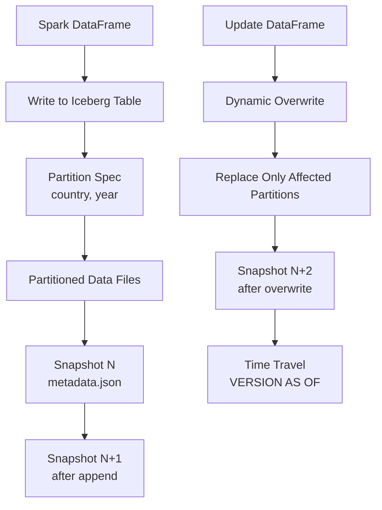
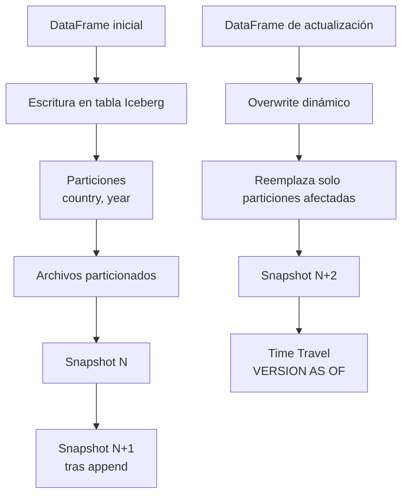

---

# 🧊 Exercises 9 & 10 — Advanced Iceberg Operations  
## Partitioning • Snapshots • Dynamic Overwrite • MERGE INTO  
## (Requires Databricks Pro/Enterprise — Not supported in Free Edition)

---

# 🇺🇸 ENGLISH VERSION

# 🧩 Exercise 9 — Iceberg Partitioned Table + DataFrame Inserts

## 1. Objective
Learn how to:

- Create a **partitioned Iceberg table**
- Insert data from a Spark DataFrame
- Inspect partitions
- Explore Iceberg metadata
- View snapshots and perform time travel

---

## 2. Create a Spark DataFrame

```python
from pyspark.sql import Row
from pyspark.sql import functions as F

data = [
    Row(country="MX", year=2024, value=10),
    Row(country="MX", year=2025, value=20),
    Row(country="US", year=2024, value=30),
    Row(country="US", year=2025, value=40),
]

df = spark.createDataFrame(data)
df.show()
```

---

## 3. Create a Partitioned Iceberg Table

```sql
CREATE TABLE IF NOT EXISTS analytics.raw.iceberg_partitioned (
  country STRING,
  year INT,
  value INT
)
USING ICEBERG
PARTITIONED BY (country, year);
```

---

## 4. Insert DataFrame into Iceberg Table

```python
(
    df.write
      .format("iceberg")
      .mode("append")
      .saveAsTable("analytics.raw.iceberg_partitioned")
)
```

---

## 5. Validate Data

```sql
SELECT * FROM analytics.raw.iceberg_partitioned;
```

---

## 6. Show Partitions

```sql
SHOW PARTITIONS analytics.raw.iceberg_partitioned;
```

---

## 7. Inspect Metadata

```sql
DESCRIBE DETAIL analytics.raw.iceberg_partitioned;
```

---

## 8. View Snapshots

```sql
CALL analytics.system.snapshots('analytics.raw.iceberg_partitioned');
```

---

## 9. Time Travel

```sql
SELECT * FROM analytics.raw.iceberg_partitioned VERSION AS OF 0;
```

---

# 🧩 Exercise 10 — Dynamic Overwrite + MERGE INTO (Iceberg)

## 1. Objective
Learn how to:

- Update partitions using **dynamic overwrite**
- Insert/update rows using **MERGE INTO**
- Validate snapshot evolution

---

## 2. Create Update DataFrame

```python
from pyspark.sql import Row

updates = [
    Row(country="MX", year=2024, value=999),   # update
    Row(country="CA", year=2024, value=50),    # new row
]

df_updates = spark.createDataFrame(updates)
df_updates.show()
```

---

## 3. Dynamic Overwrite (Partition‑aware)

```python
(
    df_updates.write
      .format("iceberg")
      .mode("overwrite")
      .option("overwrite-mode", "dynamic")
      .saveAsTable("analytics.raw.iceberg_partitioned")
)
```

---

## 4. Validate Results

```sql
SELECT * FROM analytics.raw.iceberg_partitioned ORDER BY country, year;
```

---

## 5. MERGE INTO (Iceberg)

```sql
MERGE INTO analytics.raw.iceberg_partitioned AS t
USING (
  SELECT "US" AS country, 2025 AS year, 777 AS value
) AS s
ON t.country = s.country AND t.year = s.year
WHEN MATCHED THEN UPDATE SET value = s.value
WHEN NOT MATCHED THEN INSERT (country, year, value) VALUES (s.country, s.year, s.value);
```

---

## 6. Validate MERGE

```sql
SELECT * FROM analytics.raw.iceberg_partitioned WHERE country = 'US' AND year = 2025;
```

---

## 7. View New Snapshot

```sql
CALL analytics.system.snapshots('analytics.raw.iceberg_partitioned');
```

---

# 🧠 Mermaid Diagram — Partitions + Snapshots + Dynamic Overwrite



---

# 🇲🇽 VERSIÓN EN ESPAÑOL

# 🧩 Ejercicio 9 — Tabla Iceberg Particionada + Inserción desde DataFrame

## 1. Objetivo
Aprender a:

- Crear una tabla Iceberg particionada  
- Insertar datos desde un DataFrame  
- Ver particiones  
- Revisar metadata  
- Ver snapshots y usar time travel  

---

## 2. Crear DataFrame

```python
from pyspark.sql import Row
from pyspark.sql import functions as F

data = [
    Row(country="MX", year=2024, value=10),
    Row(country="MX", year=2025, value=20),
    Row(country="US", year=2024, value=30),
    Row(country="US", year=2025, value=40),
]

df = spark.createDataFrame(data)
df.show()
```

---

## 3. Crear Tabla Iceberg Particionada

```sql
CREATE TABLE IF NOT EXISTS analytics.raw.iceberg_partitioned (
  country STRING,
  year INT,
  value INT
)
USING ICEBERG
PARTITIONED BY (country, year);
```

---

## 4. Insertar DataFrame

```python
(
    df.write
      .format("iceberg")
      .mode("append")
      .saveAsTable("analytics.raw.iceberg_partitioned")
)
```

---

## 5. Validar Datos

```sql
SELECT * FROM analytics.raw.iceberg_partitioned;
```

---

## 6. Ver Particiones

```sql
SHOW PARTITIONS analytics.raw.iceberg_partitioned;
```

---

## 7. Ver Metadata

```sql
DESCRIBE DETAIL analytics.raw.iceberg_partitioned;
```

---

## 8. Ver Snapshots

```sql
CALL analytics.system.snapshots('analytics.raw.iceberg_partitioned');
```

---

## 9. Time Travel

```sql
SELECT * FROM analytics.raw.iceberg_partitioned VERSION AS OF 0;
```

---

# 🧩 Ejercicio 10 — Overwrite Dinámico + MERGE INTO (Iceberg)

## 1. Objetivo
Aprender a:

- Actualizar particiones con **overwrite dinámico**  
- Insertar/actualizar filas con **MERGE INTO**  
- Validar evolución de snapshots  

---

## 2. Crear DataFrame de Actualización

```python
from pyspark.sql import Row

updates = [
    Row(country="MX", year=2024, value=999),
    Row(country="CA", year=2024, value=50),
]

df_updates = spark.createDataFrame(updates)
df_updates.show()
```

---

## 3. Overwrite Dinámico

```python
(
    df_updates.write
      .format("iceberg")
      .mode("overwrite")
      .option("overwrite-mode", "dynamic")
      .saveAsTable("analytics.raw.iceberg_partitioned")
)
```

---

## 4. Validar Resultados

```sql
SELECT * FROM analytics.raw.iceberg_partitioned ORDER BY country, year;
```

---

## 5. MERGE INTO

```sql
MERGE INTO analytics.raw.iceberg_partitioned AS t
USING (
  SELECT "US" AS country, 2025 AS year, 777 AS value
) AS s
ON t.country = s.country AND t.year = s.year
WHEN MATCHED THEN UPDATE SET value = s.value
WHEN NOT MATCHED THEN INSERT (country, year, value) VALUES (s.country, s.year, s.value);
```

---

## 6. Validar MERGE

```sql
SELECT * FROM analytics.raw.iceberg_partitioned WHERE country = 'US' AND year = 2025;
```

---

## 7. Ver Nuevo Snapshot

```sql
CALL analytics.system.snapshots('analytics.raw.iceberg_partitioned');
```

---

# 🧠 Diagrama Mermaid — Particiones + Snapshots + Overwrite Dinámico




---
