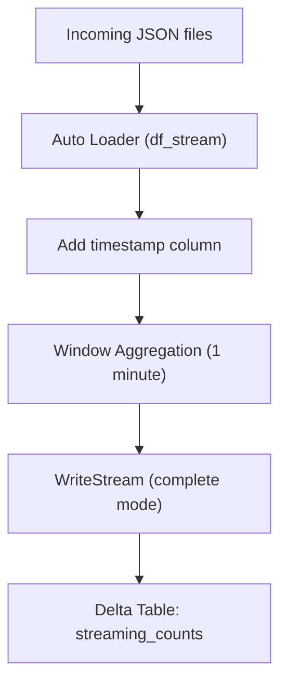
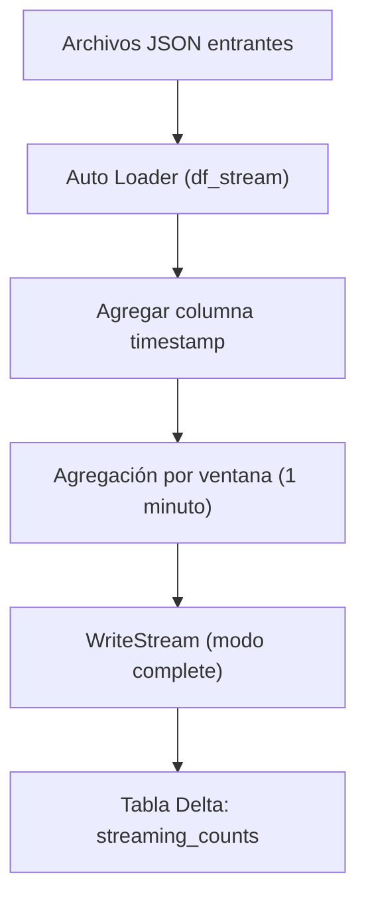

---

# 🧩 Exercise 3 — Streaming Aggregations with Time Windows  
## Bilingual (English + Spanish)  
## Adapted for Databricks Free Edition

---

# 🇺🇸 ENGLISH VERSION

# 1. Objective

This exercise practices **streaming aggregations using time windows**, specifically:

- `groupBy(window(...))`
- `count()`
- `outputMode("complete")`
- Checkpointing
- Writing results to a Delta table

Because Databricks Free Edition does **not** support time‑based continuous triggers, we adapt the exercise using `trigger(availableNow=True)`.

---

# 2. Creating the Streaming DataFrame

Since the input JSON files do not contain a timestamp column, we add one using `current_timestamp()`.

```python
from pyspark.sql import functions as F

df_stream = (
    spark.readStream.format("cloudFiles")
    .option("cloudFiles.format", "json")
    .option("cloudFiles.schemaLocation", "/Volumes/workspace/default/streaming_demo/schema")
    .load("/Volumes/workspace/default/streaming_demo/input")
    .withColumn("timestamp", F.current_timestamp())
)
```

This makes the stream compatible with window aggregations.

---

# 3. Window Aggregation

We group events into **1‑minute windows** and count how many arrived in each window.

```python
from pyspark.sql.functions import window, col

agg = (
    df_stream
    .groupBy(window(col("timestamp"), "1 minute"))
    .count()
)
```

---

# 4. Writing the Stream (Adapted for Free Edition)

Databricks Free Edition does **not** support infinite streaming triggers such as:

```
trigger(processingTime="10 seconds")
```

To run this exercise successfully, we use:

```python
.trigger(availableNow=True)
```

This processes all available data **once**, writes the results, and stops.

```python
(
    agg.writeStream
        .format("delta")
        .outputMode("complete")
        .option("checkpointLocation", "/Volumes/workspace/default/streaming_demo/chk3")
        .trigger(availableNow=True)
        .table("workspace.default.streaming_counts")
)
```

---

# 5. Creating the Output Table

```sql
CREATE TABLE IF NOT EXISTS workspace.default.streaming_counts (
    window STRUCT<start: TIMESTAMP, end: TIMESTAMP>,
    count BIGINT
);
```

---

# 6. Visual Diagram



---

# 🇲🇽 VERSIÓN EN ESPAÑOL

# 1. Objetivo

Este ejercicio practica **agregaciones en streaming usando ventanas de tiempo**, específicamente:

- `groupBy(window(...))`
- `count()`
- `outputMode("complete")`
- Uso de checkpoint
- Escritura a una tabla Delta

Como Databricks Free Edition **no soporta triggers continuos basados en tiempo**, adaptamos el ejercicio usando `trigger(availableNow=True)`.

---

# 2. Creación del DataFrame de Streaming

Como los archivos JSON no tienen columna de tiempo, agregamos una usando `current_timestamp()`.

```python
from pyspark.sql import functions as F

df_stream = (
    spark.readStream.format("cloudFiles")
    .option("cloudFiles.format", "json")
    .option("cloudFiles.schemaLocation", "/Volumes/workspace/default/streaming_demo/schema")
    .load("/Volumes/workspace/default/streaming_demo/input")
    .withColumn("timestamp", F.current_timestamp())
)
```

Esto permite usar ventanas de tiempo.

---

# 3. Agregación con Ventanas

Agrupamos los eventos en ventanas de **1 minuto** y contamos cuántos llegaron en cada una.

```python
from pyspark.sql.functions import window, col

agg = (
    df_stream
    .groupBy(window(col("timestamp"), "1 minute"))
    .count()
)
```

---

# 4. Escritura del Stream (Adaptado para Free Edition)

Databricks Free Edition **no soporta** triggers como:

```
trigger(processingTime="10 seconds")
```

Para que el ejercicio funcione, usamos:

```python
.trigger(availableNow=True)
```

Esto procesa todos los datos disponibles **una sola vez**, escribe los resultados y termina.

```python
(
    agg.writeStream
        .format("delta")
        .outputMode("complete")
        .option("checkpointLocation", "/Volumes/workspace/default/streaming_demo/chk3")
        .trigger(availableNow=True)
        .table("workspace.default.streaming_counts")
)
```

---

# 5. Crear la Tabla de Salida

```sql
CREATE TABLE IF NOT EXISTS workspace.default.streaming_counts (
    window STRUCT<start: TIMESTAMP, end: TIMESTAMP>,
    count BIGINT
);
```

---

# 6. Diagrama Visual



---

# 🏁 Conclusion

This adapted version allows you to complete the window aggregation exercise **fully**, even with the limitations of Databricks Free Edition.

You still learn:

- Window aggregations  
- Complete mode  
- Checkpointing  
- Delta sink  
- Auto Loader integration  

And the behavior is identical to a continuous stream, except that it runs in a **finite batch** using `availableNow`.


---
