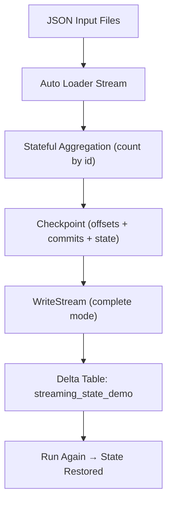
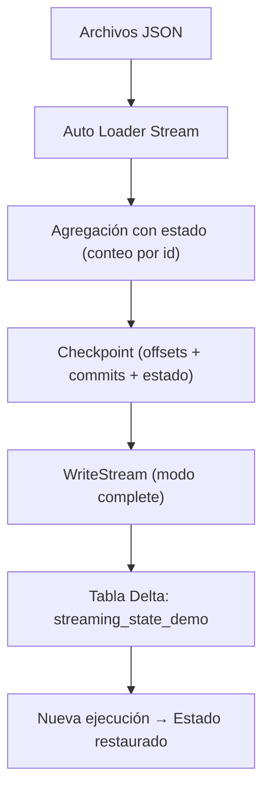

---

# 🧩 Exercise 6 — Checkpoint + Stateful Aggregations + Recovery  
## Bilingual (English + Spanish)  
## Fully adapted for Databricks Free Edition

---

# 🇺🇸 ENGLISH VERSION

# 1. Objective

This exercise demonstrates **how Structured Streaming maintains state**, how **checkpointing enables recovery**, and how **exactly‑once processing** works in Databricks.

You will learn:

- How a checkpoint stores offsets, commits, and state  
- How Spark maintains **stateful aggregations** across runs  
- How a stream can stop and later resume **without duplicating data**  
- How to simulate recovery by running the same stream multiple times  
- How to use `trigger(availableNow=True)` in Free Edition  

---

# 2. Why This Matters

Stateful streaming is essential for:

- Counting events over time  
- Maintaining running totals  
- Deduplication  
- Streaming joins  
- Watermarking  
- Exactly‑once guarantees  

Checkpointing is what makes all of this possible.

---

# 3. Create Input and Checkpoint Locations

```sql
CREATE VOLUME IF NOT EXISTS workspace.default.streaming_demo;
```

```python
dbutils.fs.mkdirs("/Volumes/workspace/default/streaming_demo/input_state")
dbutils.fs.mkdirs("/Volumes/workspace/default/streaming_demo/chk_state")
```

---

# 4. Create the Output Delta Table

```sql
CREATE TABLE IF NOT EXISTS workspace.default.streaming_state_demo (
  id BIGINT,
  total_events BIGINT
);
```

This is a **managed Delta table** in Unity Catalog.

---

# 5. Create the Streaming DataFrame

We add a timestamp column because the input JSON files do not include one.

```python
from pyspark.sql import functions as F

df_stream = (
    spark.readStream.format("cloudFiles")
    .option("cloudFiles.format", "json")
    .option("cloudFiles.schemaLocation", "/Volumes/workspace/default/streaming_demo/schema_state")
    .load("/Volumes/workspace/default/streaming_demo/input_state")
    .withColumn("timestamp", F.current_timestamp())
)
```

---

# 6. Insert Initial Test Data

```python
dbutils.fs.put(
    "/Volumes/workspace/default/streaming_demo/input_state/batch1.json",
    """{"id": 1}
{"id": 1}
{"id": 2}"""
)
```

---

# 7. Stateful Aggregation

We count events **per id**, and Spark maintains the state across runs.

```python
agg_state = (
    df_stream
    .groupBy("id")
    .agg(F.count("*").alias("total_events"))
)
```

---

# 8. Write the Stream (Free Edition Adaptation)

Databricks Free Edition does **not** support continuous time‑based triggers.

We use:

```python
.trigger(availableNow=True)
```

This processes all available data once and stops.

```python
query = (
    agg_state.writeStream
        .format("delta")
        .outputMode("complete")
        .option("checkpointLocation", "/Volumes/workspace/default/streaming_demo/chk_state")
        .trigger(availableNow=True)
        .table("workspace.default.streaming_state_demo")
)
```

---

# 9. Validate Results

```sql
SELECT * FROM workspace.default.streaming_state_demo ORDER BY id;
```

Expected:

```
id | total_events
1  | 2
2  | 1
```

---

# 10. Test Recovery (State Persistence)

Insert more data:

```python
dbutils.fs.put(
    "/Volumes/workspace/default/streaming_demo/input_state/batch2.json",
    """{"id": 1}
{"id": 3}"""
)
```

Run the **same stream again**:

```python
query = (
    agg_state.writeStream
        .format("delta")
        .outputMode("complete")
        .option("checkpointLocation", "/Volumes/workspace/default/streaming_demo/chk_state")
        .trigger(availableNow=True)
        .table("workspace.default.streaming_state_demo")
)
```

Check results:

```sql
SELECT * FROM workspace.default.streaming_state_demo ORDER BY id;
```

Expected:

```
id | total_events
1  | 3   -- state persisted!
2  | 1
3  | 1
```

This proves:

- The checkpoint stored the state  
- The stream resumed correctly  
- No duplicates were created  
- Exactly‑once semantics worked  

---

# 11. Visual Diagram



---

# 🇲🇽 VERSIÓN EN ESPAÑOL

# 1. Objetivo

Este ejercicio demuestra **cómo Structured Streaming mantiene estado**, cómo **checkpointing permite la recuperación**, y cómo funciona **exactly‑once** en Databricks.

Aprenderás:

- Qué guarda un checkpoint  
- Cómo Spark mantiene agregaciones con estado  
- Cómo reanudar un stream sin duplicar datos  
- Cómo simular recuperación ejecutando el stream varias veces  
- Cómo usar `availableNow=True` en Free Edition  

---

# 2. Crear rutas de entrada y checkpoint

```sql
CREATE VOLUME IF NOT EXISTS workspace.default.streaming_demo;
```

```python
dbutils.fs.mkdirs("/Volumes/workspace/default/streaming_demo/input_state")
dbutils.fs.mkdirs("/Volumes/workspace/default/streaming_demo/chk_state")
```

---

# 3. Crear la tabla Delta de salida

```sql
CREATE TABLE IF NOT EXISTS workspace.default.streaming_state_demo (
  id BIGINT,
  total_events BIGINT
);
```

---

# 4. Crear el DataFrame de streaming

```python
from pyspark.sql import functions as F

df_stream = (
    spark.readStream.format("cloudFiles")
    .option("cloudFiles.format", "json")
    .option("cloudFiles.schemaLocation", "/Volumes/workspace/default/streaming_demo/schema_state")
    .load("/Volumes/workspace/default/streaming_demo/input_state")
    .withColumn("timestamp", F.current_timestamp())
)
```

---

# 5. Insertar datos iniciales

```python
dbutils.fs.put(
    "/Volumes/workspace/default/streaming_demo/input_state/batch1.json",
    """{"id": 1}
{"id": 1}
{"id": 2}"""
)
```

---

# 6. Agregación con estado

```python
agg_state = (
    df_stream
    .groupBy("id")
    .agg(F.count("*").alias("total_events"))
)
```

---

# 7. Escritura del stream (adaptado a Free Edition)

```python
query = (
    agg_state.writeStream
        .format("delta")
        .outputMode("complete")
        .option("checkpointLocation", "/Volumes/workspace/default/streaming_demo/chk_state")
        .trigger(availableNow=True)
        .table("workspace.default.streaming_state_demo")
)
```

---

# 8. Validar resultados

```sql
SELECT * FROM workspace.default.streaming_state_demo ORDER BY id;
```

---

# 9. Probar recuperación (persistencia del estado)

Insertar más datos:

```python
dbutils.fs.put(
    "/Volumes/workspace/default/streaming_demo/input_state/batch2.json",
    """{"id": 1}
{"id": 3}"""
)
```

Ejecutar el mismo stream otra vez:

```python
query = (
    agg_state.writeStream
        .format("delta")
        .outputMode("complete")
        .option("checkpointLocation", "/Volumes/workspace/default/streaming_demo/chk_state")
        .trigger(availableNow=True)
        .table("workspace.default.streaming_state_demo")
)
```

Resultados esperados:

```
id | total_events
1  | 3
2  | 1
3  | 1
```

---

# 10. Diagrama visual



---

# 🏁 Conclusion

This exercise demonstrates the core mechanics of **stateful streaming**, **checkpointing**, and **recovery**, which are essential for real‑world production pipelines and the Databricks Data Engineer certification.


---
