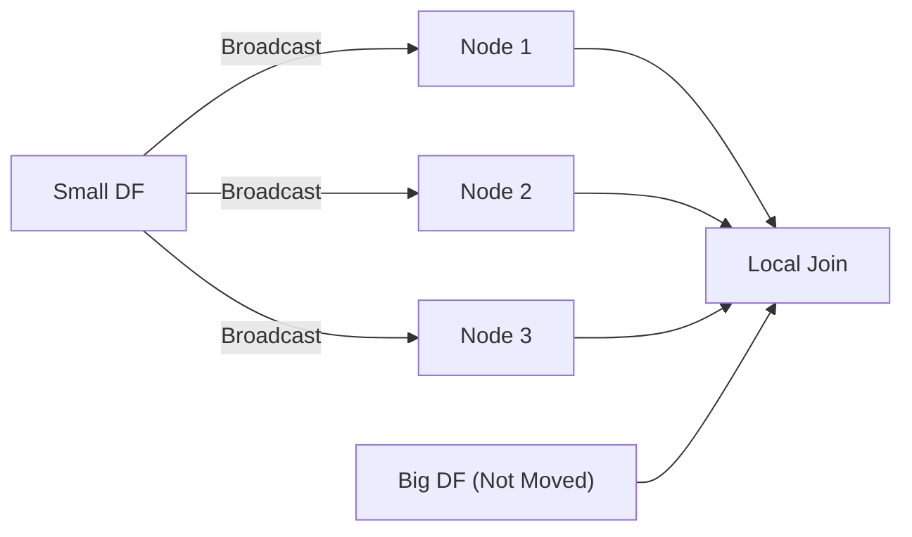
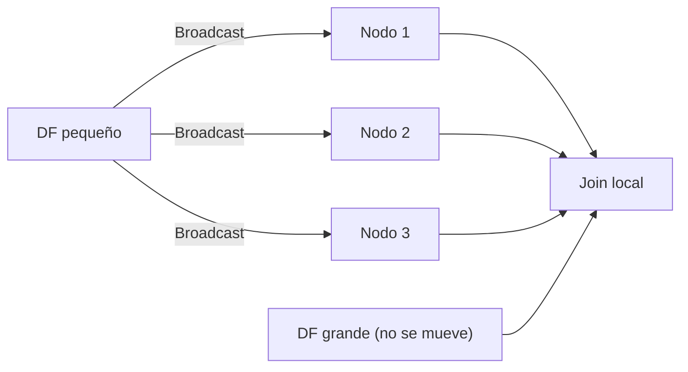

---

# 🔥 Broadcast Joins en Spark  

---

# 🇺🇸 ENGLISH VERSION

# 1. What `F.broadcast()` Does in a Join

`F.broadcast(df_small)` tells Spark:

> **“Copy this small DataFrame to every node in the cluster so the join can be done locally without shuffling the big DataFrame.”**

This triggers a **Broadcast Hash Join**, the fastest join type in Spark.

### ✔ What Spark does internally

1. Builds a **hash table** from the small DataFrame  
2. Sends that hash table to every worker node  
3. Each node joins **its partition** of the big DataFrame **locally**  
4. No shuffle of the big DataFrame  
5. Massive performance improvement

---

# 2. Why Broadcast Joins Are So Fast

Shuffles are the slowest operation in Spark.

Broadcast avoids them:

| Join Type | Moves Big DF? | Moves Small DF? | Speed |
|-----------|----------------|------------------|--------|
| Shuffle Hash Join | ✔ Yes | ✔ Yes | Slow |
| Sort Merge Join | ✔ Yes | ✔ Yes | Medium |
| **Broadcast Hash Join** | ❌ No | ✔ Yes | **Fastest** |

---

# 3. When You Should Use Broadcast

Use it when the small DataFrame:

- Is **small enough** (< 10 MB recommended)  
- Is a **lookup table** (countries, categories, products)  
- Is a **dimension table**  
- Is used in many joins  
- Spark cannot automatically detect its size  

Example:

```python
df_join = df_big.join(F.broadcast(df_small), "id", "left")
```

---

# 4. Comparison With Excel’s VLOOKUP

Here is a precise analogy:

### ✔ Excel VLOOKUP  
- Looks up row by row  
- Sequential  
- Single machine  
- No hashing  

### ✔ Spark Broadcast Join  
- Builds a **hash map** of the small table  
- Each node performs lookups locally  
- Parallel across the cluster  
- No shuffle of the big table  

So yes:

> **It behaves like a distributed, parallel, turbo‑charged VLOOKUP.**

---

# 5. Visual Diagram



# 6. How Many Nodes can we use?

This depends on where we are running Spark. 

- Databricks
- Local Spark
- EMR/Kubernetes/YARN

We are focusing on Databricks so, short answer is, we don't configure nodes directly. Databricks uses administered clusters so we only must configure:

- Workers number
- Instance Type
- Auto-Scaling

Spark internally asigns:

- 1 node per woker
- 1 driver per cluster, so

> #nodes == #workers

### Example

|Cluster config | Nodes |
|-----------|----------------|
|1 driver + 2 workers |	2 |
|1 driver + 8 workers |	8 |
|Autoscaling 2–10 workers |	2–10 |

To see how many nodes we have we have some options

### Spark UI (Most accurate)

In the notebook select `Cluster -> Spark UI`, then go to `Executors` tab, and you'll se something like
```
Driver: 1
Executors: 8
```

### Via Code

```python3
spark.sparkContext.getConf().get("spark.executor.instances")
```

In Databricks the previous code can throw `None` due to Databricks not being able to administrate this. However, you can see:

```python3
spark.sparkContext.statusTracker().getExecutorInfos()
```

which returns a list of active executors

---

# 🇲🇽 VERSIÓN EN ESPAÑOL

# 1. Qué hace `F.broadcast()` en un join

`F.broadcast(df_small)` le dice a Spark:

> **“Copia este DataFrame pequeño a todos los nodos para que el join se haga localmente sin mover el DataFrame grande.”**

Esto activa un **Broadcast Hash Join**, el join más rápido de Spark.

---

# 2. Por qué es tan rápido

Los shuffles son lo más lento en Spark.

Broadcast los evita:

| Tipo de Join | Mueve DF grande | Mueve DF pequeño | Velocidad |
|--------------|------------------|------------------|-----------|
| Shuffle Hash Join | ✔ Sí | ✔ Sí | Lento |
| Sort Merge Join | ✔ Sí | ✔ Sí | Medio |
| **Broadcast Hash Join** | ❌ No | ✔ Sí | **Más rápido** |

---

# 3. Cuándo usar broadcast

Úsalo cuando el DataFrame pequeño:

- Cabe en memoria (< 10 MB recomendado)  
- Es una tabla de catálogo (países, productos, categorías)  
- Es una tabla de dimensiones  
- Se usa en muchos joins  
- Spark no puede estimar bien su tamaño  

Ejemplo:

```python
df_join = df_big.join(F.broadcast(df_small), "id", "left")
```

---

# 4. Comparación con BUSCARV de Excel

Aquí tenemos una analogía precisa:

### ✔ BUSCARV en Excel  
- Busca fila por fila  
- Secuencial  
- Una sola máquina  
- Sin hashing  

### ✔ Broadcast Join en Spark  
- Construye una **tabla hash** del DF pequeño  
- Cada nodo hace búsquedas locales  
- Todo en paralelo  
- No mueve el DF grande  

Así que sí:

> **Funciona como un BUSCARV distribuido, paralelo y turbo‑optimizado.**

---

# 5. Diagrama Visual



---


# 6. ¿Cuántos nodos podemos usar?

Esto depende de dónde estemos ejecutando Spark.

- Databricks  
- Spark local  
- EMR/Kubernetes/YARN  

Nos estamos enfocando en Databricks, así que la respuesta corta es: **no configuramos los nodos directamente**.  
Databricks usa clusters administrados, por lo que solo debemos configurar:

- Número de workers  
- Tipo de instancia  
- Auto-Scaling  

Spark internamente asigna:

- 1 nodo por worker  
- 1 driver por cluster, así que:

> #nodos == #workers

### Ejemplo

| Configuración del cluster | Nodos |
|---------------------------|--------|
| 1 driver + 2 workers      | 2      |
| 1 driver + 8 workers      | 8      |
| Autoscaling 2–10 workers  | 2–10   |

Para ver cuántos nodos tenemos, existen algunas opciones.

### Spark UI (la más precisa)

En el notebook selecciona `Cluster -> Spark UI`, luego ve a la pestaña `Executors`, y verás algo como:

```
Driver: 1
Executors: 8
```

### Vía código

```python
spark.sparkContext.getConf().get("spark.executor.instances")
```

En Databricks este código puede regresar `None` debido a que Databricks administra esto automáticamente.  
Sin embargo, puedes ver:

```python
spark.sparkContext.statusTracker().getExecutorInfos()
```

lo cual devuelve una lista de ejecutores activos.

---

# 🏁 Conclusión

- `F.broadcast()` fuerza un **Broadcast Hash Join**  
- Evita shuffles del DataFrame grande  
- Es ideal para tablas pequeñas de referencia  
- Funciona como un **BUSCARV distribuido**  
- Es una de las optimizaciones más importantes de Spark

---
