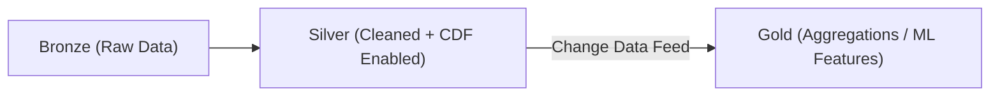
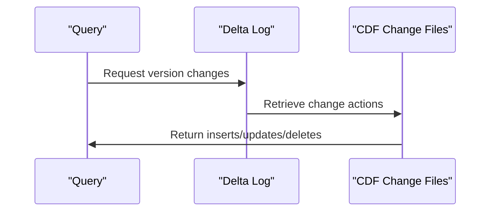
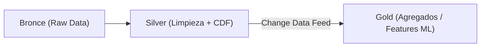
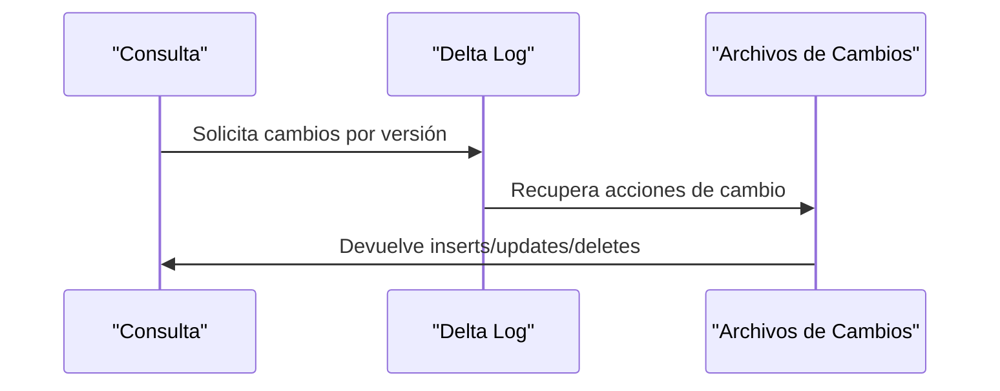

---

# 📘 **Change Data Feed (CDF) in Databricks / Delta Lake**  

---

# 🇺🇸 **Change Data Feed (CDF) in Delta Lake**

## ## **1. What is CDF?**
**Change Data Feed (CDF)** is a Delta Lake feature that allows you to **query only the rows that changed** (inserts, updates, deletes) between table versions.  
Instead of scanning the entire table, you consume only incremental changes.

CDF exposes changes as a *virtual change log* with the following actions:

- **`insert`** — new rows  
- **`update_preimage`** — values before an update  
- **`update_postimage`** — values after an update  
- **`delete`** — deleted rows  

---

## ## **2. Why CDF matters**
CDF enables:

- **Incremental pipelines** (Silver → Gold)  
- **Faster downstream processing**  
- **Lower compute cost**  
- **Real-time propagation of updates**  
- **Efficient SCD Type 2 implementations**  

---

## ## **3. How CDF works internally**
CDF stores change information inside Delta transaction logs.  
When enabled, Delta Lake writes additional metadata and row-level change files.

You can then query changes using:

- **`table_changes()`** (batch)  
- **Streaming reads with `readChangeFeed`**  

---

## ## **4. Enabling CDF**

### **Option A — When creating the table**
```sql
CREATE TABLE sales_silver (
  id BIGINT,
  amount DOUBLE,
  updated_at TIMESTAMP
)
TBLPROPERTIES (
  delta.enableChangeDataFeed = true
);
```

### **Option B — On an existing table**
```sql
ALTER TABLE sales_silver
SET TBLPROPERTIES (delta.enableChangeDataFeed = true);
```

---

## ## **5. Reading CDF in batch**
```sql
SELECT *
FROM table_changes('sales_silver', 10);
```

Or between two versions:

```sql
SELECT *
FROM table_changes('sales_silver', 10, 15);
```

---

## ## **6. Reading CDF in streaming**
```python
df = (
    spark.readStream.format("delta")
        .option("readChangeFeed", "true")
        .option("startingVersion", 10)
        .table("sales_silver")
)

df.writeStream.format("delta").table("sales_gold")
```

---

## ## **7. Mermaid Diagram — How CDF flows in Medallion Architecture**



---

## ## **8. Mermaid Diagram — Internal CDF Mechanics**



---

# 🇲🇽 **Change Data Feed (CDF) en Delta Lake**

## ## **1. ¿Qué es CDF?**
**Change Data Feed (CDF)** es una funcionalidad de Delta Lake que permite **consultar únicamente las filas que cambiaron** (inserciones, actualizaciones y eliminaciones) entre versiones de una tabla Delta.

En lugar de leer toda la tabla, consumes solo los cambios incrementales.

CDF expone acciones como:

- **`insert`** — filas nuevas  
- **`update_preimage`** — valores antes del update  
- **`update_postimage`** — valores después del update  
- **`delete`** — filas eliminadas  

---

## ## **2. ¿Por qué es importante CDF?**
CDF permite:

- Pipelines **incrementales** (Silver → Gold)  
- Menor costo computacional  
- Propagación eficiente de cambios en tiempo real  
- Implementaciones SCD Type 2 más simples  
- Evitar reescanear tablas completas  

---

## ## **3. ¿Cómo funciona internamente?**
CDF almacena información de cambios dentro del transaction log de Delta.  
Cuando está habilitado, Delta escribe archivos adicionales con los cambios por fila.

Puedes leer los cambios mediante:

- **`table_changes()`** (batch)  
- **Lecturas streaming con `readChangeFeed`**  

---

## ## **4. Habilitar CDF**

### **Opción A — Al crear la tabla**
```sql
CREATE TABLE sales_silver (
  id BIGINT,
  amount DOUBLE,
  updated_at TIMESTAMP
)
TBLPROPERTIES (
  delta.enableChangeDataFeed = true
);
```

### **Opción B — En una tabla existente**
```sql
ALTER TABLE sales_silver
SET TBLPROPERTIES (delta.enableChangeDataFeed = true);
```

---

## ## **5. Leer CDF en batch**
```sql
SELECT *
FROM table_changes('sales_silver', 10);
```

O entre dos versiones:

```sql
SELECT *
FROM table_changes('sales_silver', 10, 15);
```

---

## ## **6. Leer CDF en streaming**
```python
df = (
    spark.readStream.format("delta")
        .option("readChangeFeed", "true")
        .option("startingVersion", 10)
        .table("sales_silver")
)

df.writeStream.format("delta").table("sales_gold")
```

---

## ## **7. Diagrama Mermaid — Flujo CDF en arquitectura Medallion**



---

## ## **8. Diagrama Mermaid — Mecánica interna de CDF**



---
