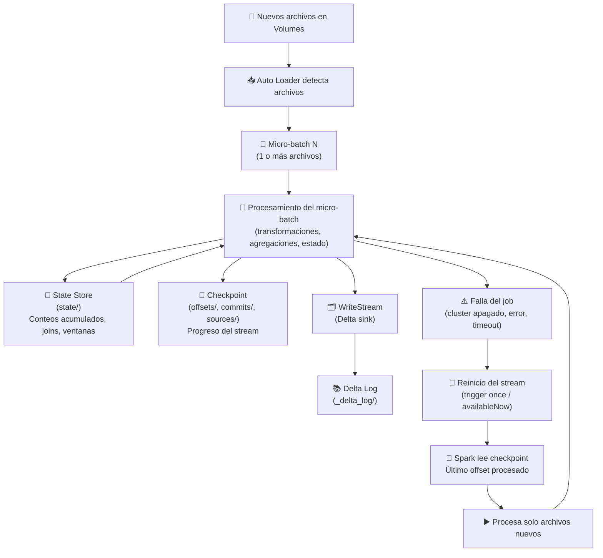

---

# 🧠 **Checkpoint + State + Recovery — Diagrama Completo**

---

# 🟩 **Explicación del diagrama (rápida y quirúrgica)**

## **1. Auto Loader detecta archivos**
- En Volumes  
- En micro‑batches  
- No uno por uno, sino en lotes  

## **2. Spark procesa un micro‑batch**
- Aplica transformaciones  
- Aplica agregaciones  
- Si hay estado, lo actualiza  

## **3. State Store (`state/`)**
Aquí Spark guarda:

- Conteos acumulados  
- Ventanas  
- Joins con estado  
- Cualquier operación stateful  

Esto es lo que permite que:

👉 **id=1 pase de 2 → 3 → 4 sin reiniciar**

## **4. Checkpoint (`offsets/`, `commits/`)**
Guarda:

- Qué archivos ya se procesaron  
- Qué micro‑batch fue el último  
- Qué commit fue exitoso  

Esto permite:

👉 **exactly‑once**  
👉 **no duplicar datos**  
👉 **reanudar sin reprocesar**

## **5. Delta Log**
Cuando escribes a Delta:

- Se genera un commit  
- Se escribe un JSON en `_delta_log/`  
- La tabla queda consistente  

## **6. Si el job falla**
Spark no pierde nada:

- El estado está en `state/`  
- El progreso está en `offsets/`  
- La tabla está consistente  

## **7. Recovery**
Cuando vuelves a correr el stream:

- Spark lee el checkpoint  
- Recupera el estado  
- Procesa solo lo nuevo  
- Continúa donde se quedó  

---
