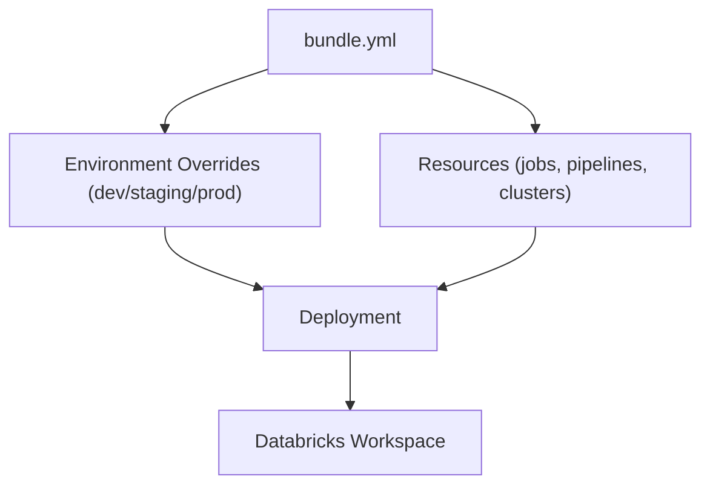
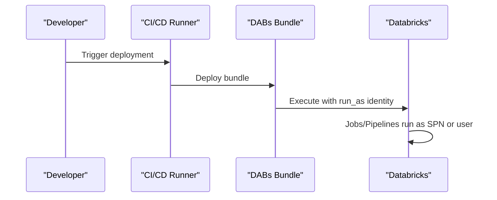

---

# 📘 Databricks Asset Bundles (DABs) — Cheatsheet

A fast reference for configuring, structuring, and deploying Databricks Asset Bundles.

---

## 🧩 1. What Are DABs?

**Databricks Asset Bundles (DABs)** are an *Infrastructure‑as‑Code* framework that lets you define Databricks resources using YAML files and deploy them consistently across environments (dev, staging, prod).

Bundles can include:

- Jobs  
- Delta Live Tables pipelines  
- Clusters  
- Notebooks  
- Permissions  
- Secrets references  
- Execution identity (`run_as`)  

---

## 📁 2. Typical Project Structure

```
project-root/
│
├── bundle.yml
├── resources/
│   ├── jobs.yml
│   ├── pipelines.yml
│   └── clusters.yml
│
├── notebooks/
│   └── etl.py
│
└── environments/
    ├── dev.yml
    ├── staging.yml
    └── prod.yml
```

---

## ⚙️ 3. Core File: `bundle.yml`

Defines the bundle, included resources, and execution identity.

```yaml
bundle:
  name: my_dabs_project
  version: 1.0.0

include:
  - resources/jobs.yml
  - resources/pipelines.yml

run_as:
  service_principal_name: spn-prod-databricks
```

---

## 🔐 4. `run_as` — Execution Identity

`run_as` configures **the identity used to execute all jobs and pipelines in the bundle**, regardless of who deploys it.

### Service Principal
```yaml
run_as:
  service_principal_name: spn-prod-dbx
```

### User Identity
```yaml
run_as:
  user_name: someone@databricks.com
```

**Purpose:**

- Enforce controlled permissions  
- Ensure consistent auditing  
- Prevent human identities in production  
- Secure CI/CD execution  

---

## 🛠️ 5. Jobs Definition (`resources/jobs.yml`)

```yaml
resources:
  jobs:
    daily_etl:
      name: "Daily ETL Job"
      schedule:
        quartz_cron_expression: "0 0 2 * * ?"
      tasks:
        - task_key: etl
          notebook_task:
            notebook_path: "/Repos/my_repo/notebooks/etl.py"
          existing_cluster_id: "1234-56789-cluster"
```

---

## 🔄 6. Pipelines Definition (`resources/pipelines.yml`)

```yaml
resources:
  pipelines:
    sales_pipeline:
      name: "Sales DLT Pipeline"
      target: "sales_gold"
      libraries:
        - notebook:
            path: "/Repos/my_repo/notebooks/dlt_sales.py"
```

---

## 🖥️ 7. Cluster Definition (`resources/clusters.yml`)

```yaml
resources:
  clusters:
    default_cluster:
      spark_version: "14.3.x-scala2.12"
      node_type_id: "i3.xlarge"
      autoscale:
        min_workers: 1
        max_workers: 4
```

---

## 🌎 8. Environment Overrides (`environments/prod.yml`)

Overrides apply *on top* of the base bundle.

```yaml
bundle:
  environment: prod

resources:
  jobs:
    daily_etl:
      schedule:
        pause_status: "UNPAUSED"
```

---

## 🚀 9. Deployment Commands (CLI)

### Validate bundle
```
databricks bundle validate
```

### Deploy to environment
```
databricks bundle deploy -e prod
```

### Run a job from the bundle
```
databricks bundle run daily_etl -e prod
```

---

## 🧠 10. Mermaid Diagram — DABs Architecture



---

## 🧠 11. Mermaid Diagram — `run_as` Execution Identity



---

If you want, I can also generate:

- A **DABs troubleshooting guide**  
- A **DABs exam‑style Q&A sheet**  
- A **full production-ready bundle template**  

Just tell me what you want next.