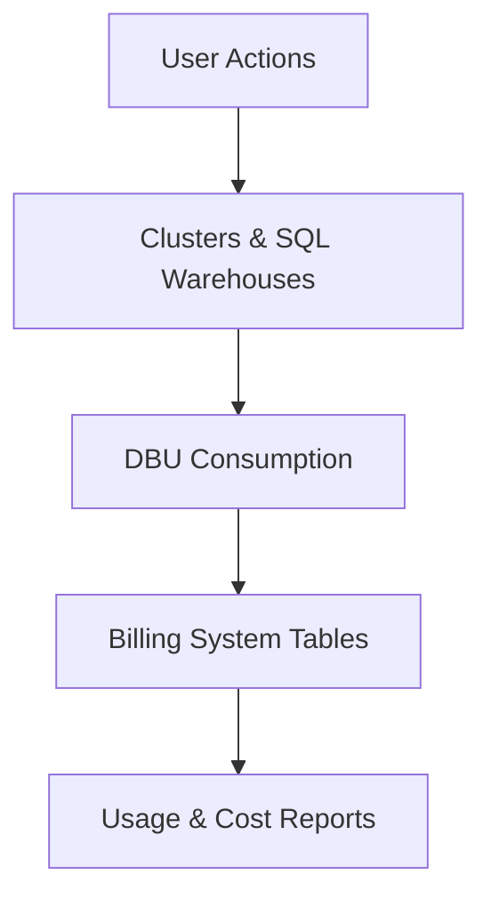
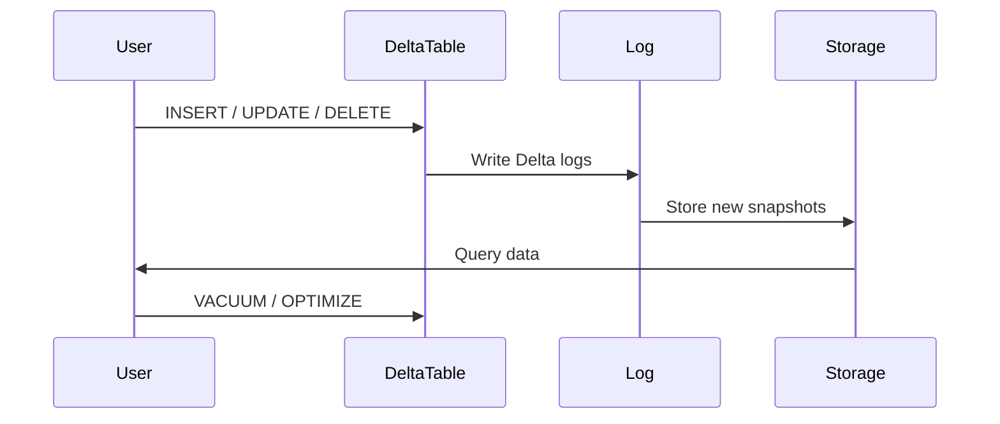
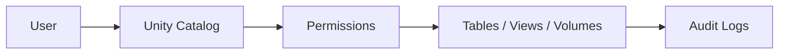

---

# 🇬🇧 **Databricks Environment Administration: Usage, Cost, and Monitoring**  
*A bilingual guide with SQL examples and Mermaid diagrams*

---

# **1. Overview**

Managing a Databricks environment involves controlling:

- Workspace usage  
- Cluster and SQL Warehouse costs  
- Job execution efficiency  
- Storage consumption (DBFS, Delta Lake)  
- Governance and access  
- Monitoring and alerting  

This document provides **SQL queries**, **best practices**, and **Mermaid diagrams** to visualize how Databricks usage and cost administration works.

---

# **2. Monitoring Cluster & Warehouse Usage**

Databricks exposes usage data through **system tables**:

- `system.billing.usage`  
- `system.compute.clusters`  
- `system.compute.warehouses`  
- `system.access.audit`  

---

## **2.1 Query: Daily DBU Consumption**

```sql
SELECT
  usage_date,
  sku_name,
  SUM(dbus_consumed) AS total_dbus
FROM system.billing.usage
GROUP BY usage_date, sku_name
ORDER BY usage_date DESC;
```

---

## **2.2 Query: Cost by Cluster**

```sql
SELECT
  cluster_id,
  cluster_name,
  SUM(dbus_consumed) AS dbus,
  SUM(cost) AS total_cost
FROM system.billing.usage
WHERE usage_type = 'CLUSTER'
GROUP BY cluster_id, cluster_name
ORDER BY total_cost DESC;
```

---

## **2.3 Query: SQL Warehouse Cost**

```sql
SELECT
  warehouse_id,
  warehouse_name,
  SUM(dbus_consumed) AS dbus,
  SUM(cost) AS total_cost
FROM system.billing.usage
WHERE usage_type = 'SQL_WAREHOUSE'
GROUP BY warehouse_id, warehouse_name
ORDER BY total_cost DESC;
```

---

# **3. Monitoring Storage Costs**

Delta Lake storage costs come from:

- Data files  
- Delta logs  
- Retention policies  
- Unused snapshots  

---

## **3.1 Query: Storage by Table**

```sql
DESCRIBE DETAIL delta.`/mnt/data/silver/customers`;
```

Returns:

- `sizeInBytes`  
- `numFiles`  
- `numRows`  
- `createdAt`  

---

## **3.2 Query: Storage Across All Tables**

```sql
SELECT
  table_catalog,
  table_schema,
  table_name,
  total_size
FROM system.information_schema.table_storage
ORDER BY total_size DESC;
```

---

# **4. Delta Lake Retention & Cleanup**

Retention settings affect storage cost.

---

## **4.1 Check Retention Settings**

```sql
SHOW TBLPROPERTIES delta.`/mnt/data/silver/customers`;
```

Look for:

- `delta.logRetentionDuration`  
- `delta.deletedFileRetentionDuration`  

---

## **4.2 Cleanup with VACUUM**

```sql
VACUUM delta.`/mnt/data/silver/customers` RETAIN 168 HOURS;
```

---

# **5. Job Cost & Performance Monitoring**

---

## **5.1 Query: Job Run Costs**

```sql
SELECT
  job_id,
  run_id,
  start_time,
  end_time,
  compute_cost,
  dbus_consumed
FROM system.billing.job_cost
ORDER BY start_time DESC;
```

---

## **5.2 Query: Longest Running Jobs**

```sql
SELECT
  job_id,
  run_id,
  (end_time - start_time) AS duration
FROM system.jobs.run_history
ORDER BY duration DESC;
```

---

# **6. Access & Governance Monitoring**

---

## **6.1 Query: Who Accessed What**

```sql
SELECT
  user_identity,
  action,
  object_id,
  timestamp
FROM system.access.audit
ORDER BY timestamp DESC;
```

---

## **6.2 Query: Privileges on a Schema**

```sql
SHOW GRANTS ON SCHEMA main.silver;
```

---

# **7. Mermaid Diagrams**

---

## **7.1 Cost Flow Diagram**



---

## **7.2 Storage Lifecycle**



---

## **7.3 Governance & Access**



---

# **8. Best Practices for Cost Optimization**

### **Clusters**
- Use **autoscaling**  
- Prefer **job clusters** over all-purpose clusters  
- Use **Photon** for SQL workloads  
- Set **auto-termination** (10–20 min)

### **SQL Warehouses**
- Use **Serverless** when available  
- Use **small** or **medium** warehouses for development  
- Enable **auto-stop**

### **Storage**
- Run **OPTIMIZE ZORDER** on large tables  
- Use **VACUUM** regularly  
- Reduce retention durations if compliance allows  

### **Jobs**
- Use **Delta Live Tables** or **Lakeflow** for incremental pipelines  
- Avoid unnecessary shuffles  
- Cache only when beneficial  

---

# 🇪🇸 **Administración del Entorno Databricks: Uso, Costos y Monitoreo**

---

# **1. Descripción General**

Administrar un entorno Databricks implica controlar:

- Uso del workspace  
- Costos de clusters y SQL Warehouses  
- Eficiencia de jobs  
- Consumo de almacenamiento  
- Gobernanza y accesos  
- Monitoreo y alertas  

---

# **2. Monitoreo de Uso de Clusters y Warehouses**

(Contenido equivalente al inglés, con las mismas consultas SQL.)

---

# **3. Monitoreo de Costos de Almacenamiento**

(Contenido equivalente.)

---

# **4. Retención y Limpieza en Delta Lake**

(Contenido equivalente.)

---

# **5. Monitoreo de Jobs**

(Contenido equivalente.)

---

# **6. Gobernanza y Auditoría**

(Contenido equivalente.)

---

# **7. Diagramas Mermaid**

(Contenido equivalente.)

---

# **8. Mejores Prácticas de Optimización de Costos**

(Contenido equivalente.)

---
