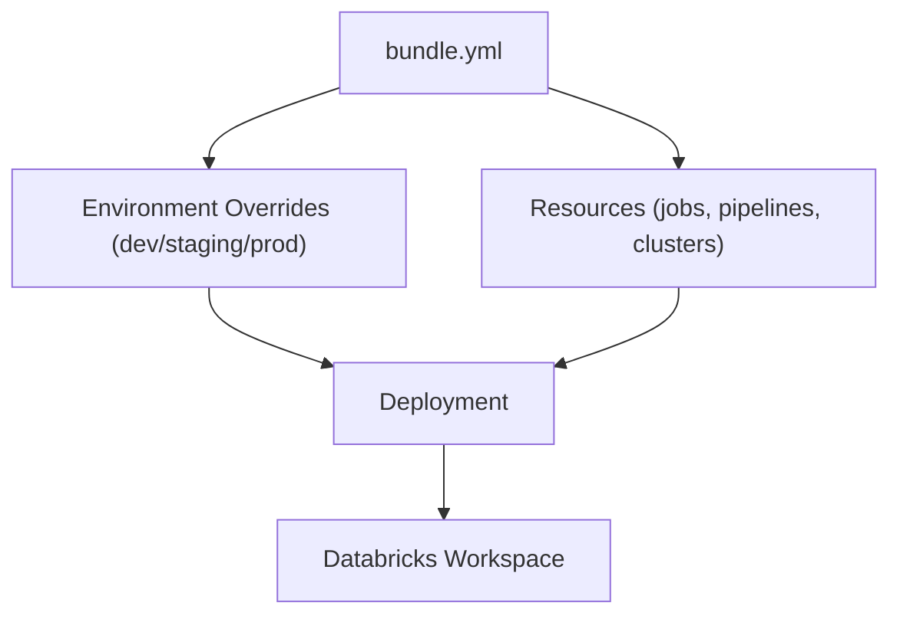
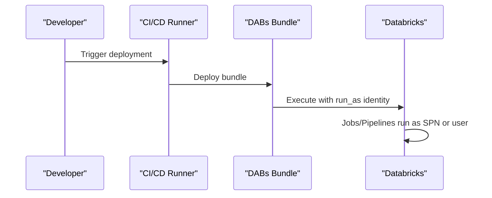
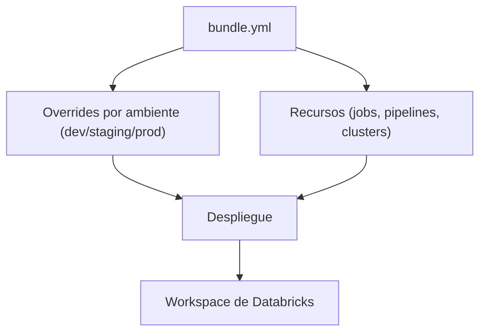
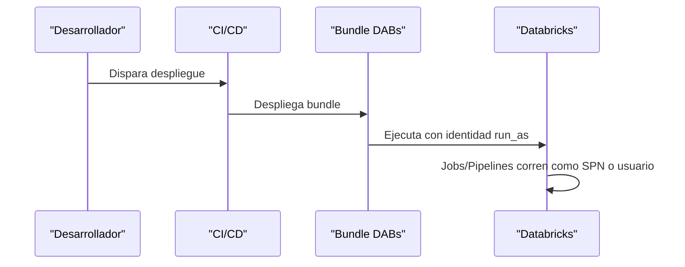

---

# 📘 **Databricks Asset Bundles (DABs)**  

---

# 🇺🇸 **Databricks Asset Bundles (DABs)**

## ## **1. What are Databricks Asset Bundles?**
**Databricks Asset Bundles (DABs)** are an *Infrastructure-as-Code* framework that lets you define, version, deploy, and manage Databricks resources using declarative YAML files.

A bundle can include:

- Jobs  
- Delta Live Tables pipelines  
- Notebooks  
- Permissions  
- Cluster definitions  
- Secrets references  
- Execution identity (`run_as`)  

DABs allow consistent, reproducible deployments across:

- Dev  
- Staging  
- Production  

---

## ## **2. Why DABs matter**
DABs provide:

- **Version-controlled deployments**  
- **Consistent environments**  
- **CI/CD automation**  
- **Separation of configuration per environment**  
- **Controlled execution identity** via `run_as`  

---

## ## **3. Core files in a DAB project**

A typical bundle has this structure:

```
project-root/
│
├── bundle.yml
├── resources/
│   ├── jobs.yml
│   ├── pipelines.yml
│   └── clusters.yml
│
├── notebooks/
│   └── my_notebook.py
│
└── environments/
    ├── dev.yml
    ├── staging.yml
    └── prod.yml
```

---

## ## **4. The `bundle.yml` file (main configuration)**

This is the root descriptor of the bundle.

### **Example**
```yaml
bundle:
  name: my_dabs_project
  version: 1.0.0

include:
  - resources/jobs.yml
  - resources/pipelines.yml

run_as:
  service_principal_name: spn-prod-databricks
```

---

## ## **5. What `run_as` configures**
`run_as` defines **the execution identity for all jobs and pipelines in the bundle**, regardless of who deploys it.

This ensures:

- Controlled permissions  
- Consistent auditing  
- No human identity is used in production  
- Secure CI/CD execution  

### **Example**
```yaml
run_as:
  service_principal_name: spn-prod-dbx
```

Or:

```yaml
run_as:
  user_name: someone@databricks.com
```

---

## ## **6. Jobs definition (`resources/jobs.yml`)**

```yaml
resources:
  jobs:
    my_job:
      name: "Daily ETL Job"
      schedule:
        quartz_cron_expression: "0 0 2 * * ?"
      tasks:
        - task_key: etl
          notebook_task:
            notebook_path: "/Repos/my_repo/notebooks/etl.py"
          existing_cluster_id: "1234-56789-cluster"
```

---

## ## **7. Environment overrides (`environments/prod.yml`)**

```yaml
bundle:
  environment: prod

resources:
  jobs:
    my_job:
      schedule:
        pause_status: "UNPAUSED"
```

---

## ## **8. Mermaid Diagram — DABs Architecture**



---

## ## **9. Mermaid Diagram — `run_as` Execution Identity**



---

# 🇲🇽 **Databricks Asset Bundles (DABs)**

## ## **1. ¿Qué son los Databricks Asset Bundles?**
**Databricks Asset Bundles (DABs)** son un framework de *Infraestructura como Código* que permite definir, versionar, desplegar y administrar recursos de Databricks usando archivos YAML declarativos.

Un bundle puede incluir:

- Jobs  
- Pipelines de Delta Live Tables  
- Notebooks  
- Permisos  
- Clusters  
- Referencias a secretos  
- Identidad de ejecución (`run_as`)  

---

## ## **2. ¿Por qué son importantes?**
DABs permiten:

- Despliegues reproducibles  
- Control de versiones  
- Automatización CI/CD  
- Configuración por ambiente  
- Identidad de ejecución controlada  

---

## ## **3. Archivos principales de un proyecto DAB**

```
project-root/
│
├── bundle.yml
├── resources/
│   ├── jobs.yml
│   ├── pipelines.yml
│   └── clusters.yml
│
├── notebooks/
│   └── my_notebook.py
│
└── environments/
    ├── dev.yml
    ├── staging.yml
    └── prod.yml
```

---

## ## **4. El archivo `bundle.yml`**

### **Ejemplo**
```yaml
bundle:
  name: mi_proyecto_dabs
  version: 1.0.0

include:
  - resources/jobs.yml
  - resources/pipelines.yml

run_as:
  service_principal_name: spn-prod-databricks
```

---

## ## **5. ¿Qué configura `run_as`?**
`run_as` define **la identidad con la que se ejecutan todos los jobs y pipelines del bundle**, sin importar quién haga el deploy.

Esto garantiza:

- Permisos controlados  
- Auditoría consistente  
- Evitar identidades humanas en producción  
- Ejecución segura desde CI/CD  

---

## ## **6. Definición de jobs (`resources/jobs.yml`)**

```yaml
resources:
  jobs:
    mi_job:
      name: "ETL Diario"
      schedule:
        quartz_cron_expression: "0 0 2 * * ?"
      tasks:
        - task_key: etl
          notebook_task:
            notebook_path: "/Repos/mi_repo/notebooks/etl.py"
          existing_cluster_id: "1234-56789-cluster"
```

---

## ## **7. Overrides por ambiente (`environments/prod.yml`)**

```yaml
bundle:
  environment: prod

resources:
  jobs:
    mi_job:
      schedule:
        pause_status: "UNPAUSED"
```

---

## ## **8. Diagrama Mermaid — Arquitectura de DABs**



---

## ## **9. Diagrama Mermaid — Identidad de ejecución `run_as`**



---

