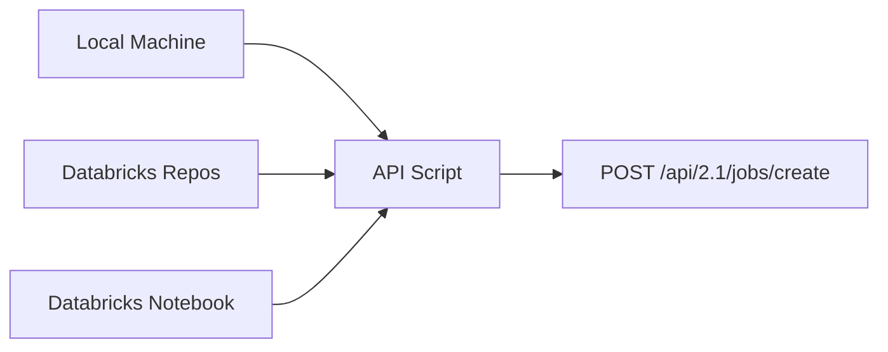
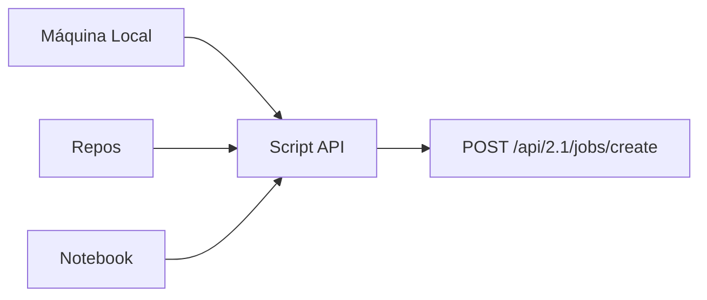

---

# 📄 **Databricks Jobs API — How & Where to Create API Scripts**  

---

# ------------------------------------------------------------
# 🇺🇸 **ENGLISH VERSION**
# ------------------------------------------------------------

# # **Databricks Jobs API — Where and How to Create API Scripts**

This section explains **where** you can create and run the scripts that call the Databricks Jobs API.  
You have **three valid places** to write and execute these scripts:

---

# # **1. Option A — Local Machine (Recommended for CI/CD)**

You can create a script on your local machine using:

- Python (`jobs.py`)
- Bash (`create_job.sh`)
- PowerShell (`create_job.ps1`)
- Any HTTP client (curl, Postman, Thunder Client)

### ✔ Folder structure example

```
my-project/
  ├── api/
  │     ├── create_job.py
  │     ├── run_job.py
  │     └── delete_job.py
  ├── notebooks/
  ├── README.md
```

### ✔ Example Python script (`create_job.py`)

```python
import requests
import json

DATABRICKS_HOST = "https://<your-workspace>.cloud.databricks.com"
TOKEN = "<your-token>"

payload = {
  "name": "example_pipeline",
  "tasks": [
    {
      "task_key": "ingest",
      "notebook_task": {
        "notebook_path": "/Repos/team/ingest"
      },
      "new_cluster": {
        "spark_version": "14.3.x-scala2.12",
        "node_type_id": "i3.xlarge",
        "num_workers": 2
      }
    }
  ]
}

resp = requests.post(
    f"{DATABRICKS_HOST}/api/2.1/jobs/create",
    headers={"Authorization": f"Bearer {TOKEN}"},
    json=payload
)

print(resp.json())
```

Run it:

```
python create_job.py
```

---

# # **2. Option B — Databricks Repos (Inside the Workspace)**

You can create a script **inside Databricks Repos**, which syncs with GitHub.

### ✔ Steps

1. Left sidebar → **Repos**  
2. Click **Add Repo**  
3. Choose GitHub or create a new repo  
4. Inside the repo, click **Add File → Create File**  
5. Name it:  
   ```
   create_job.py
   ```
6. Write your API script there  
7. Run it using a **Databricks Notebook**:

```python
%run ./create_job
```

Or:

```python
%pip install requests
!python create_job.py
```

---

# # **3. Option C — Databricks Notebooks (Quick Testing)**

You can also call the API **directly from a notebook** using Python or curl.

### ✔ Python example

```python
import requests

resp = requests.get(
  f"{host}/api/2.1/jobs/list",
  headers={"Authorization": f"Bearer {token}"}
)

resp.json()
```

### ✔ Curl example

```bash
%sh
curl -X POST $host/api/2.1/jobs/create \
  -H "Authorization: Bearer $token" \
  -H "Content-Type: application/json" \
  -d @job_definition.json
```

---

# # **4. Where to Store the DAG Definition**

Your DAG (the `tasks[]` array) should live in:

```
/api/create_job.py
```

or

```
/api/job_definition.json
```

Example JSON file:

```json
{
  "name": "pipeline",
  "tasks": [
    { "task_key": "ingest", ... },
    { "task_key": "transform", "depends_on": [{"task_key": "ingest"}] },
    { "task_key": "validate", "depends_on": [{"task_key": "transform"}] }
  ]
}
```

---

# # **5. Mermaid Diagram — Where Scripts Live**



---

# # **6. English Summary**

- You can create API scripts **locally**, in **Repos**, or in **Notebooks**  
- The DAG lives inside the `tasks[]` array  
- Use `POST /api/2.1/jobs/create`  
- Never use `workflow[]`  
- Repos is the best place for production pipelines  

---

# ------------------------------------------------------------
# 🇲🇽 **VERSIÓN EN ESPAÑOL**
# ------------------------------------------------------------

# # **API de Jobs — Dónde y Cómo Crear Scripts**

Esta sección explica **dónde** puedes crear los scripts que llaman a la API de Databricks Jobs.  
Tienes **tres lugares válidos**:

---

# # **1. Opción A — Tu Máquina Local (Recomendado para CI/CD)**

Puedes crear un script en tu compu usando:

- Python (`jobs.py`)
- Bash (`create_job.sh`)
- PowerShell (`create_job.ps1`)
- Postman / Thunder Client

### ✔ Ejemplo de estructura

```
mi-proyecto/
  ├── api/
  │     ├── create_job.py
  │     ├── run_job.py
  │     └── delete_job.py
  ├── notebooks/
  ├── README.md
```

### ✔ Script Python

```python
import requests
import json

DATABRICKS_HOST = "https://<tu-workspace>.cloud.databricks.com"
TOKEN = "<tu-token>"

payload = { ... }

resp = requests.post(
    f"{DATABRICKS_HOST}/api/2.1/jobs/create",
    headers={"Authorization": f"Bearer {TOKEN}"},
    json=payload
)

print(resp.json())
```

---

# # **2. Opción B — Databricks Repos (Dentro del Workspace)**

Puedes crear scripts **dentro de Repos**, sincronizados con GitHub.

### ✔ Pasos

1. Barra izquierda → **Repos**  
2. **Add Repo**  
3. Selecciona GitHub o crea uno nuevo  
4. Dentro del repo → **Add File → Create File**  
5. Nómbralo:  
   ```
   create_job.py
   ```
6. Escribe tu script  
7. Ejecútalo desde un Notebook:

```python
%run ./create_job
```

---

# # **3. Opción C — Notebooks (Para pruebas rápidas)**

Puedes llamar la API **directo desde un notebook**.

### ✔ Python

```python
import requests
resp = requests.get(f"{host}/api/2.1/jobs/list", headers={"Authorization": f"Bearer {token}"})
resp.json()
```

### ✔ Curl

```bash
%sh
curl -X POST $host/api/2.1/jobs/create \
  -H "Authorization: Bearer $token" \
  -H "Content-Type: application/json" \
  -d @job_definition.json
```

---

# # **4. Dónde guardar el DAG**

Tu DAG (el arreglo `tasks[]`) debe vivir en:

```
/api/create_job.py
```

o

```
/api/job_definition.json
```

---

# # **5. Diagrama Mermaid — Dónde viven los scripts**



---

# # **6. Resumen en Español**

- Puedes crear scripts en tu compu, en Repos o en Notebooks  
- El DAG vive dentro de `tasks[]`  
- Usa `POST /api/2.1/jobs/create`  
- Nunca uses `workflow[]`  
- Repos es la mejor opción para producción  

---
