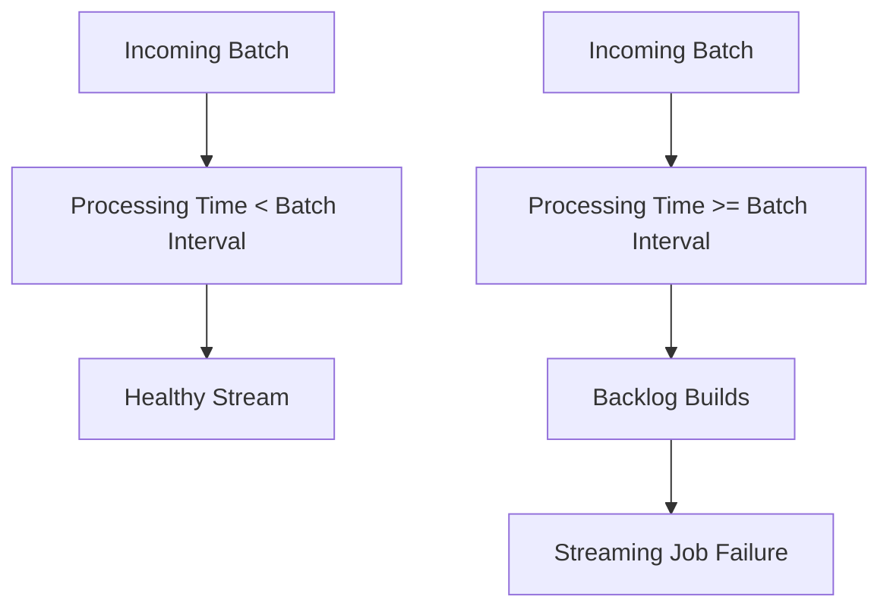
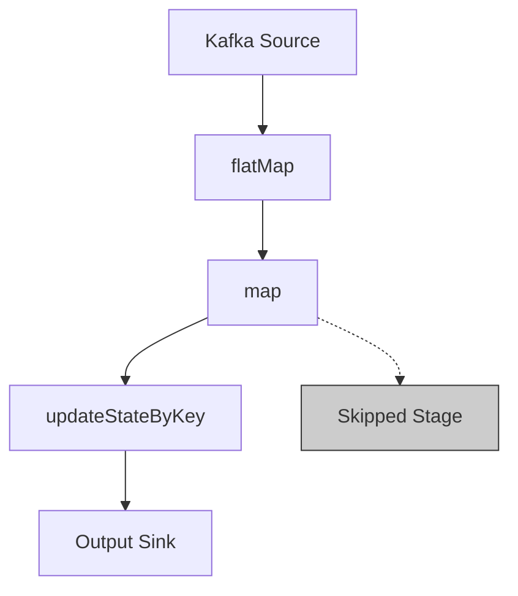

---

# 🇬🇧 Debugging with the Spark UI  
*A bilingual guide with SQL, PySpark, Mermaid diagrams, and image placeholders.*

---

# 1. Overview

The Spark UI is one of the most powerful tools for debugging and understanding the behavior of Apache Spark applications.  
It provides visibility into:

- Job execution  
- Stages and tasks  
- Streaming workloads  
- Processing time  
- Input rates  
- Thread dumps  
- Driver and executor logs  

(Ref: Spark UI overview   [Página actual](citation-section://979802608/3))

---

# 2. Accessing the Spark UI

To open the Spark UI:

1. Go to **Compute**  
2. Select your cluster  
3. Click the **Spark UI** tab  

(Ref: How to access Spark UI   [Página actual](citation-section://979802608/4))

> **Insert image here:**  
> ``  
> *(Screenshot of the Spark UI tab)*

---

# 3. Streaming Tab

The **Streaming** tab appears only when a Structured Streaming job is running.  
It shows:

- Input rate  
- Processing time  
- Completed batches  

(Ref: Streaming tab visibility and purpose   [Página actual](citation-section://979802608/5))

### 3.1 Input Rate

Shows events per second per receiver.  
Useful for verifying whether the stream is receiving data.

(Ref: Input rate details   [Página actual](citation-section://979802608/10))

> **Insert image here:**  
> ``

---

### 3.2 Processing Time

One of the most important graphs for streaming performance.

Rule of thumb:

- Processing time should stay **below 80%** of the batch interval  
- If processing time ≥ batch interval → backlog will grow  

(Ref: Processing time explanation   [Página actual](citation-section://979802608/12))



---

### 3.3 Completed Batches

Shows the last 1000 completed batches.

(Ref: Completed batches section   [Página actual](citation-section://979802608/16))

> **Insert image here:**  
> ``

---

# 4. Batch Details Page

Clicking a batch opens the **Batch Details** page.

It contains:

- Input details (Kafka partitions, offsets, or file names)  
- Processing details  
- Link to the Job Details page  

(Ref: Batch details explanation   [Página actual](citation-section://979802608/19))

### Example: Inspecting Kafka Offsets

```text
Topic: inventory_updates  
Partition: 3  
Offsets: 12000 → 12500  
```

> **Insert image here:**  
> ``

---

# 5. Job Details Page (DAG Visualization)

Shows the **DAG** (Directed Acyclic Graph) of the job.

- Shows operations and dependencies  
- Grayed-out stages = skipped due to caching or checkpointing  

(Ref: DAG visualization and skipped stages   [Página actual](citation-section://979802608/26))



> **Insert image here:**  
> ``

---

# 6. Task Details Page

The most granular debugging level.

Shows:

- Number of tasks  
- Executor assignment  
- Shuffle metrics  

(Ref: Task details page description   [Página actual](citation-section://979802608/35))

### Example: Checking Parallelism

```sql
-- Check number of executors
spark.sparkContext.getExecutorMemoryStatus
```

> **Insert image here:**  
> ``

---

# 7. Thread Dumps

Thread dumps help debug:

- Hanging tasks  
- Slow-running tasks  
- Driver hangs  

(Ref: Thread dump explanation   [Página actual](citation-section://979802608/39))

### Steps to view a task’s thread dump:

1. Go to **Jobs**  
2. Open the job  
3. Open the stage  
4. Open the task  
5. Go to **Executors**  
6. Find the executor  
7. Click **Thread Dump**  

(Ref: Thread dump navigation steps   [Página actual](citation-section://979802608/40))

> **Insert image here:**  
> ``

---

# 8. Driver Logs

Driver logs help diagnose:

- Exceptions during startup  
- Streaming jobs that never start  
- Batches stuck in processing  

(Ref: Driver logs explanation   [Página actual](citation-section://979802608/52))

### Example: Viewing driver logs in PySpark

```python
spark.sparkContext.setLogLevel("DEBUG")
```

> **Insert image here:**  
> ``

---

# 9. Executor Logs

Useful when:

- A specific task misbehaves  
- You need to inspect log4j output  
- You want to see executor-level errors  

(Ref: Executor logs explanation   [Página actual](citation-section://979802608/60))

> **Insert image here:**  
> ``

---

# 🇪🇸 Depuración con Spark UI  
*Guía bilingüe con código, diagramas y marcadores para imágenes.*

---

# 1. Descripción general

La Spark UI permite depurar aplicaciones Spark mostrando:

- Jobs  
- Stages  
- Tasks  
- Métricas de streaming  
- Tiempos de procesamiento  
- Thread dumps  
- Logs del driver y ejecutores  

(Ref: Introducción a Spark UI   [Página actual](citation-section://979802608/3))

---

# 2. Acceder a Spark UI

(Equivalente a la sección en inglés.)

> **Insertar imagen aquí**  
> ``

---

# 3. Pestaña de Streaming

(Equivalente.)

---

# 4. Página de Detalles del Batch

(Equivalente.)

---

# 5. Página de Detalles del Job (DAG)

(Equivalente.)

---

# 6. Página de Detalles de Tareas

(Equivalente.)

---

# 7. Thread Dumps

(Equivalente.)

---

# 8. Logs del Driver

(Equivalente.)

---

# 9. Logs de Ejecutores

(Equivalente.)

---

# End of Document

---

