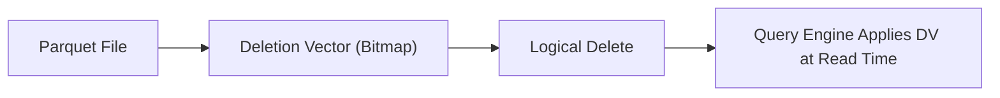
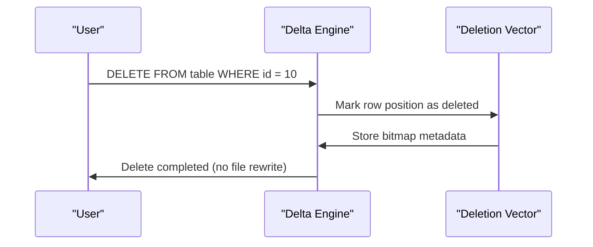
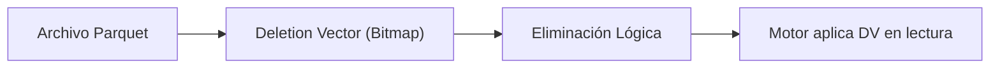
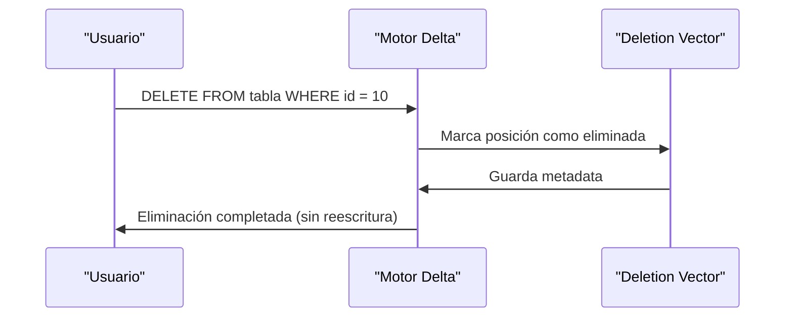

---

# 📘 **Deletion Vectors in Delta Lake (Databricks)**  

---

# 🇺🇸 **Deletion Vectors in Delta Lake**

## 1. What Are Deletion Vectors?

**Deletion Vectors (DVs)** are a Delta Lake feature that mark specific rows as *logically deleted* **without rewriting the entire Parquet file**.

Instead of rewriting files during `DELETE`, `MERGE`, or `UPDATE` operations, Delta Lake stores a compact bitmap indicating which rows are deleted.

This makes deletes:

- **Faster**  
- **Cheaper**  
- **More scalable**  
- **Less I/O intensive**  

Deletion vectors are stored separately from the data files and applied at read time.

---

## 2. Why Deletion Vectors Matter

### Benefits

- **Avoids rewriting large Parquet files**  
- **Improves MERGE performance**  
- **Reduces small-file creation**  
- **Speeds up DELETE operations**  
- **Improves concurrency**  

### When they are used automatically

- `DELETE FROM table`
- `MERGE INTO table`
- `UPDATE table SET ... WHERE ...`

Delta Lake decides whether to use DVs based on table properties and file sizes.

---

## 3. Enabling Deletion Vectors

### Enable on table creation

```sql
CREATE TABLE sales_delta (
  id BIGINT,
  amount DOUBLE,
  updated_at TIMESTAMP
)
USING DELTA
TBLPROPERTIES (
  'delta.enableDeletionVectors' = true
);
```

### Enable on an existing table

```sql
ALTER TABLE sales_delta
SET TBLPROPERTIES ('delta.enableDeletionVectors' = true);
```

---

## 4. How Deletion Vectors Work Internally

When a row is deleted:

1. Delta **does not rewrite** the Parquet file.  
2. A **deletion vector file** is created (bitmap of deleted row positions).  
3. Reads apply the DV to filter out deleted rows.  
4. Compaction (`OPTIMIZE`) may rewrite files and remove DVs.

---

## 5. Querying Tables with Deletion Vectors

You query normally — DVs are transparent:

```sql
SELECT * FROM sales_delta WHERE amount > 100;
```

To inspect metadata:

```sql
DESCRIBE DETAIL sales_delta;
```

Look for:

- `deletionVectorsPresent = true`

---

## 6. Removing Deletion Vectors (Compaction)

```sql
OPTIMIZE sales_delta
ZORDER BY (id);
```

`OPTIMIZE` rewrites files and clears DVs.

---

## 7. Mermaid Diagram — How Deletion Vectors Work



---

## 8. Mermaid Diagram — Lifecycle of a Delete



---

# 🇲🇽 **Deletion Vectors en Delta Lake**

## 1. ¿Qué son los Deletion Vectors?

Los **Deletion Vectors (DVs)** son una funcionalidad de Delta Lake que marca filas como *eliminadas lógicamente* **sin reescribir el archivo Parquet completo**.

En lugar de reescribir archivos durante operaciones `DELETE`, `MERGE` o `UPDATE`, Delta almacena un bitmap compacto indicando qué filas fueron eliminadas.

Esto hace que las eliminaciones sean:

- **Más rápidas**  
- **Más baratas**  
- **Más escalables**  
- **Con menos I/O**  

Los DVs se almacenan por separado y se aplican al momento de lectura.

---

## 2. ¿Por qué son importantes?

### Beneficios

- Evitan reescritura de archivos grandes  
- Mejoran el rendimiento de `MERGE`  
- Reducen la creación de archivos pequeños  
- Aceleran `DELETE`  
- Mejoran la concurrencia  

### Se usan automáticamente en:

- `DELETE FROM`
- `MERGE INTO`
- `UPDATE ... WHERE ...`

---

## 3. Habilitar Deletion Vectors

### Al crear la tabla

```sql
CREATE TABLE sales_delta (
  id BIGINT,
  amount DOUBLE,
  updated_at TIMESTAMP
)
USING DELTA
TBLPROPERTIES (
  'delta.enableDeletionVectors' = true
);
```

### En una tabla existente

```sql
ALTER TABLE sales_delta
SET TBLPROPERTIES ('delta.enableDeletionVectors' = true);
```

---

## 4. ¿Cómo funcionan internamente?

Cuando se elimina una fila:

1. Delta **no reescribe** el archivo Parquet.  
2. Se crea un archivo DV (bitmap de posiciones eliminadas).  
3. Las lecturas aplican el DV para ocultar esas filas.  
4. `OPTIMIZE` puede reescribir archivos y limpiar los DVs.

---

## 5. Consultar tablas con DVs

La consulta es normal:

```sql
SELECT * FROM sales_delta WHERE amount > 100;
```

Ver metadata:

```sql
DESCRIBE DETAIL sales_delta;
```

Buscar:

- `deletionVectorsPresent = true`

---

## 6. Eliminar Deletion Vectors (Compaction)

```sql
OPTIMIZE sales_delta
ZORDER BY (id);
```

Esto reescribe archivos y limpia los DVs.

---

## 7. Diagrama Mermaid — Funcionamiento de DVs



---

## 8. Diagrama Mermaid — Ciclo de vida de un DELETE



---

