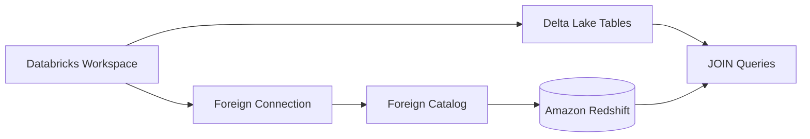
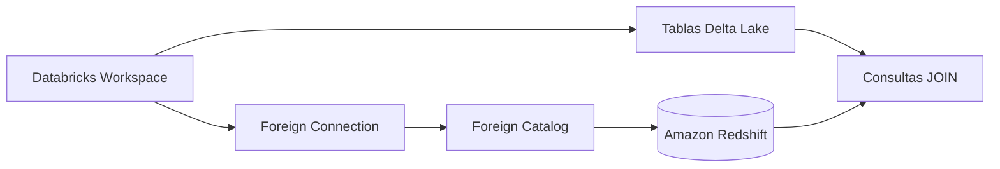

---

# 📄 **Federated Querying vs Delta Sharing — Bilingual Guide**  

---

# ------------------------------------------------------------
# 🇺🇸 **ENGLISH VERSION**
# ------------------------------------------------------------

# # **Federated Querying vs Delta Sharing in Databricks**

This document explains the difference between:

- **Foreign Connections + Foreign Catalogs** (federated querying)  
- **Delta Sharing** (governed data sharing)

And why a **foreign connection to Amazon Redshift** is the correct approach when Databricks needs to **query external data in place** without replication.

---

# # **1. Federated Querying with Foreign Connections**

Federated querying allows Databricks to **query external databases directly**, without copying or replicating data.

Supported systems include:

- Amazon Redshift  
- PostgreSQL  
- MySQL  
- SQL Server  
- Snowflake (preview)  
- Other JDBC-compatible warehouses  

### ✔ Key Benefits

- **No data movement**  
- **No replication or ETL**  
- **Live queries against the external system**  
- **Full Unity Catalog governance**  
- **Audit logging for all access**  
- **Cross-cloud compatibility**  
- **Ability to JOIN external data with Delta Lake tables**

### ✔ How it works

1. Create a **foreign connection** (credentials + URL).  
2. Create a **foreign catalog** that mirrors schemas/tables from the external system.  
3. Query the external tables as if they were native UC tables.

### ✔ Example

```sql
CREATE FOREIGN CONNECTION redshift_conn
  TYPE redshift
  OPTIONS (
    host 'redshift.amazonaws.com',
    port '5439',
    user 'my_user',
    password 'my_password',
    database 'sales'
  );

CREATE FOREIGN CATALOG redshift_catalog
  USING CONNECTION redshift_conn;
```

Querying:

```sql
SELECT *
FROM redshift_catalog.public.customers c
JOIN main.analytics.orders o
  ON c.id = o.customer_id;
```

---

# # **2. Delta Sharing**

Delta Sharing is an **open protocol** for sharing **Delta Lake tables** securely and without copying data.

### ✔ Best for:

- Sharing **Delta tables** across organizations  
- Cross-cloud sharing  
- Tokenless Databricks-to-Databricks sharing  
- UC-governed access to Delta data  

### ❌ Not suitable for:

- Querying external warehouses (e.g., Redshift, Snowflake, BigQuery)  
- Federated querying  
- Joining external data with Lakehouse data in real time  

Delta Sharing requires the **provider** to expose **Delta tables**.  
Amazon Redshift **cannot** act as a Delta Sharing provider.

---

# # **3. Why Federated Querying Is the Correct Approach**

When Databricks needs to:

- Run analytical queries  
- Join Lakehouse data with Redshift data  
- Avoid replication  
- Maintain UC governance  
- Maintain audit logging  
- Avoid data movement  

The correct solution is:

# ⭐ **Foreign Connection + Foreign Catalog**

Because:

- Redshift cannot publish Delta Shares  
- Delta Sharing cannot expose Redshift tables  
- Federated querying allows live access  
- UC governs permissions and auditing  
- No ETL or replication is required  

---

# # **4. Mermaid Diagram — Federated Querying Flow**



---

# # **5. When to Use Each Approach**

| Requirement | Use Foreign Catalog | Use Delta Sharing |
|------------|---------------------|-------------------|
| Query external DB in place | ✔ Yes | ❌ No |
| Join external data with Delta Lake | ✔ Yes | ❌ No |
| No data replication | ✔ Yes | ✔ Yes |
| UC governance & audit | ✔ Yes | ✔ Yes |
| External system is Redshift | ✔ Yes | ❌ No |
| External system provides Delta tables | ❌ No | ✔ Yes |
| Cross-cloud sharing of Delta | ❌ No | ✔ Yes |

---

# # **6. English Summary**

- **Federated querying** enables Databricks to query Redshift directly.  
- **Delta Sharing** only works with Delta Lake tables.  
- Redshift cannot publish Delta Shares.  
- Therefore, the correct approach is:  
  **Foreign Connection + Foreign Catalog**.

---

# ------------------------------------------------------------
# 🇲🇽 **VERSIÓN EN ESPAÑOL**
# ------------------------------------------------------------

# # **Consultas Federadas vs Delta Sharing en Databricks**

Este documento explica la diferencia entre:

- **Foreign Connections + Foreign Catalogs** (consultas federadas)  
- **Delta Sharing** (compartición gobernada de datos)

Y por qué una **conexión federada a Amazon Redshift** es la solución correcta cuando Databricks necesita **consultar datos externos sin replicarlos**.

---

# # **1. Consultas Federadas con Foreign Connections**

Las consultas federadas permiten que Databricks **consulte bases externas directamente**, sin mover ni copiar datos.

Sistemas soportados:

- Amazon Redshift  
- PostgreSQL  
- MySQL  
- SQL Server  
- Snowflake (preview)  
- Cualquier warehouse compatible con JDBC  

### ✔ Beneficios clave

- **Sin movimiento de datos**  
- **Sin replicación ni ETL**  
- **Consultas en vivo contra el sistema externo**  
- **Gobernanza completa con Unity Catalog**  
- **Auditoría de accesos**  
- **Compatibilidad entre nubes**  
- **Permite JOIN con tablas Delta Lake**

### ✔ Cómo funciona

1. Crear una **foreign connection** (credenciales + URL).  
2. Crear un **foreign catalog** que refleja los esquemas/tablas del sistema externo.  
3. Consultar las tablas externas como si fueran nativas de UC.

### ✔ Ejemplo

```sql
CREATE FOREIGN CONNECTION redshift_conn
  TYPE redshift
  OPTIONS (
    host 'redshift.amazonaws.com',
    port '5439',
    user 'my_user',
    password 'my_password',
    database 'sales'
  );

CREATE FOREIGN CATALOG redshift_catalog
  USING CONNECTION redshift_conn;
```

Consulta:

```sql
SELECT *
FROM redshift_catalog.public.customers c
JOIN main.analytics.orders o
  ON c.id = o.customer_id;
```

---

# # **2. Delta Sharing**

Delta Sharing es un **protocolo abierto** para compartir **tablas Delta Lake** de forma segura y sin copiar datos.

### ✔ Ideal para:

- Compartir **tablas Delta** entre organizaciones  
- Compartir entre nubes  
- Compartición sin tokens (Databricks-to-Databricks)  
- Gobernanza UC sobre datos Delta  

### ❌ No sirve para:

- Consultar warehouses externos (Redshift, Snowflake, BigQuery)  
- Consultas federadas  
- Hacer JOIN en tiempo real con datos externos  

Delta Sharing requiere que el **proveedor** exponga **tablas Delta**.  
Amazon Redshift **no puede** actuar como proveedor de Delta Sharing.

---

# # **3. Por qué la Conexión Federada es la Solución Correcta**

Cuando Databricks necesita:

- Ejecutar consultas analíticas  
- Unir datos del Lakehouse con datos de Redshift  
- Evitar replicación  
- Mantener gobernanza UC  
- Mantener auditoría  
- Evitar movimiento de datos  

La solución correcta es:

# ⭐ **Foreign Connection + Foreign Catalog**

Porque:

- Redshift no puede publicar Delta Shares  
- Delta Sharing no expone tablas de Redshift  
- Las consultas federadas permiten acceso en vivo  
- UC gobierna permisos y auditoría  
- No se requiere ETL ni replicación  

---

# # **4. Diagrama Mermaid — Flujo de Consultas Federadas**



---

# # **5. Cuándo usar cada enfoque**

| Necesidad | Foreign Catalog | Delta Sharing |
|-----------|-----------------|---------------|
| Consultar DB externa en vivo | ✔ Sí | ❌ No |
| Hacer JOIN con Delta Lake | ✔ Sí | ❌ No |
| Sin replicación | ✔ Sí | ✔ Sí |
| Gobernanza UC | ✔ Sí | ✔ Sí |
| Sistema externo es Redshift | ✔ Sí | ❌ No |
| Sistema externo expone Delta | ❌ No | ✔ Sí |
| Compartición cross-cloud de Delta | ❌ No | ✔ Sí |

---

# # **6. Resumen en Español**

- **Consultas federadas** permiten consultar Redshift directamente.  
- **Delta Sharing** solo funciona con tablas Delta.  
- Redshift no puede publicar Delta Shares.  
- Por lo tanto, la solución correcta es:  
  **Foreign Connection + Foreign Catalog**.

---

