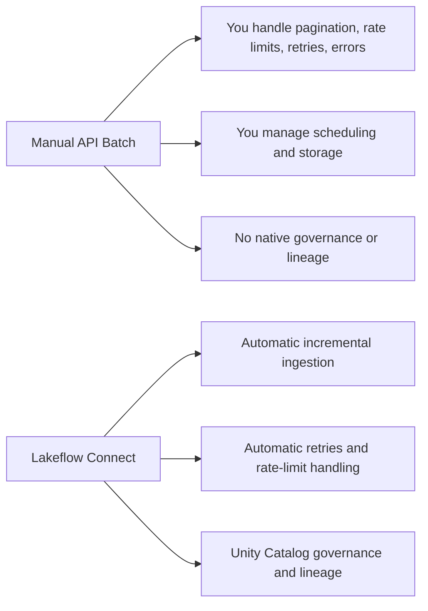
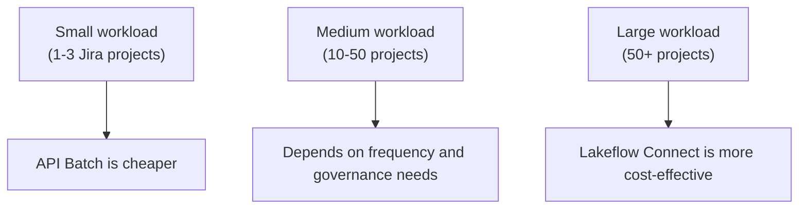
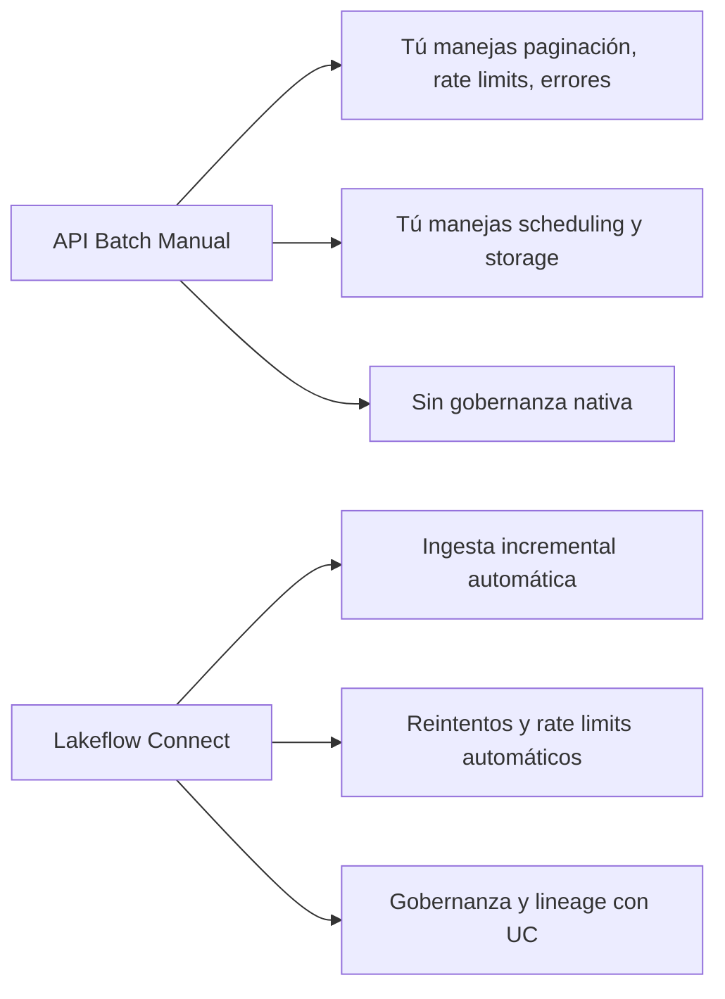
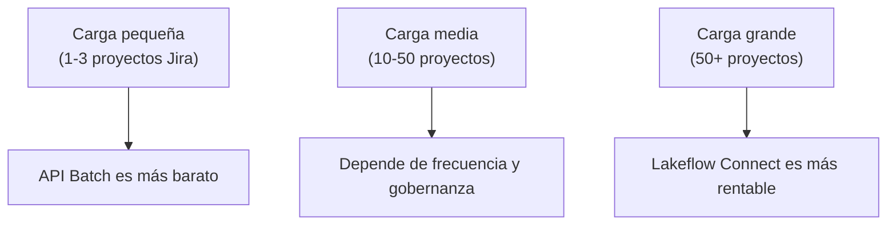

# 🌊 Databricks Lakeflow Connect — Overview & Cost Analysis  

This document explains what **Lakeflow Connect** is, how it compares to **manual API ingestion** (e.g., Jira), and when it is economically justified.

English version first, Spanish version after.

---

# 🇺🇸 ENGLISH VERSION

# 1. What is Lakeflow Connect?

**Lakeflow Connect** is Databricks’ *managed ingestion layer* that allows you to bring data from:

- SaaS systems (Salesforce, Jira, HubSpot, Workday, etc.)
- Databases (MySQL, PostgreSQL, SQL Server, RDS, Azure SQL)
- Cloud storage
- Message buses

It provides:

- Incremental ingestion  
- Automatic retries  
- Rate‑limit handling  
- Serverless execution  
- Unity Catalog governance  
- Lineage and monitoring  

It is **not** a network connector like AWS DirectConnect or PrivateLink.

---

# 2. Lakeflow Connect vs Manual API Batch (e.g., Jira)

## 2.1 Conceptual Difference

### ❌ Manual API Batch
You must implement:

- Pagination  
- Rate‑limit handling  
- Error handling  
- Retries  
- Incremental logic  
- Authentication  
- Scheduling  
- Logging  
- Storage management  
- Governance  

### ✔ Lakeflow Connect
Databricks handles:

- Incremental ingestion  
- Rate‑limit backoff  
- Retries  
- Monitoring  
- Scheduling  
- Storage  
- Unity Catalog governance  
- Lineage  

You only configure the connector.

---

# 3. Technical Advantages of Lakeflow Connect

- **True incremental ingestion** (CDC when available)  
- **Automatic retry logic**  
- **Automatic rate‑limit handling**  
- **Serverless orchestration**  
- **Unity Catalog integration**  
- **Lineage and auditability**  
- **Zero maintenance**  

---

# 4. Economic Considerations

Lakeflow Connect is **not free**.  
It charges based on:

- Rows processed  
- Serverless compute  
- Temporary storage  

### ✔ When Lakeflow Connect *is worth it*
- Many Jira projects (10–200+)  
- Daily or continuous ingestion  
- Mission‑critical pipelines  
- Need for governance and lineage  
- Want zero maintenance  
- Engineering time is expensive  

### ❌ When Lakeflow Connect *is overkill*
- Only 1–3 Jira projects  
- Low volume  
- Weekly or monthly ingestion  
- No need for incremental logic  
- Existing scripts already work  
- Budget is tight  

---

# 5. Diagrams

## 🔷 Architecture Comparison

---

## 🔷 Economic Decision Flow

---

# 🇲🇽 VERSIÓN EN ESPAÑOL

# 1. ¿Qué es Lakeflow Connect?

**Lakeflow Connect** es la capa de *ingesta administrada* de Databricks que permite traer datos desde:

- Sistemas SaaS (Salesforce, Jira, HubSpot, Workday, etc.)
- Bases de datos (MySQL, PostgreSQL, SQL Server, RDS, Azure SQL)
- Almacenamiento en la nube
- Buses de mensajes

Ofrece:

- Ingesta incremental  
- Reintentos automáticos  
- Manejo de rate limits  
- Ejecución serverless  
- Gobernanza con Unity Catalog  
- Lineage y monitoreo  

No es un conector de red como AWS DirectConnect.

---

# 2. Lakeflow Connect vs API Batch Manual (ej. Jira)

## 2.1 Diferencia conceptual

### ❌ API Batch Manual
Tú debes implementar:

- Paginación  
- Manejo de rate limits  
- Manejo de errores  
- Reintentos  
- Lógica incremental  
- Autenticación  
- Schedulers  
- Logs  
- Manejo de storage  
- Gobernanza  

### ✔ Lakeflow Connect
Databricks maneja:

- Ingesta incremental  
- Reintentos  
- Rate limits  
- Monitoreo  
- Orquestación serverless  
- Storage  
- Gobernanza en UC  
- Lineage  

Tú solo configuras el conector.

---

# 3. Ventajas Técnicas de Lakeflow Connect

- **Incrementalidad real**  
- **Reintentos automáticos**  
- **Manejo automático de rate limits**  
- **Orquestación serverless**  
- **Integración con Unity Catalog**  
- **Lineage y auditoría**  
- **Cero mantenimiento**  

---

# 4. Consideraciones Económicas

Lakeflow Connect **no es gratis**.  
Cobra por:

- Filas procesadas  
- Compute serverless  
- Storage temporal  

### ✔ Cuándo *sí* conviene
- Muchos proyectos de Jira (10–200+)  
- Ingesta diaria o continua  
- Pipelines críticos  
- Necesidad de gobernanza  
- Cero mantenimiento  
- Tiempo de ingeniería costoso  

### ❌ Cuándo *no* conviene
- 1–3 proyectos de Jira  
- Bajo volumen  
- Ingesta semanal/mensual  
- No necesitas incrementalidad  
- Ya tienes scripts funcionando  

---

# 5. Diagramas

## 🔷 Comparación de Arquitectura

---

## 🔷 Flujo de Decisión Económica

---

# 🏁 Conclusion

- Lakeflow Connect is ideal for **large, incremental, governed, low‑maintenance pipelines**.  
- Manual API ingestion is ideal for **small, simple, low‑frequency workloads**.  
- The decision is **economic**, not technical.

---
