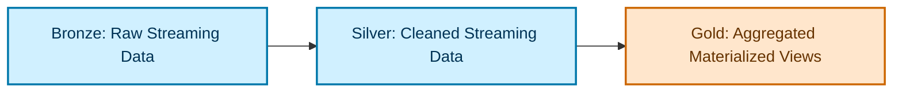
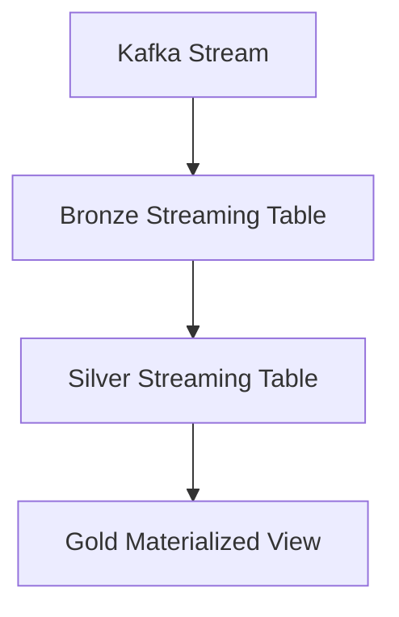
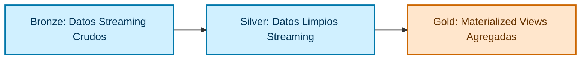

---

# 📄 **Lakeflow Declarative Tables — Bilingual Guide**  


---

# ------------------------------------------------------------
# 🇺🇸 **ENGLISH VERSION**
# ------------------------------------------------------------

# # **Lakeflow Declarative Tables — Overview**

Lakeflow is Databricks’ new **declarative data pipeline engine**, designed to simplify and automate:

- Streaming ingestion  
- Incremental transformations  
- Batch recomputation  
- Medallion architecture orchestration  
- Dependency management  
- Scheduling and optimization  

Lakeflow introduces **Declarative Tables**, which allow engineers to define *what* a table should contain, while Lakeflow handles *how* it is computed.

There are two main types:

- **Streaming Tables**  
- **Materialized Views**

---

# # **1. Streaming Tables**

Streaming Tables are **continuously updated tables** that process data incrementally.

### ✔ Key Characteristics

- Continuous ingestion  
- Incremental processing  
- Stateful transformations  
- Ideal for Bronze and Silver layers  
- Automatically handles checkpoints, state, and recovery  
- Supports deduplication, cleansing, normalization  
- Optimized for low-latency pipelines  

### ✔ Example Definition

```sql
CREATE OR REFRESH STREAMING TABLE bronze_events
AS SELECT * FROM kafka_stream;
```

Silver example:

```sql
CREATE OR REFRESH STREAMING TABLE silver_clean
AS SELECT DISTINCT * FROM STREAM(bronze_events);
```

---

# # **2. Materialized Views**

Materialized Views are **periodically recomputed tables** designed for:

- Batch aggregations  
- Full recomputation  
- Daily/Hourly refreshes  
- Business-level metrics  

### ✔ Key Characteristics

- Not incremental  
- Recompute on schedule  
- Ideal for Gold layer  
- Perfect for daily aggregations  
- Automatically optimized and refreshed  

### ✔ Example Definition

```sql
CREATE OR REFRESH MATERIALIZED VIEW gold_daily_sales
AS SELECT
  customer_id,
  SUM(amount) AS total_sales,
  DATE(order_timestamp) AS order_date
FROM silver_clean
GROUP BY customer_id, DATE(order_timestamp);
```

---

# # **3. How Declarative Tables Fit Medallion Architecture**



### ✔ Bronze → Streaming Table  
### ✔ Silver → Streaming Table  
### ✔ Gold → Materialized View  

This aligns with Lakeflow’s design:

- Bronze: append-only ingestion  
- Silver: incremental cleansing  
- Gold: periodic full recomputation  

---

# # **4. When to Use Each Type**

| Requirement | Streaming Table | Materialized View |
|------------|-----------------|-------------------|
| Continuous ingestion | ✔ Yes | ❌ No |
| Incremental transformations | ✔ Yes | ❌ No |
| Deduplication | ✔ Yes | ❌ No |
| Cleansing / normalization | ✔ Yes | ❌ No |
| Daily/weekly aggregations | ❌ No | ✔ Yes |
| Full recomputation | ❌ No | ✔ Yes |
| Gold business metrics | ❌ No | ✔ Yes |

---

# # **5. Example Medallion Pipeline Using Lakeflow**



---

# # **6. English Summary**

- **Streaming Tables** → continuous, incremental, stateful  
- **Materialized Views** → periodic, full recomputation  
- Bronze & Silver = Streaming Tables  
- Gold = Materialized Views  
- Lakeflow automates orchestration, dependencies, and optimization  

---

# ------------------------------------------------------------
# 🇲🇽 **VERSIÓN EN ESPAÑOL**
# ------------------------------------------------------------

# # **Lakeflow Declarative Tables — Resumen**

Lakeflow es el nuevo motor declarativo de Databricks para simplificar y automatizar:

- Ingesta streaming  
- Transformaciones incrementales  
- Recomputos batch  
- Orquestación Medallion  
- Manejo de dependencias  
- Optimización automática  

Lakeflow introduce **Tablas Declarativas**, donde defines *qué* debe contener una tabla y Lakeflow decide *cómo* construirla.

Los dos tipos principales son:

- **Streaming Tables**  
- **Materialized Views**

---

# # **1. Streaming Tables**

Las Streaming Tables son tablas **actualizadas continuamente** que procesan datos de forma incremental.

### ✔ Características

- Ingesta continua  
- Procesamiento incremental  
- Transformaciones con estado  
- Ideales para Bronze y Silver  
- Manejo automático de checkpoints y estado  
- Soportan deduplicación y limpieza  
- Optimizadas para baja latencia  

### ✔ Ejemplo

```sql
CREATE OR REFRESH STREAMING TABLE bronze_events
AS SELECT * FROM kafka_stream;
```

Silver:

```sql
CREATE OR REFRESH STREAMING TABLE silver_clean
AS SELECT DISTINCT * FROM STREAM(bronze_events);
```

---

# # **2. Materialized Views**

Las Materialized Views son tablas **recomputadas periódicamente**, ideales para:

- Agregaciones batch  
- Recomputos completos  
- Métricas de negocio  
- Cálculos diarios  

### ✔ Características

- No incrementales  
- Se recomputan por horario  
- Ideales para Gold  
- Perfectas para agregaciones diarias  

### ✔ Ejemplo

```sql
CREATE OR REFRESH MATERIALIZED VIEW gold_daily_sales
AS SELECT
  customer_id,
  SUM(amount) AS total_sales,
  DATE(order_timestamp) AS order_date
FROM silver_clean
GROUP BY customer_id, DATE(order_timestamp);
```

---

# # **3. Cómo encajan en Medallion Architecture**



### ✔ Bronze → Streaming Table  
### ✔ Silver → Streaming Table  
### ✔ Gold → Materialized View  

---

# # **4. Cuándo usar cada tipo**

| Necesidad | Streaming Table | Materialized View |
|-----------|-----------------|-------------------|
| Ingesta continua | ✔ Sí | ❌ No |
| Transformaciones incrementales | ✔ Sí | ❌ No |
| Deduplicación | ✔ Sí | ❌ No |
| Limpieza / normalización | ✔ Sí | ❌ No |
| Agregaciones diarias | ❌ No | ✔ Sí |
| Recomputo completo | ❌ No | ✔ Sí |
| Métricas Gold | ❌ No | ✔ Sí |

---

# # **5. Ejemplo de pipeline Medallion con Lakeflow**


---

# # **6. Resumen en Español**

- **Streaming Tables** → continuas, incrementales, con estado  
- **Materialized Views** → periódicas, recomputo completo  
- Bronze y Silver = Streaming Tables  
- Gold = Materialized Views  
- Lakeflow automatiza orquestación, dependencias y optimización  

---

