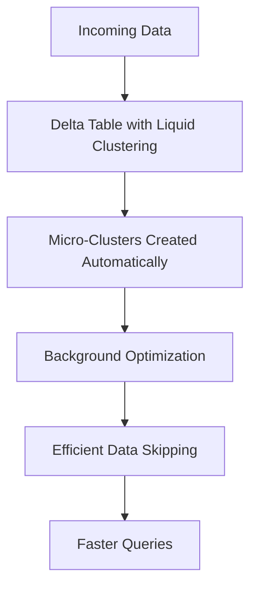
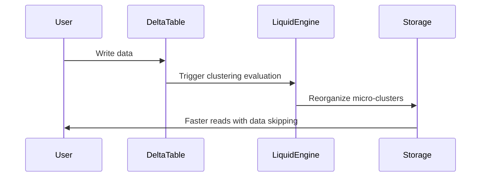
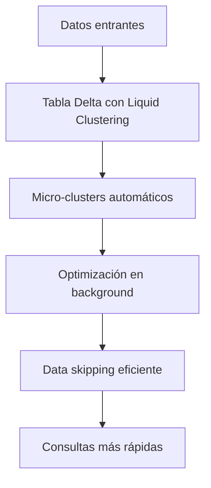
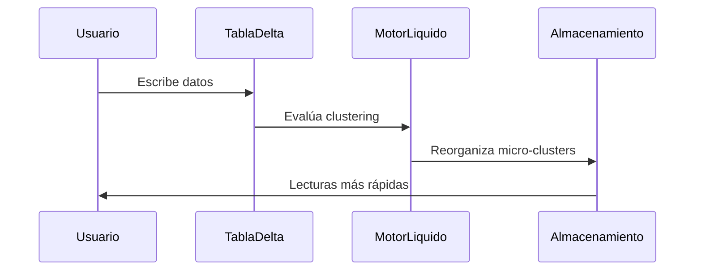

---

# 🇬🇧 **Liquid Clustering in Databricks**
*A bilingual guide with SQL, PySpark, and Mermaid diagrams*

---

# 1. What Is Liquid Clustering?

Liquid Clustering is Databricks’ **next‑generation data layout engine** for Delta Lake tables.  
It replaces traditional **Z‑Ordering** and **partitioning** with a **self‑optimizing, adaptive clustering system**.

### Key characteristics:

- **Automatic**: Databricks continuously reorganizes data in the background.  
- **Adaptive**: It adjusts clustering based on workload patterns.  
- **Fine‑grained**: Uses micro‑clustering instead of large partitions.  
- **Low maintenance**: No need for manual OPTIMIZE ZORDER.  
- **Improves performance** for:
  - Range queries  
  - Time‑series queries  
  - Joins on clustering keys  
  - High‑cardinality columns  

---

# 2. How Liquid Clustering Works (Conceptual Diagram)



---

# 3. Enabling Liquid Clustering

## 3.1 Create a table with Liquid Clustering

```sql
CREATE TABLE sales (
  sale_id BIGINT,
  sale_date DATE,
  customer_id STRING,
  amount DOUBLE
)
USING DELTA
CLUSTER BY (sale_date, customer_id);
```

---

## 3.2 Add Liquid Clustering to an existing table

```sql
ALTER TABLE sales
SET TBLPROPERTIES (
  'delta.liquidClustering.enabled' = 'true',
  'delta.liquidClustering.columns' = 'sale_date, customer_id'
);
```

---

## 3.3 PySpark example

```python
spark.sql("""
ALTER TABLE sales
SET TBLPROPERTIES (
  'delta.liquidClustering.enabled' = 'true',
  'delta.liquidClustering.columns' = 'sale_date, customer_id'
)
""")
```

---

# 4. How Liquid Clustering Differs from Z‑Ordering

| Feature | Z‑Ordering | Liquid Clustering |
|--------|------------|-------------------|
| Optimization | Manual (`OPTIMIZE ZORDER`) | Automatic |
| Adaptivity | Static | Adaptive |
| Granularity | File-level | Micro-cluster level |
| Cost | High (shuffle-heavy) | Lower |
| Best for | Medium cardinality | High cardinality |

---

# 5. Internal Architecture (Mermaid Diagram)



---

# 6. Best Practices

### ✔️ Choose clustering columns that:
- Are frequently filtered  
- Are used in range queries  
- Have high cardinality  
- Are used in joins  

### ✔️ Avoid:
- Low-cardinality columns (e.g., boolean flags)  
- Columns rarely used in queries  

### ✔️ Combine with:
- Auto‑Optimize  
- Auto‑Compaction  
- Photon execution engine  

---

# 7. SQL Examples

## 7.1 Query performance improvement

```sql
SELECT *
FROM sales
WHERE sale_date BETWEEN '2024-01-01' AND '2024-01-31'
  AND customer_id = 'C12345';
```

Liquid Clustering improves:

- Data skipping  
- File pruning  
- Range filtering  

---

## 7.2 Inspect clustering metadata

```sql
DESCRIBE DETAIL sales;
```

Look for:

- `clusteringColumns`
- `numFiles`
- `min/max stats`

---

# 8. Maintenance

Liquid Clustering reduces the need for:

- `OPTIMIZE`  
- `ZORDER`  
- Manual repartitioning  

But you can still run:

```sql
OPTIMIZE sales;
```

This triggers a **liquid-aware compaction**, not Z‑Ordering.

---

# 🇪🇸 **Liquid Clustering en Databricks**
*Guía bilingüe con SQL, PySpark y diagramas Mermaid*

---

# 1. ¿Qué es Liquid Clustering?

Liquid Clustering es el motor de organización de datos de nueva generación para tablas Delta.  
Reemplaza:

- Particionamiento tradicional  
- Z‑Ordering manual  

Con un sistema **automático, adaptativo y de micro‑clustering**.

---

# 2. Cómo funciona (Diagrama)



---

# 3. Habilitar Liquid Clustering

## Crear tabla

```sql
CREATE TABLE ventas (
  id BIGINT,
  fecha DATE,
  cliente STRING,
  monto DOUBLE
)
USING DELTA
CLUSTER BY (fecha, cliente);
```

---

## Activar en tabla existente

```sql
ALTER TABLE ventas
SET TBLPROPERTIES (
  'delta.liquidClustering.enabled' = 'true',
  'delta.liquidClustering.columns' = 'fecha, cliente'
);
```

---

# 4. Diferencias con Z‑Ordering

(Equivalente a la tabla en inglés.)

---

# 5. Arquitectura interna



---

# 6. Mejores prácticas

(Equivalentes a la sección en inglés.)

---

# 7. Ejemplos SQL

(Equivalentes.)

---

# 8. Mantenimiento

Liquid Clustering reduce la necesidad de:

- OPTIMIZE  
- ZORDER  
- Reparticionamiento manual  

---

# End of Document

---

