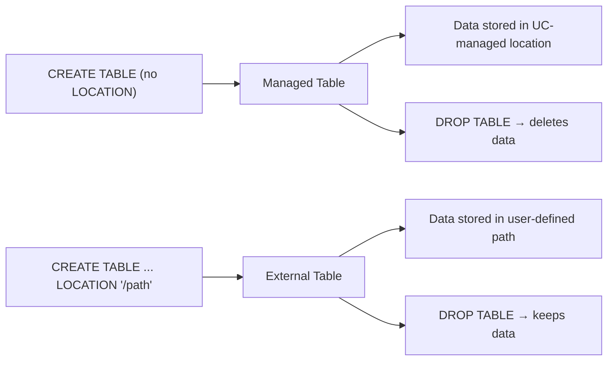
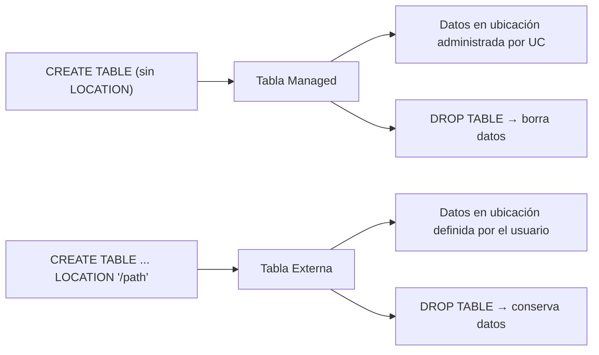

---

# 🧩 Managed vs External Tables in Databricks (Unity Catalog)  
## Bilingual (English + Spanish)  

---

# 🇺🇸 ENGLISH VERSION

# 1. Overview

Databricks supports two types of Delta tables:

- **Managed tables** → Unity Catalog controls both metadata and data  
- **External tables** → Unity Catalog controls metadata, but **you** control the data location

Understanding the difference is essential for ingestion, COPY INTO, governance, and DROP TABLE behavior.

---

# 2. Managed Tables

## 2.1 Definition

A **managed table** is fully controlled by Unity Catalog:

- UC stores metadata  
- UC stores the data files  
- UC manages the Delta Log  
- Dropping the table **deletes the data**  

## 2.2 Create a Managed Table

```sql
CREATE TABLE IF NOT EXISTS workspace.default.managed_demo (
  id BIGINT,
  name STRING
);
```

## 2.3 Insert Data

```sql
INSERT INTO workspace.default.managed_demo VALUES
(1, "Alice"),
(2, "Bob");
```

## 2.4 Drop a Managed Table

```sql
DROP TABLE workspace.default.managed_demo;
```

**Effect:**  
- Metadata deleted  
- Data files deleted  
- Delta Log deleted  

---

# 3. External Tables

## 3.1 Definition

An **external table** stores data in a location you specify:

- UC stores metadata  
- Data lives in a path you control  
- Dropping the table **does NOT delete the data**  
- Ideal for:  
  - Interoperability  
  - Custom storage  
  - Multi‑system access  
  - COPY INTO pipelines  

## 3.2 Create an External Table (Volumes)

```sql
CREATE TABLE IF NOT EXISTS workspace.default.external_demo (
  id BIGINT,
  city STRING
)
USING DELTA
LOCATION '/Volumes/workspace/default/external_demo/table';
```

## 3.3 Insert Data

```sql
INSERT INTO workspace.default.external_demo VALUES
(1, "Tokyo"),
(2, "Berlin");
```

## 3.4 Drop an External Table

```sql
DROP TABLE workspace.default.external_demo;
```

**Effect:**  
- Metadata deleted  
- Data files remain in the LOCATION  
- Delta Log remains  

---

# 4. Quick Summary Table

| Feature | Managed Table | External Table |
|--------|----------------|----------------|
| Data location | Controlled by UC | Controlled by you |
| Metadata | UC | UC |
| DROP TABLE behavior | Deletes data | Keeps data |
| Best for | Most workloads | Interop, custom storage |
| Requires LOCATION | No | Yes |
| Supported in Free Edition | ✔ Yes | ✔ Yes (Volumes only) |

---

# 5. Visual Diagram



---

# 🇲🇽 VERSIÓN EN ESPAÑOL

# 1. Descripción General

Databricks soporta dos tipos de tablas Delta:

- **Managed tables** → Unity Catalog controla metadatos y datos  
- **External tables** → Unity Catalog controla metadatos, pero **tú** controlas la ubicación de los datos  

La diferencia es clave para COPY INTO, gobernanza y comportamiento al borrar tablas.

---

# 2. Tablas Managed

## 2.1 Definición

Una tabla **managed** es totalmente administrada por Unity Catalog:

- UC almacena metadatos  
- UC almacena los datos  
- UC administra el Delta Log  
- Al borrar la tabla, **se borran los datos**  

## 2.2 Crear una Tabla Managed

```sql
CREATE TABLE IF NOT EXISTS workspace.default.managed_demo (
  id BIGINT,
  name STRING
);
```

## 2.3 Insertar Datos

```sql
INSERT INTO workspace.default.managed_demo VALUES
(1, "Alice"),
(2, "Bob");
```

## 2.4 Borrar una Tabla Managed

```sql
DROP TABLE workspace.default.managed_demo;
```

**Efecto:**  
- Se borran metadatos  
- Se borran datos  
- Se borra el Delta Log  

---

# 3. Tablas Externas

## 3.1 Definición

Una tabla **external** almacena los datos en una ubicación definida por ti:

- UC almacena metadatos  
- Los datos viven en un path que tú controlas  
- Al borrar la tabla, **los datos permanecen**  
- Ideal para:  
  - Integraciones  
  - Control fino del almacenamiento  
  - COPY INTO  
  - Acceso multi‑sistema  

## 3.2 Crear una Tabla Externa (Volumes)

```sql
CREATE TABLE IF NOT EXISTS workspace.default.external_demo (
  id BIGINT,
  city STRING
)
USING DELTA
LOCATION '/Volumes/workspace/default/external_demo/table';
```

## 3.3 Insertar Datos

```sql
INSERT INTO workspace.default.external_demo VALUES
(1, "Tokyo"),
(2, "Berlin");
```

## 3.4 Borrar una Tabla Externa

```sql
DROP TABLE workspace.default.external_demo;
```

**Efecto:**  
- Se borran metadatos  
- Los datos permanecen en la LOCATION  
- El Delta Log permanece  

---

# 4. Resumen Rápido

| Característica | Managed | External |
|----------------|---------|----------|
| Ubicación de datos | UC | Tú la defines |
| Metadatos | UC | UC |
| DROP TABLE | Borra datos | Conserva datos |
| Uso ideal | Casi todo | Integraciones, control fino |
| LOCATION requerido | No | Sí |
| Free Edition | ✔ Sí | ✔ Sí (solo Volumes) |

---

# 5. Diagrama Visual



---
