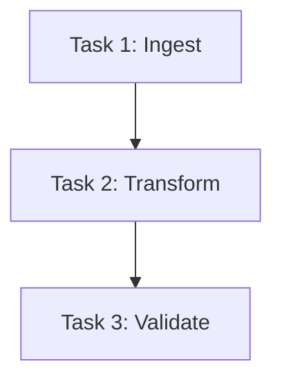
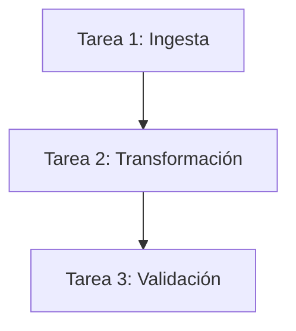

---

# 📄 **Databricks Jobs API — Bilingual Guide**  

---

# ------------------------------------------------------------
# 🇺🇸 **ENGLISH VERSION**
# ------------------------------------------------------------

# # **Databricks Jobs API — How to Create Multi‑Task Jobs**

The Databricks Jobs API allows programmatic creation, modification, and execution of jobs.  
This is essential for CI/CD, automation, and orchestrating multi-step pipelines.

This guide explains:

- How the Jobs API works  
- How to define multi-task workflows  
- How to express dependencies  
- Correct JSON structure  
- Common mistakes  

---

# # **1. Jobs API Overview**

The main endpoint to create a job is:

```
POST /api/2.1/jobs/create
```

A job can contain:

- One or more **tasks**  
- Dependencies between tasks  
- Cluster definitions  
- Parameters  
- Schedules (optional)  

---

# # **2. Correct Structure: `tasks[]` Array**

A multi-task job **must** use a `tasks` array.

Each task requires:

- `task_key` (unique identifier)  
- `depends_on` (optional)  
- A task type (e.g., `notebook_task`, `spark_jar_task`, `python_wheel_task`)  
- A cluster specification  

### ✔ Correct structure

```json
{
  "name": "example_pipeline",
  "tasks": [
    {
      "task_key": "ingest",
      "notebook_task": {
        "notebook_path": "/Repos/team/ingest"
      },
      "new_cluster": {
        "spark_version": "14.3.x-scala2.12",
        "node_type_id": "i3.xlarge",
        "num_workers": 2
      }
    },
    {
      "task_key": "transform",
      "depends_on": [
        { "task_key": "ingest" }
      ],
      "notebook_task": {
        "notebook_path": "/Repos/team/transform"
      },
      "new_cluster": {
        "spark_version": "14.3.x-scala2.12",
        "node_type_id": "i3.xlarge",
        "num_workers": 2
      }
    },
    {
      "task_key": "validate",
      "depends_on": [
        { "task_key": "transform" }
      ],
      "notebook_task": {
        "notebook_path": "/Repos/team/validate"
      },
      "new_cluster": {
        "spark_version": "14.3.x-scala2.12",
        "node_type_id": "i3.xlarge",
        "num_workers": 1
      }
    }
  ]
}
```

---

# # **3. Incorrect Structure: `workflow` Array (Do NOT Use)**

Some engineers mistakenly try:

```json
"workflow": [ ... ]
```

This is **not** supported.  
Only `tasks[]` is valid.

---

# # **4. Task Dependencies**

Dependencies are expressed using:

```json
"depends_on": [
  { "task_key": "previous_task" }
]
```

This creates a DAG of execution.

---

# # **5. Mermaid Diagram — Multi‑Task Job DAG**



---

# # **6. Running a Job via API**

```
POST /api/2.1/jobs/run-now
{
  "job_id": 12345
}
```

---

# # **7. Best Practices**

- Use **task_key** names that reflect pipeline stages  
- Keep clusters small for lightweight tasks  
- Use **depends_on** to enforce ordering  
- Store notebooks in Repos for version control  
- Avoid using a single giant task — break into steps  

---

# # **8. English Summary**

- Use `POST /api/2.1/jobs/create`  
- Use **`tasks[]`**, not `workflow[]`  
- Each task needs a `task_key`  
- Dependencies use `depends_on`  
- This enables multi-step pipelines with proper orchestration  

---

# ------------------------------------------------------------
# 🇲🇽 **VERSIÓN EN ESPAÑOL**
# ------------------------------------------------------------

# # **API de Jobs en Databricks — Cómo Crear Jobs con Múltiples Tareas**

La API de Jobs permite crear, modificar y ejecutar jobs de forma programática.  
Es esencial para CI/CD, automatización y orquestación de pipelines complejos.

Este documento explica:

- Cómo funciona la API  
- Cómo definir múltiples tareas  
- Cómo expresar dependencias  
- La estructura JSON correcta  
- Errores comunes  

---

# # **1. Descripción General de la API**

El endpoint principal para crear un job es:

```
POST /api/2.1/jobs/create
```

Un job puede contener:

- Una o varias **tareas**  
- Dependencias entre tareas  
- Definición de clúster  
- Parámetros  
- Schedules (opcional)  

---

# # **2. Estructura Correcta: Arreglo `tasks[]`**

Un job con múltiples pasos **debe** usar `tasks[]`.

Cada tarea requiere:

- `task_key` (identificador único)  
- `depends_on` (opcional)  
- Tipo de tarea (`notebook_task`, `spark_jar_task`, etc.)  
- Especificación de clúster  

### ✔ Estructura correcta

```json
{
  "name": "pipeline_ejemplo",
  "tasks": [
    {
      "task_key": "ingesta",
      "notebook_task": {
        "notebook_path": "/Repos/team/ingesta"
      },
      "new_cluster": {
        "spark_version": "14.3.x-scala2.12",
        "node_type_id": "i3.xlarge",
        "num_workers": 2
      }
    },
    {
      "task_key": "transformacion",
      "depends_on": [
        { "task_key": "ingesta" }
      ],
      "notebook_task": {
        "notebook_path": "/Repos/team/transformacion"
      },
      "new_cluster": {
        "spark_version": "14.3.x-scala2.12",
        "node_type_id": "i3.xlarge",
        "num_workers": 2
      }
    },
    {
      "task_key": "validacion",
      "depends_on": [
        { "task_key": "transformacion" }
      ],
      "notebook_task": {
        "notebook_path": "/Repos/team/validacion"
      },
      "new_cluster": {
        "spark_version": "14.3.x-scala2.12",
        "node_type_id": "i3.xlarge",
        "num_workers": 1
      }
    }
  ]
}
```

---

# # **3. Estructura Incorrecta: `workflow[]` (NO usar)**

Algunos ingenieros intentan:

```json
"workflow": [ ... ]
```

Esto **no** es válido.  
Solo `tasks[]` funciona.

---

# # **4. Dependencias entre Tareas**

Las dependencias se expresan así:

```json
"depends_on": [
  { "task_key": "tarea_previa" }
]
```

Esto crea un DAG de ejecución.

---

# # **5. Diagrama Mermaid — DAG del Job**



---

# # **6. Ejecutar un Job vía API**

```
POST /api/2.1/jobs/run-now
{
  "job_id": 12345
}
```

---

# # **7. Buenas Prácticas**

- Usa `task_key` descriptivos  
- Mantén clústeres pequeños para tareas ligeras  
- Usa `depends_on` para controlar el orden  
- Guarda notebooks en Repos para versionado  
- Evita una sola tarea gigante — divide el pipeline  

---

# # **8. Resumen en Español**

- Usa `POST /api/2.1/jobs/create`  
- Usa **`tasks[]`**, no `workflow[]`  
- Cada tarea necesita `task_key`  
- Las dependencias usan `depends_on`  
- Esto permite pipelines multi‑paso bien orquestados  

---
