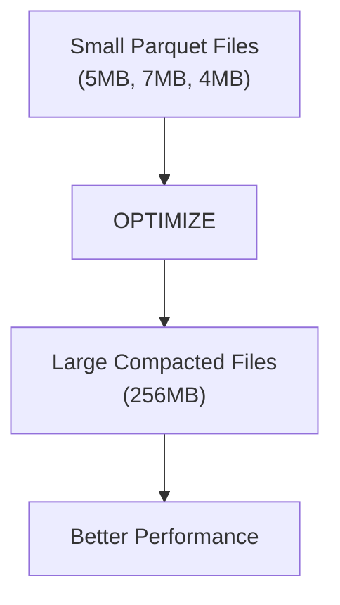
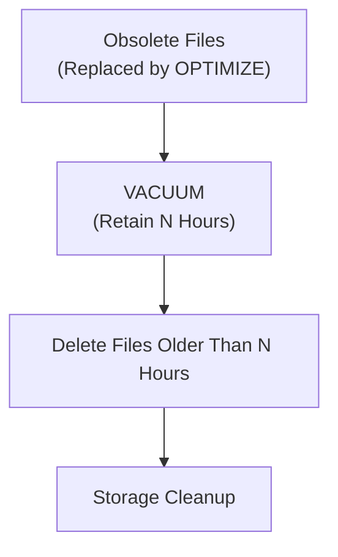
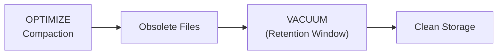
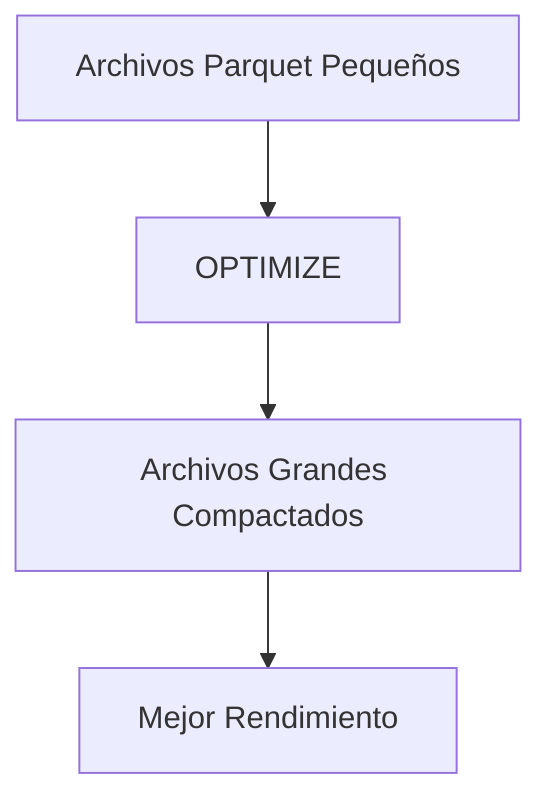
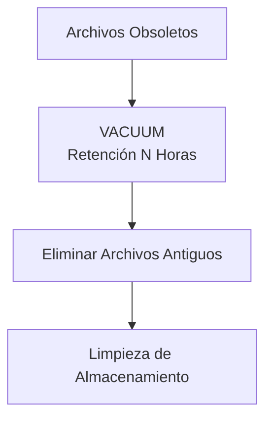

Claro que sí, Axel — aquí tienes un **archivo `.md` bilingüe**, con **diagramas Mermaid**, **primero en inglés y luego en español**, exactamente como lo pediste.  
Está listo para pegarse en tu repo como:

```
notes/optimize-vacuum-bilingual.md
```

---

```markdown
# 🧹 Delta Lake — OPTIMIZE & VACUUM (Bilingual + Mermaid)

This document explains how **OPTIMIZE** and **VACUUM** work in Delta Lake, how they interact, and what actually happens under the hood.  
English version first, Spanish version after.

---

# 🇺🇸 ENGLISH VERSION

# 🚀 1. What OPTIMIZE Does

## ✔ Purpose
`OPTIMIZE` **compacts many small Parquet files into fewer large files**.

Small files appear because:
- Auto Loader writes micro‑batches  
- Structured Streaming writes per trigger  
- MERGE/UPDATE/DELETE create new files  
- ACID operations generate new Parquet files  

Over time, tables accumulate **thousands of small files**, slowing down reads.

---

## 📦 Before vs After OPTIMIZE

**Before:**

```
5 MB
7 MB
4 MB
6 MB
```

**After:**

```
256 MB
```

---

## 🎯 Benefits
- Faster reads  
- Fewer files → less metadata overhead  
- Better performance for joins, scans, aggregations  
- Lower pressure on the metastore  

---

## ⚠ Important
OPTIMIZE **does NOT delete files**.

It only:
- creates new compacted files  
- marks the old small files as **obsolete** in the Delta Log  

The obsolete files still exist physically until VACUUM removes them.

---

# 🧽 2. What VACUUM Does

## ✔ Purpose
`VACUUM` **deletes obsolete files** that are no longer part of the current table snapshot.

These include:
- files replaced by OPTIMIZE  
- files removed by MERGE/DELETE  
- files from older versions  
- files no longer referenced by the Delta Log  

---

## ⏳ Retention Period (RETAIN N HOURS)

Example:

```sql
VACUUM my_table RETAIN 168 HOURS;
```

Meaning:

> Delete obsolete files **older than 7 days**.

VACUUM **does NOT delete active data**.

---

# 🔥 3. OPTIMIZE + VACUUM Together

Recommended workflow:

```
OPTIMIZE → VACUUM
```

- OPTIMIZE compacts  
- VACUUM cleans obsolete files (after retention period)

---

# 🟥 4. Important Clarification

## ❌ “VACUUM without hours deletes everything obsolete”
Incorrect.

## ✔ “VACUUM without hours uses the default retention of 168 hours”
Correct.

If you run:

```sql
VACUUM my_table;
```

It behaves as:

```
VACUUM my_table RETAIN 168 HOURS;
```

---

# ⚠ 5. Deleting EVERYTHING Immediately

You would need:

```sql
VACUUM my_table RETAIN 0 HOURS;
```

But:
- disables Time Travel  
- can break ACID guarantees  
- Databricks blocks it by default  
- requires advanced configuration  

Not recommended.

---

# 🧠 6. Summary Table

| Operation | What it DOES | What it DOES NOT do |
|----------|--------------|----------------------|
| **OPTIMIZE** | Compacts small files into large files | Delete files |
| **VACUUM** | Deletes obsolete files older than N hours | Compact files |

---

# 🎨 7. Mermaid Diagrams

## 🔷 OPTIMIZE Process



---

## 🔷 VACUUM Process



---

## 🔷 OPTIMIZE + VACUUM Together



---

---

# 🇲🇽 VERSIÓN EN ESPAÑOL

# 🚀 1. Qué hace OPTIMIZE

## ✔ Propósito
`OPTIMIZE` **compacta muchos archivos Parquet pequeños en pocos archivos grandes**.

Los archivos pequeños aparecen porque:
- Auto Loader escribe micro‑batches  
- Structured Streaming escribe por trigger  
- MERGE/UPDATE/DELETE generan archivos nuevos  
- Cada operación ACID crea nuevos Parquet  

Con el tiempo, la tabla acumula **miles de archivos pequeños**, lo que degrada el rendimiento.

---

## 📦 Antes vs Después de OPTIMIZE

**Antes:**

```
5 MB
7 MB
4 MB
6 MB
```

**Después:**

```
256 MB
```

---

## 🎯 Beneficios
- Lecturas más rápidas  
- Menos archivos → menos overhead  
- Mejor rendimiento en joins, scans y aggregations  
- Menos presión en el metastore  

---

## ⚠ Importante
OPTIMIZE **no borra archivos**.

Solo:
- crea archivos compactados  
- marca los archivos pequeños como **obsoletos** en el Delta Log  

Los archivos obsoletos siguen existiendo hasta que VACUUM los elimina.

---

# 🧽 2. Qué hace VACUUM

## ✔ Propósito
`VACUUM` **elimina archivos obsoletos** que ya no forman parte del snapshot actual.

Incluye:
- archivos reemplazados por OPTIMIZE  
- archivos eliminados por MERGE/DELETE  
- archivos de versiones antiguas  
- archivos no referenciados  

---

## ⏳ Periodo de retención (RETAIN N HOURS)

Ejemplo:

```sql
VACUUM my_table RETAIN 168 HOURS;
```

Significa:

> Borra archivos obsoletos **con más de 7 días**.

VACUUM **no borra datos activos**.

---

# 🔥 3. OPTIMIZE + VACUUM Juntos

Flujo recomendado:

```
OPTIMIZE → VACUUM
```

- OPTIMIZE compacta  
- VACUUM limpia archivos obsoletos (después del periodo de retención)

---

# 🟥 4. Aclaración importante

## ❌ “VACUUM sin horas borra todo lo obsoleto”
Incorrecto.

## ✔ “VACUUM sin horas usa 168 horas por default”
Correcto.

```sql
VACUUM my_table;
```

Es equivalente a:

```
VACUUM my_table RETAIN 168 HOURS;
```

---

# ⚠ 5. Borrar TODO inmediatamente

Requeriría:

```sql
VACUUM my_table RETAIN 0 HOURS;
```

Pero:
- deshabilita Time Travel  
- puede romper garantías ACID  
- Databricks lo bloquea por default  

No recomendado.

---

# 🧠 6. Resumen

| Operación | Qué hace | Qué NO hace |
|----------|----------|-------------|
| **OPTIMIZE** | Compacta archivos pequeños | Borrar archivos |
| **VACUUM** | Borra archivos obsoletos mayores a N horas | Compactar archivos |

---

# 🎨 7. Diagramas Mermaid

## 🔷 Proceso de OPTIMIZE



---

## 🔷 Proceso de VACUUM



---

## 🔷 OPTIMIZE + VACUUM


---

# 🏁 Conclusión

OPTIMIZE **compacta**, VACUUM **limpia**.  
Juntos mantienen tus tablas Delta rápidas, ligeras y consistentes.

```

---

Si quieres, puedo generar:

- Una **versión ultra‑resumida tipo flashcards**  
- Una **versión para tu README general del repo**  
- Un **diagrama único combinando todo el flujo Delta Lake**  

Tú dime y lo armamos.