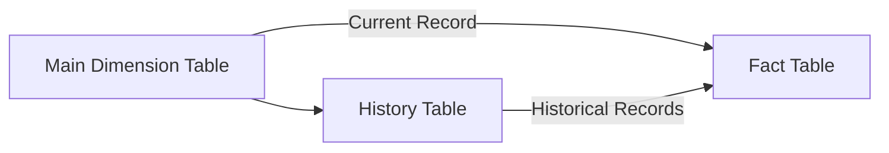
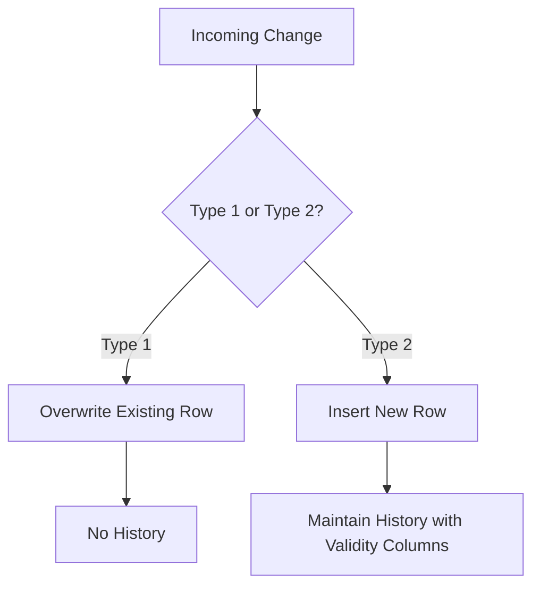

---

# 🇬🇧 Slowly Changing Dimensions (SCD)  
*A bilingual guide with SQL examples and Mermaid diagrams*

---

# 1. What Are Slowly Changing Dimensions?

A **Slowly Changing Dimension (SCD)** is a data modeling technique used to manage **changes in dimensional data** over time.

Dimensions such as:

- Customer  
- Product  
- Employee  
- Inventory  
- Supplier  

may change slowly and irregularly.  
SCD techniques define **how to store and track those changes**.

---

# 2. Why SCDs Matter in the Lakehouse

In Databricks and Delta Lake, SCDs are essential for:

- Maintaining historical accuracy  
- Supporting BI and analytics  
- Handling late-arriving data  
- Implementing Type 1 and Type 2 patterns with `MERGE INTO`  

---

# 3. Types of SCDs

Below is the complete list of SCD types used in modern data engineering.

---

# 3.1 **SCD Type 0 — Retain Original**

- No updates allowed  
- The original value is preserved forever  

**Use case:** Immutable attributes (e.g., date of birth)

---

# 3.2 **SCD Type 1 — Overwrite (No History)**

- Only the most recent value is kept  
- No historical tracking  
- Fastest and simplest  

**Example (Delta Lake MERGE):**

```sql
MERGE INTO dim_product AS target
USING updates AS source
ON target.product_id = source.product_id
WHEN MATCHED THEN UPDATE SET *
WHEN NOT MATCHED THEN INSERT *;
```

---

# 3.3 **SCD Type 2 — Add New Row (Full History)**

- Keeps historical versions  
- Adds a new row for every change  
- Uses validity columns:

  - `valid_from`
  - `valid_to`
  - `is_current`

**Example:**

```sql
MERGE INTO dim_customer AS target
USING updates AS source
ON target.customer_id = source.customer_id
WHEN MATCHED AND target.current_flag = true
  AND (target.name <> source.name OR target.city <> source.city)
  THEN UPDATE SET current_flag = false, valid_to = current_timestamp()
WHEN NOT MATCHED THEN
  INSERT (customer_id, name, city, valid_from, current_flag)
  VALUES (source.customer_id, source.name, source.city, current_timestamp(), true);
```

---

# 3.4 **SCD Type 3 — Add New Column (Limited History)**

- Stores only the **previous value**  
- Adds a column like `previous_city`  

**Example:**

```sql
UPDATE dim_customer
SET previous_city = city,
    city = source.city
FROM updates AS source
WHERE dim_customer.customer_id = source.customer_id;
```

---

# 3.5 **SCD Type 4 — History Table**

- Main table stores only current record  
- Separate table stores full history  

**Diagram:**



---

# 3.6 **SCD Type 6 — Hybrid (1 + 2 + 3)**

- Combines:
  - Overwrite (Type 1)
  - New row (Type 2)
  - Previous value column (Type 3)

Used in advanced BI systems.

---

# 4. SCD Type 1 vs Type 2



---

# 5. Choosing the Right SCD Type

| Requirement | Recommended SCD |
|------------|-----------------|
| Keep only latest value | Type 1 |
| Full historical tracking | Type 2 |
| Track only previous value | Type 3 |
| Separate history table | Type 4 |
| Hybrid BI needs | Type 6 |

---

# 6. Databricks Best Practices

### ✔️ Use Delta Lake `MERGE INTO` for SCD1 and SCD2  
### ✔️ Use Auto Loader for incremental ingestion  
### ✔️ Use Liquid Clustering for large SCD2 tables  
### ✔️ Use ZORDER (if not using Liquid) on natural keys  
### ✔️ Use `OPTIMIZE` for compaction  

---

# 🇪🇸 Slowly Changing Dimensions (SCD)  
*Guía bilingüe con ejemplos SQL y diagramas Mermaid*

---

# 1. ¿Qué son los Slowly Changing Dimensions?

Un **SCD** es una técnica de modelado para manejar **cambios en datos dimensionales** a lo largo del tiempo.

---

# 2. Importancia en Databricks

Los SCD permiten:

- Mantener historial  
- Actualizar dimensiones de forma eficiente  
- Implementar patrones Type 1 y Type 2 con Delta Lake  

---

# 3. Tipos de SCD

(Equivalentes a la sección en inglés.)

---

# 3.1 **SCD Tipo 0 — Retener Original**

No se actualiza nunca.

---

# 3.2 **SCD Tipo 1 — Sobrescribir (Sin Historial)**

Solo se conserva el valor más reciente.

**Ejemplo:**

```sql
MERGE INTO dim_producto AS target
USING updates AS source
ON target.product_id = source.product_id
WHEN MATCHED THEN UPDATE SET *
WHEN NOT MATCHED THEN INSERT *;
```

---

# 3.3 **SCD Tipo 2 — Insertar Nueva Fila (Historial Completo)**

Mantiene todas las versiones.

(Equivalente al ejemplo en inglés.)

---

# 3.4 **SCD Tipo 3 — Nueva Columna (Historial Limitado)**

Guarda solo el valor anterior.

---

# 3.5 **SCD Tipo 4 — Tabla de Historial**

Tabla principal + tabla de historial.

---

# 3.6 **SCD Tipo 6 — Híbrido**

Combinación de Type 1 + Type 2 + Type 3.

---

# 4. SCD Type 1 vs Type 2

(Equivalente.)

---

# 5. Cómo elegir el tipo correcto

(Equivalente.)

---

# 6. Mejores prácticas en Databricks

(Equivalente.)

---
