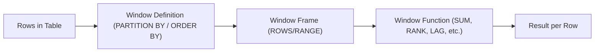
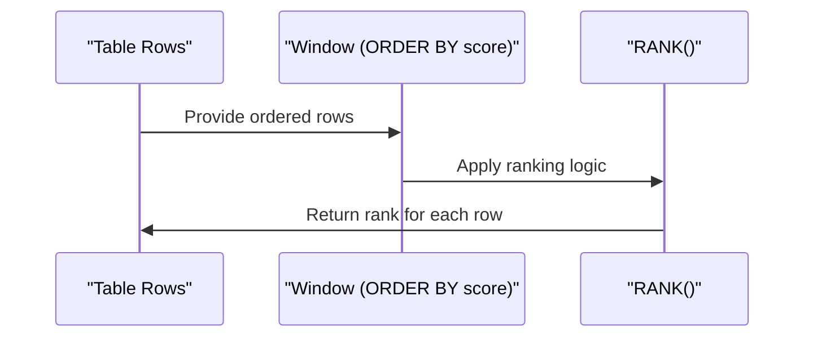

---

# 📘 SQL Window Functions — Cheatsheet

A fast reference for analytic window functions used in SQL engines such as Databricks, Spark SQL, PostgreSQL, Snowflake, and SQL Server.

---

## 🧩 1. What Are Window Functions?

Window functions perform calculations **across a set of rows related to the current row**, without collapsing results like `GROUP BY`.

They use the `OVER()` clause:

```sql
<function>() OVER (
    PARTITION BY ...
    ORDER BY ...
    ROWS BETWEEN ... 
)
```

---

## 🪟 2. Window Function Categories

- **Ranking** → `ROW_NUMBER`, `RANK`, `DENSE_RANK`, `NTILE`
- **Aggregate** → `SUM`, `AVG`, `MIN`, `MAX`, `COUNT`
- **Value** → `LAG`, `LEAD`, `FIRST_VALUE`, `LAST_VALUE`
- **Distribution** → `PERCENT_RANK`, `CUME_DIST`

---

## 🧱 3. Basic Window Syntax

```sql
SELECT
    col,
    SUM(amount) OVER (PARTITION BY category) AS total_by_category,
    AVG(amount) OVER (ORDER BY date) AS running_avg
FROM table;
```

---

## 🏆 4. Ranking Functions

### `ROW_NUMBER()`
Unique sequential number per partition.

```sql
ROW_NUMBER() OVER (PARTITION BY category ORDER BY sales DESC)
```

### `RANK()`
Ties receive the same rank; gaps appear.

```sql
RANK() OVER (ORDER BY score DESC)
```

### `DENSE_RANK()`
Ties receive same rank; **no gaps**.

```sql
DENSE_RANK() OVER (ORDER BY score DESC)
```

### `NTILE(n)`
Splits rows into `n` buckets.

```sql
NTILE(4) OVER (ORDER BY revenue DESC)
```

---

## 📊 5. Aggregate Window Functions

### Running totals

```sql
SUM(amount) OVER (ORDER BY date)
```

### Partitioned totals

```sql
SUM(amount) OVER (PARTITION BY region)
```

### Moving average (sliding window)

```sql
AVG(amount) OVER (
    ORDER BY date
    ROWS BETWEEN 6 PRECEDING AND CURRENT ROW
)
```

---

## 🔁 6. Value Functions

### `LAG()` — previous row value

```sql
LAG(sales, 1) OVER (ORDER BY date) AS prev_sales
```

### `LEAD()` — next row value

```sql
LEAD(sales, 1) OVER (ORDER BY date) AS next_sales
```

### `FIRST_VALUE()` / `LAST_VALUE()`

```sql
FIRST_VALUE(price) OVER (PARTITION BY product ORDER BY date)
```

**Important:** `LAST_VALUE()` often requires a frame:

```sql
LAST_VALUE(price) OVER (
    PARTITION BY product
    ORDER BY date
    ROWS BETWEEN UNBOUNDED PRECEDING AND UNBOUNDED FOLLOWING
)
```

---

## 🧮 7. Distribution Functions

### `PERCENT_RANK()`

```sql
PERCENT_RANK() OVER (ORDER BY score)
```

### `CUME_DIST()`

```sql
CUME_DIST() OVER (ORDER BY score)
```

---

## 🪟 8. Window Frames

Default frame (varies by engine):

```sql
RANGE BETWEEN UNBOUNDED PRECEDING AND CURRENT ROW
```

Common frames:

### Entire partition

```sql
ROWS BETWEEN UNBOUNDED PRECEDING AND UNBOUNDED FOLLOWING
```

### Sliding window (e.g., last 7 rows)

```sql
ROWS BETWEEN 6 PRECEDING AND CURRENT ROW
```

### Range-based (e.g., last 7 days)

```sql
RANGE BETWEEN INTERVAL 7 DAYS PRECEDING AND CURRENT ROW
```

---

## 🧠 9. Practical Examples

### Top 3 per category

```sql
SELECT *
FROM (
    SELECT *,
           ROW_NUMBER() OVER (PARTITION BY category ORDER BY sales DESC) AS rn
    FROM products
)
WHERE rn <= 3;
```

### Month-over-month difference

```sql
SELECT
    month,
    revenue,
    revenue - LAG(revenue) OVER (ORDER BY month) AS mom_diff
FROM sales;
```

### Running cumulative revenue per region

```sql
SUM(revenue) OVER (
    PARTITION BY region
    ORDER BY date
) AS running_revenue
```

---

## 🧭 10. Window Function Concept



---

## 🧭 11. Ranking Example



---

