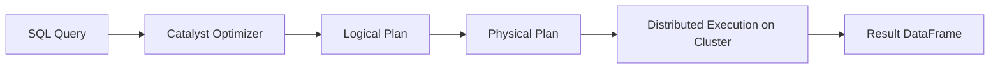
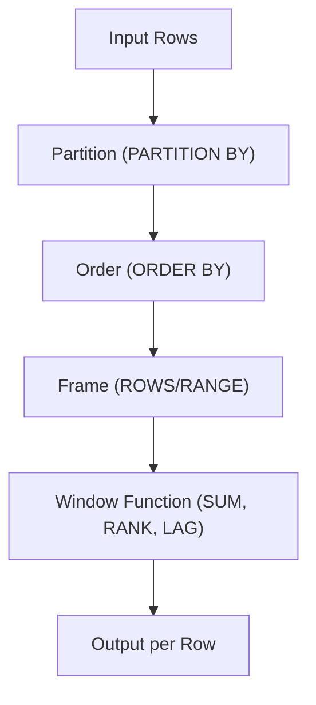

---

# 📘 Spark SQL — Cheatsheet

A fast reference for Spark SQL (Databricks / PySpark SQL), including syntax, functions, joins, aggregations, and window functions.

---

## 🧩 1. Core Spark SQL Concepts

- Spark SQL = SQL engine on top of Spark  
- Works with **DataFrames**, **temporary views**, **Delta tables**  
- SQL queries run distributed across the cluster  
- Supports ANSI SQL + Spark extensions  

---

## 🗂️ 2. Creating and Using Tables

### Create table (managed)
```sql
CREATE TABLE sales (
  id INT,
  amount DOUBLE,
  date DATE
);
```

### Create table (Delta)
```sql
CREATE TABLE sales_delta
USING DELTA
AS SELECT * FROM sales;
```

### Read table
```sql
SELECT * FROM sales_delta;
```

### Create temp view
```python
df.createOrReplaceTempView("sales_view")
```

---

## 🔄 3. Inserts, Updates, Deletes (Delta)

### Insert
```sql
INSERT INTO sales_delta VALUES (1, 100.0, '2024-01-01');
```

### Update
```sql
UPDATE sales_delta
SET amount = amount * 1.1
WHERE id = 1;
```

### Delete
```sql
DELETE FROM sales_delta WHERE amount < 0;
```

---

## 🔗 4. Joins

### Inner Join
```sql
SELECT *
FROM a
JOIN b ON a.id = b.id;
```

### Left Join
```sql
SELECT *
FROM a
LEFT JOIN b ON a.id = b.id;
```

### Full Outer Join
```sql
SELECT *
FROM a
FULL OUTER JOIN b ON a.id = b.id;
```

### Cross Join
```sql
SELECT *
FROM a CROSS JOIN b;
```

---

## 📊 5. Aggregations

### Basic aggregations
```sql
SELECT
  category,
  SUM(amount) AS total,
  AVG(amount) AS avg_amount,
  COUNT(*) AS cnt
FROM sales
GROUP BY category;
```

### HAVING
```sql
SELECT category, SUM(amount) AS total
FROM sales
GROUP BY category
HAVING total > 1000;
```

---

## 🧮 6. Window Functions (Spark SQL)

### Syntax
```sql
<function>() OVER (
  PARTITION BY ...
  ORDER BY ...
  ROWS BETWEEN ... 
)
```

### Ranking
```sql
ROW_NUMBER() OVER (PARTITION BY region ORDER BY revenue DESC)
```

### Running total
```sql
SUM(amount) OVER (ORDER BY date)
```

### Moving average (7 rows)
```sql
AVG(amount) OVER (
  ORDER BY date
  ROWS BETWEEN 6 PRECEDING AND CURRENT ROW
)
```

### LAG / LEAD
```sql
LAG(amount, 1) OVER (ORDER BY date)
LEAD(amount, 1) OVER (ORDER BY date)
```

---

## 🗓️ 7. Date & Time Functions

### Extract parts
```sql
SELECT
  year(date) AS yr,
  month(date) AS mo,
  day(date) AS dy
FROM sales;
```

### Date arithmetic
```sql
SELECT date_add(date, 7) AS next_week FROM sales;
```

### Current timestamp
```sql
SELECT current_timestamp();
```

---

## 🧼 8. Null Handling

### Replace nulls
```sql
SELECT COALESCE(amount, 0) FROM sales;
```

### Null-safe equality
```sql
SELECT * FROM a JOIN b ON a.id <=> b.id;
```

### Filter nulls
```sql
SELECT * FROM sales WHERE amount IS NOT NULL;
```

---

## 🧪 9. DataFrame API Equivalents (Quick Map)

| SQL | DataFrame API |
|-----|----------------|
| `SELECT * FROM t` | `df.select("*")` |
| `WHERE x > 10` | `df.filter(col("x") > 10)` |
| `GROUP BY` | `df.groupBy("col")` |
| `ORDER BY` | `df.orderBy("col")` |
| `JOIN` | `df.join(df2, "id")` |
| `WITH COLUMN` | `df.withColumn("new", expr("..."))` |

---

## ⚡ 10. Performance Tips (Spark SQL)

### Use Delta Lake
```sql
CREATE TABLE t USING DELTA AS SELECT ...
```

### Use Z-Ordering (Databricks)
```sql
OPTIMIZE sales_delta ZORDER BY (customer_id);
```

### Cache when reused
```sql
CACHE TABLE sales_delta;
```

### Avoid SELECT *
Specify columns to reduce shuffle.

---

## 🧭 11. Mermaid Diagram — Spark SQL Execution Flow



---

## 🧭 12. Mermaid Diagram — Window Function Flow



---

