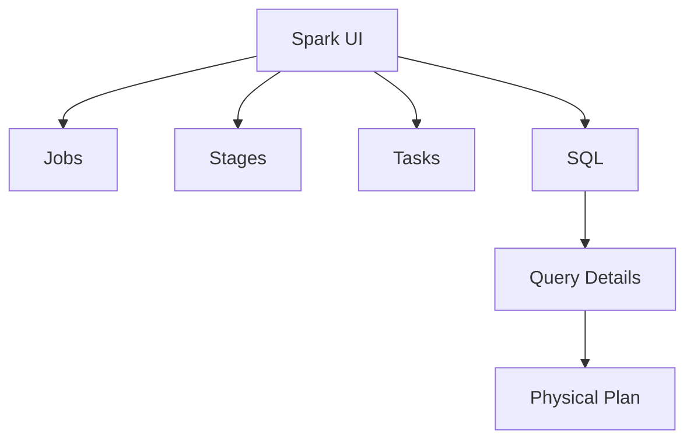
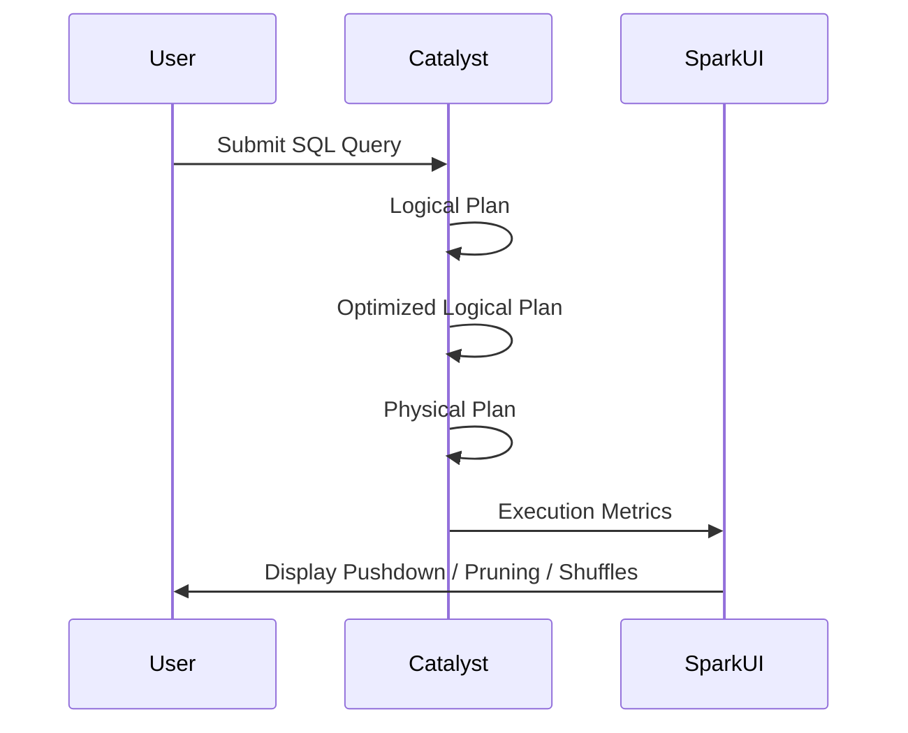
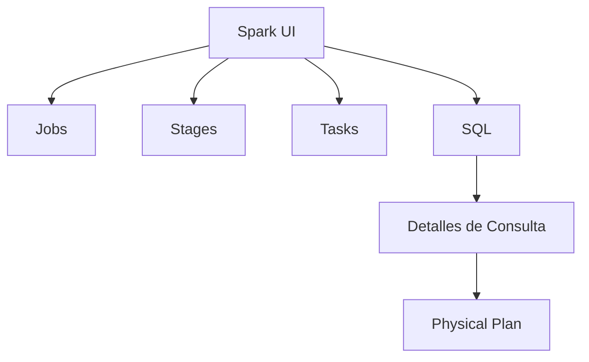
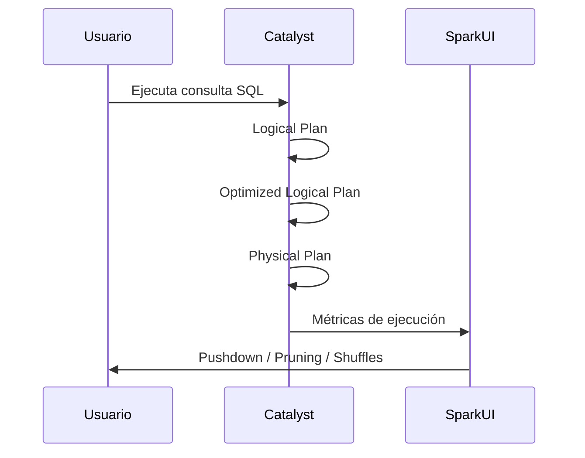

---

# 📄 **Spark UI & Query Optimization — Bilingual Guide**  

---

# ------------------------------------------------------------
# 🇺🇸 **ENGLISH VERSION**
# ------------------------------------------------------------

# **Spark UI & Query Optimization Guide**

This document explains how to use the **Spark UI** to diagnose performance issues, understand query execution, and verify optimizations such as **predicate push‑down**, **partition pruning**, **broadcast joins**, and **shuffle behavior**.

> ⚠ **Note:** Databricks Free Edition does *not* expose Spark UI.  
> These concepts apply to paid Databricks workspaces or local Spark (`http://localhost:4040`).

---

# **1. What is Spark UI?**

Spark UI is the primary interface for inspecting:

- Job execution  
- Stages and tasks  
- DAG visualization  
- SQL query plans  
- Shuffle and spill metrics  
- Predicate push‑down  
- Partition pruning  
- Broadcast usage  

It is essential for performance debugging.

---

# **2. Where to Find Spark UI (Paid Databricks)**

### From a Notebook:
```
Notebook cell → View Details → Spark UI
```

### From a Job:
```
Jobs → Run → Spark UI
```

### From SQL Query History:
```
SQL → Query History → Spark UI
```

---

# **3. Spark UI Structure**



---

# **4. SQL Tab — The Most Important Section**

The **SQL** tab shows:

- Logical plan  
- Optimized logical plan  
- Physical plan  
- Metrics per operator  
- Scan details (where push‑down appears)  

This is where you verify **predicate push‑down**.

---

# **5. How to Verify Predicate Push‑Down**

Go to:

```
Spark UI → SQL → Query Details → Physical Plan
```

Look for the **Scan** node:

Example:

```
Scan parquet default.sales
  PushedFilters: [EqualTo(country, USA)]
  PartitionFilters: [IsNotNull(date)]
  DataFilters: []
```

### Interpretation:

- **PushedFilters** → filters applied *before* reading data  
- **PartitionFilters** → partition pruning  
- **DataFilters** → filters applied *after* reading data  

### Predicate push‑down is working if:

```
PushedFilters: [...]
```

is **not empty**.

---

# **6. Common Optimization Indicators**

### ✔ Predicate Push‑Down  
```
PushedFilters: [...]
```

### ✔ Partition Pruning  
```
PartitionFilters: [...]
```

### ✔ Broadcast Join  
```
BroadcastHashJoin
```

### ✔ Shuffle  
```
Exchange hashpartitioning(...)
```

### ✔ Spill  
```
Spill occurred
```

### ✔ Whole‑Stage Codegen  
```
*(1) Project ...
```

---

# **7. Example Physical Plan (Annotated)**

```text
*(1) Project [id, amount]
+- *(1) Filter (country#12 = USA)
   +- *(1) FileScan parquet default.sales
         PushedFilters: [EqualTo(country,USA)]
         PartitionFilters: [IsNotNull(date)]
         ReadSchema: struct<id:int, country:string, amount:double>
```

---

# **8. Mermaid Diagram — Query Flow**



---

# **9. Summary (English)**

- Spark UI is essential for performance debugging  
- Predicate push‑down is visible in the **Scan** node  
- Look for `PushedFilters`, `PartitionFilters`, `DataFilters`  
- Databricks Free Edition does not expose Spark UI  
- Paid workspaces and local Spark do  

---

# ------------------------------------------------------------
# 🇲🇽 **VERSIÓN EN ESPAÑOL**
# ------------------------------------------------------------

# **Guía de Spark UI y Optimización de Consultas**

Este documento explica cómo usar la **Spark UI** para diagnosticar problemas de rendimiento, entender la ejecución de consultas y verificar optimizaciones como **predicate push‑down**, **partition pruning**, **broadcast joins** y **shuffles**.

> ⚠ **Nota:** Databricks Free Edition *no* expone Spark UI.  
> Estos conceptos aplican a workspaces pagados o Spark local (`http://localhost:4040`).

---

# **1. ¿Qué es Spark UI?**

Spark UI es la interfaz principal para inspeccionar:

- Ejecución de jobs  
- Stages y tasks  
- DAG  
- Planes SQL  
- Métricas de shuffle y spill  
- Predicate push‑down  
- Partition pruning  
- Broadcast joins  

Es esencial para depurar rendimiento.

---

# **2. ¿Dónde encontrar Spark UI (Databricks pagado)?**

### Desde un Notebook:
```
Notebook → View Details → Spark UI
```

### Desde un Job:
```
Jobs → Run → Spark UI
```

### Desde SQL Query History:
```
SQL → Query History → Spark UI
```

---

# **3. Estructura de Spark UI**



---

# **4. La pestaña SQL — La más importante**

La pestaña **SQL** muestra:

- Logical plan  
- Optimized logical plan  
- Physical plan  
- Métricas por operador  
- Detalles del Scan (donde aparece push‑down)  

Aquí verificas **predicate push‑down**.

---

# **5. Cómo verificar Predicate Push‑Down**

Ruta:

```
Spark UI → SQL → Detalles → Physical Plan
```

Busca el nodo **Scan**:

Ejemplo:

```
Scan parquet default.sales
  PushedFilters: [EqualTo(country, USA)]
  PartitionFilters: [IsNotNull(date)]
  DataFilters: []
```

### Interpretación:

- **PushedFilters** → filtros aplicados *antes* de leer datos  
- **PartitionFilters** → pruning de particiones  
- **DataFilters** → filtros aplicados *después* de leer datos  

### Predicate push‑down funciona si:

```
PushedFilters: [...]
```

NO está vacío.

---

# **6. Indicadores comunes de optimización**

### ✔ Predicate Push‑Down  
```
PushedFilters: [...]
```

### ✔ Partition Pruning  
```
PartitionFilters: [...]
```

### ✔ Broadcast Join  
```
BroadcastHashJoin
```

### ✔ Shuffle  
```
Exchange hashpartitioning(...)
```

### ✔ Spill  
```
Spill occurred
```

### ✔ Whole‑Stage Codegen  
```
*(1) Project ...
```

---

# **7. Ejemplo de Physical Plan (Anotado)**

```text
*(1) Project [id, amount]
+- *(1) Filter (country#12 = USA)
   +- *(1) FileScan parquet default.sales
         PushedFilters: [EqualTo(country,USA)]
         PartitionFilters: [IsNotNull(date)]
         ReadSchema: struct<id:int, country:string, amount:double>
```

---

# **8. Diagrama Mermaid — Flujo de ejecución**



---

# **9. Resumen (Español)**

- Spark UI es clave para depurar rendimiento  
- Predicate push‑down se ve en el nodo **Scan**  
- Busca `PushedFilters`, `PartitionFilters`, `DataFilters`  
- Free Edition no tiene Spark UI  
- Workspaces pagados y Spark local sí  

---

