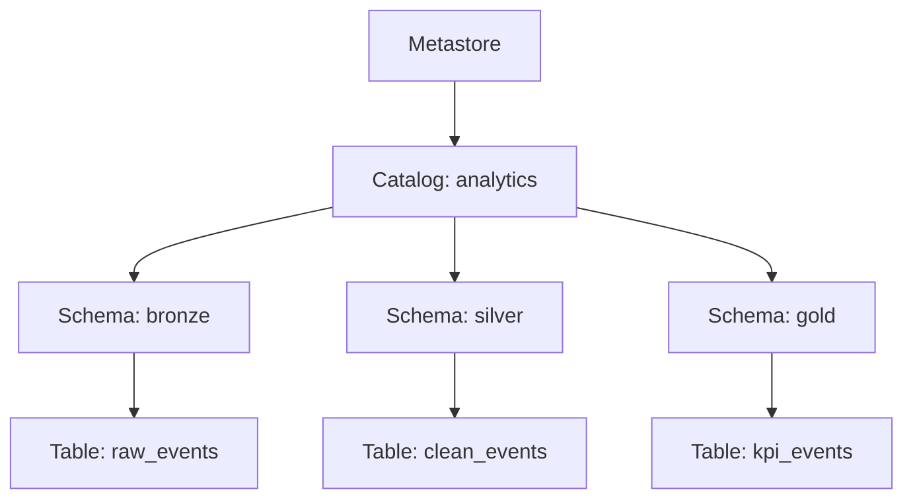
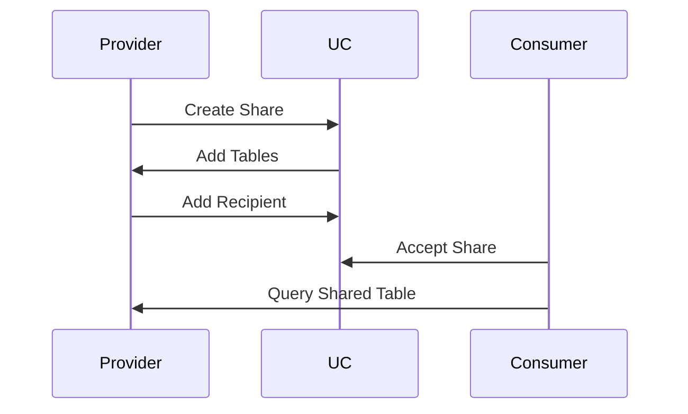
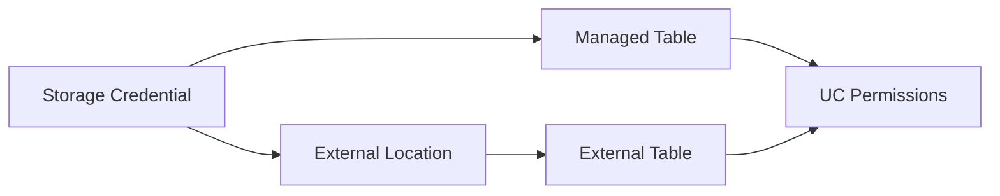

---

# 📄 **Unity Catalog, Delta Sharing & Storage Governance — Bilingual Guide**  

---

# ------------------------------------------------------------
# 🇺🇸 **ENGLISH VERSION**
# ------------------------------------------------------------

# # **Unity Catalog (UC)**

---

## ## **1. What is Unity Catalog?**

Unity Catalog is Databricks’ **centralized governance layer** for:

- Data (tables, views, volumes)  
- AI assets (models, functions)  
- Permissions  
- Lineage  
- Audit logging  
- Secure data sharing  

It unifies governance across **all workspaces**, **all clouds**, and **all personas**.

---

## ## **2. UC Object Hierarchy**

```
Metastore
 └── Catalog
      └── Schema
           └── Table / View / Volume / Function / Model
```

### Explanation  
- **Metastore**: top-level governance boundary  
- **Catalog**: logical grouping (e.g., `main`, `analytics`, `finance`)  
- **Schema**: similar to a database  
- **Table**: managed or external  

---

## ## **3. UC Permissions Model**

UC uses **ANSI SQL GRANTs**:

```sql
GRANT SELECT ON TABLE analytics.sales TO `finance-team`;
GRANT MODIFY ON SCHEMA analytics TO `data-engineers`;
GRANT USAGE ON CATALOG analytics TO `all-users`;
```

---

## ## **4. UC Lineage**

Unity Catalog automatically tracks:

- Data sources  
- Transformations  
- Downstream consumers  

This enables full auditability and impact analysis.

---

## ## **5. UC Diagram**



---

# # **Delta Sharing**

---

## ## **1. What is Delta Sharing?**

Delta Sharing is an **open protocol** for secure data sharing **without copying data**.

It allows:

- Cross-cloud sharing  
- Cross-organization sharing  
- Zero-copy access  
- Full governance (when using UC mode)  

---

## ## **2. Two Modes of Delta Sharing**

| Mode | Description | Tokenless? | UC Governance? |
|------|-------------|------------|----------------|
| **Open Sharing** | REST API, any client | ❌ No | ❌ No |
| **Databricks-to-Databricks** | Native sharing between workspaces | ✔ Yes | ✔ Yes |

---

## ## **3. Why Databricks-to-Databricks Sharing?**

- No token management  
- Full Unity Catalog governance  
- Cross-cloud interoperability  
- Full audit logging  
- Zero-copy sharing  

This is the recommended method for enterprise-grade sharing.

---

## ## **4. Delta Sharing Diagram**



---

# # **Storage Governance**

---

## ## **1. What is Storage Governance?**

Storage governance in Databricks is enforced through Unity Catalog using:

- **Storage Credentials**  
- **External Locations**  
- **Managed Tables**  
- **Access Policies**  

---

## ## **2. Storage Credentials**

Example:

```sql
CREATE STORAGE CREDENTIAL my_cred
WITH AZURE_MANAGED_IDENTITY '...';
```

---

## ## **3. External Locations**

```sql
CREATE EXTERNAL LOCATION raw_events_loc
URL 'abfss://raw@mycontainer.dfs.core.windows.net/'
WITH (STORAGE CREDENTIAL my_cred);
```

---

## ## **4. Managed vs External Tables**

| Type | Storage | Managed by UC | Best for |
|------|---------|----------------|----------|
| **Managed** | UC-owned | ✔ Yes | Internal pipelines |
| **External** | Your bucket | ✔ Yes | Cross-team / cross-cloud |

---

## ## **5. Storage Governance Diagram**



---

# # **English Summary**

- **Unity Catalog** = governance, lineage, permissions, audit  
- **Delta Sharing** = secure, tokenless, cross-cloud sharing  
- **Storage Governance** = secure access to cloud storage via UC  

---

# ------------------------------------------------------------
# 🇲🇽 **VERSIÓN EN ESPAÑOL**
# ------------------------------------------------------------

# # **Unity Catalog (UC)**

---

## ## **1. ¿Qué es Unity Catalog?**

Unity Catalog es la **capa centralizada de gobernanza** de Databricks para:

- Datos (tablas, vistas, volúmenes)  
- Activos de IA (modelos, funciones)  
- Permisos  
- Lineage  
- Auditoría  
- Compartición segura de datos  

Unifica la gobernanza entre **todos los workspaces**, **todas las nubes** y **todos los usuarios**.

---

## ## **2. Jerarquía de objetos en UC**

```
Metastore
 └── Catalog
      └── Schema
           └── Table / View / Volume / Function / Model
```

### Explicación  
- **Metastore**: límite superior de gobernanza  
- **Catalog**: agrupación lógica  
- **Schema**: equivalente a una base de datos  
- **Table**: administrada o externa  

---

## ## **3. Modelo de permisos en UC**

UC usa **GRANTs ANSI SQL**:

```sql
GRANT SELECT ON TABLE analytics.sales TO `finance-team`;
GRANT MODIFY ON SCHEMA analytics TO `data-engineers`;
GRANT USAGE ON CATALOG analytics TO `all-users`;
```

---

## ## **4. Lineage en UC**

UC rastrea automáticamente:

- Orígenes de datos  
- Transformaciones  
- Consumidores downstream  

Permite auditoría completa y análisis de impacto.

---

## ## **5. Diagrama de UC**


---

# # **Delta Sharing**

---

## ## **1. ¿Qué es Delta Sharing?**

Delta Sharing es un **protocolo abierto** para compartir datos **sin copiarlos**.

Permite:

- Compartición entre nubes  
- Compartición entre organizaciones  
- Acceso zero-copy  
- Gobernanza completa (modo UC)  

---

## ## **2. Dos modos de Delta Sharing**

| Modo | Descripción | ¿Sin tokens? | ¿Gobernanza UC? |
|------|-------------|--------------|------------------|
| **Open Sharing** | REST API, cualquier cliente | ❌ No | ❌ No |
| **Databricks-to-Databricks** | Compartición nativa entre workspaces | ✔ Sí | ✔ Sí |

---

## ## **3. ¿Por qué Databricks-to-Databricks Sharing?**

- No requiere tokens  
- Gobernanza completa con UC  
- Interoperabilidad entre nubes  
- Auditoría completa  
- Zero-copy  

Es el método recomendado para entornos empresariales.

---

## ## **4. Diagrama de Delta Sharing**


---

# # **Gobernanza de Storage**

---

## ## **1. ¿Qué es la gobernanza de storage?**

La gobernanza de storage en Databricks se implementa mediante Unity Catalog usando:

- **Credenciales de storage**  
- **Ubicaciones externas**  
- **Tablas administradas**  
- **Políticas de acceso**  

---

## ## **2. Credenciales de Storage**

```sql
CREATE STORAGE CREDENTIAL my_cred
WITH AZURE_MANAGED_IDENTITY '...';
```

---

## ## **3. Ubicaciones Externas**

```sql
CREATE EXTERNAL LOCATION raw_events_loc
URL 'abfss://raw@mycontainer.dfs.core.windows.net/'
WITH (STORAGE CREDENTIAL my_cred);
```

---

## ## **4. Tablas Managed vs External**

| Tipo | Storage | Administrado por UC | Ideal para |
|------|---------|----------------------|------------|
| **Managed** | UC | ✔ Sí | Pipelines internos |
| **External** | Tu bucket | ✔ Sí | Equipos externos / cross-cloud |

---

## ## **5. Diagrama de Storage Governance**


---

# # **Resumen en Español**

- **Unity Catalog** = gobernanza, lineage, permisos, auditoría  
- **Delta Sharing** = compartición segura, sin tokens, entre nubes  
- **Storage Governance** = control seguro del storage mediante UC  

---
