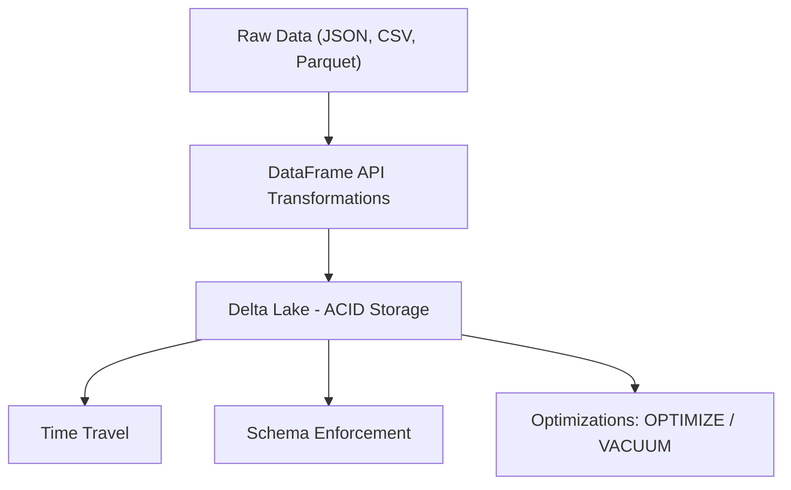
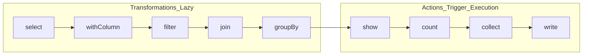
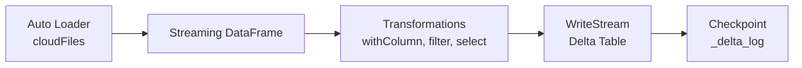
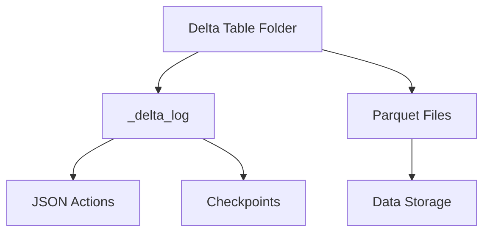
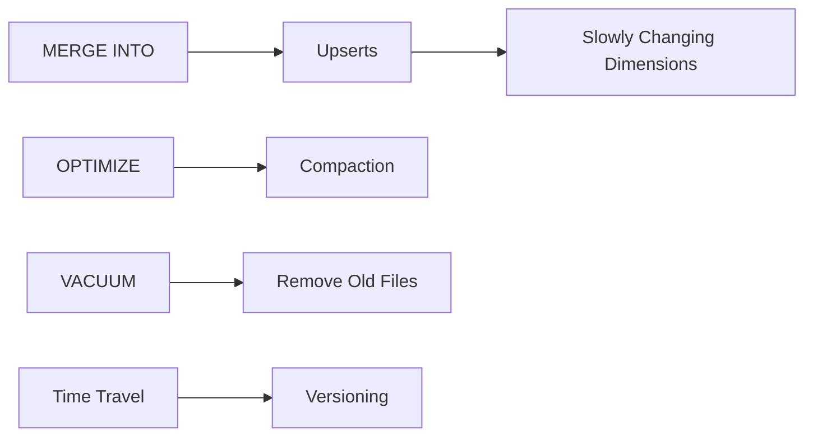

---

# 📘 DataFrame API & Delta Lake — Full Cheatsheet (English + Spanish)

This document combines a complete textual reference with visual Mermaid diagrams, covering DataFrame API, Delta Lake, Structured Streaming, Auto Loader, and their relationships within the Databricks ecosystem.

---

# 🇺🇸 **ENGLISH VERSION**

# 🧩 1. DataFrame API — Core Concepts

## ✔ What is a DataFrame?
- A distributed table with named columns.
- Immutable: every transformation produces a new DataFrame.
- Lazy evaluation: nothing executes until an action occurs.

## ✔ Lazy Evaluation
Spark builds a **logical plan** and executes only when an action is triggered (`show`, `count`, `write`, etc.).

---

# 🛠 2. Transformations (lazy)

```python
df.select("col1", "col2")
df.withColumn("new_col", expr("col1 * 2"))
df.filter(col("age") > 18)
df.drop("col")
df.groupBy("country").agg(count("*"))
df.join(df2, "id", "inner")
df.orderBy(col("timestamp").desc())
```

---

# ⚡ 3. Actions (trigger execution)

```python
df.show()
df.count()
df.collect()
df.write.format("delta").save("/path")
```

---

# 🧮 4. Common Functions (pyspark.sql.functions)

```python
col("name")
expr("salary * 1.1")
lit(5)
current_timestamp()
lower(col("name"))
concat(col("a"), col("b"))
count("*")
sum("amount")
```

---

# 🔄 5. Structured Streaming + DataFrame API

Streaming supports most deterministic DataFrame transformations.

```python
df_stream.withColumn("processed_at", current_timestamp())
df_stream.filter(col("id") > 0)
df_stream.select("id", "value")
```

---

# 🏛 6. Delta Lake — Core Concepts

- ACID transactions  
- Schema enforcement  
- Schema evolution  
- Time Travel  
- OPTIMIZE (file compaction)  
- VACUUM (file cleanup)  

---

# 📂 7. Delta Lake Architecture

- Parquet files  
- `_delta_log` folder with JSON + checkpoints  
- Versioning  
- Transaction metadata  

---

# 🧱 8. Creating & Writing Delta Tables

```python
df.write.format("delta").save("/path")
df.write.saveAsTable("catalog.schema.table")
df.write.format("delta").mode("append").save("/path")
```

---

# 🔧 9. Reading Delta Tables

```python
spark.read.format("delta").load("/path")
spark.table("catalog.schema.table")
```

---

# 🔄 10. Schema Enforcement & Evolution

```python
df.write.format("delta").save("/path")  # enforcement
df.write.option("mergeSchema", "true").mode("append").save("/path")  # evolution
```

---

# 🕒 11. Time Travel

```python
spark.read.format("delta").option("versionAsOf", 3).load("/path")
spark.read.format("delta").option("timestampAsOf", "2024-01-01").load("/path")
```

---

# 🔀 12. MERGE INTO (Upserts)

```sql
MERGE INTO target t
USING source s
ON t.id = s.id
WHEN MATCHED THEN UPDATE SET *
WHEN NOT MATCHED THEN INSERT *
```

---

# 🚀 13. OPTIMIZE (Compaction)

```sql
OPTIMIZE catalog.schema.table
```

---

# 🧹 14. VACUUM (Cleanup)

```sql
VACUUM catalog.schema.table RETAIN 168 HOURS;
```

---

# 🔗 15. DataFrame API ↔ Delta Lake Relationship

| DataFrame API | Delta Lake |
|---------------|------------|
| Transformations | ACID writes |
| Lazy evaluation | Versioning |
| Actions | Time Travel |
| Read/write | Schema enforcement |
| Streaming | Auto Loader + Delta |

---

# 🎯 16. Certification Key Points

- DataFrames are **immutable** and **lazy**  
- Transformations ≠ actions  
- Delta Lake adds **ACID + Time Travel**  
- `mergeSchema` enables evolution  
- `OPTIMIZE` compacts small files  
- `VACUUM` removes obsolete files  
- Streaming + Delta = recommended pattern  
- Auto Loader + Delta = incremental ingestion  

---

# 🎨 17. Visual Cheatsheet (Mermaid)

## 🔷 General Architecture



---

## 🔷 Transformations vs Actions



---

## 🔷 Streaming + DataFrame API



---

## 🔷 Delta Lake Internals



---

## 🔷 Delta Operations



---

# 🇲🇽 **VERSIÓN EN ESPAÑOL**

# 🧩 1. DataFrame API — Conceptos Fundamentales

## ✔ ¿Qué es un DataFrame?
- Una tabla distribuida con columnas nombradas.
- Inmutable: cada transformación produce un nuevo DataFrame.
- Lazy evaluation: Spark no ejecuta nada hasta que ocurre una acción.

## ✔ Lazy Evaluation
Spark construye un **plan lógico** y solo ejecuta cuando ocurre una acción (`show`, `count`, `write`, etc.).

---

# 🛠 2. Transformaciones (lazy)

```python
df.select("col1", "col2")
df.withColumn("new_col", expr("col1 * 2"))
df.filter(col("age") > 18)
df.drop("col")
df.groupBy("country").agg(count("*"))
df.join(df2, "id", "inner")
df.orderBy(col("timestamp").desc())
```

---

# ⚡ 3. Acciones (ejecutan el plan)

```python
df.show()
df.count()
df.collect()
df.write.format("delta").save("/path")
```

---

# 🧮 4. Funciones comunes

```python
col("name")
expr("salary * 1.1")
lit(5)
current_timestamp()
lower(col("name"))
concat(col("a"), col("b"))
count("*")
sum("amount")
```

---

# 🔄 5. Structured Streaming + DataFrame API

```python
df_stream.withColumn("processed_at", current_timestamp())
df_stream.filter(col("id") > 0)
df_stream.select("id", "value")
```

---

# 🏛 6. Delta Lake — Conceptos Clave

- Transacciones ACID  
- Schema enforcement  
- Schema evolution  
- Time Travel  
- OPTIMIZE (compactación)  
- VACUUM (limpieza)  

---

# 📂 7. Arquitectura Delta Lake

- Archivos Parquet  
- Carpeta `_delta_log`  
- Versionado  
- Metadatos transaccionales  

---

# 🧱 8. Crear y escribir tablas Delta

```python
df.write.format("delta").save("/path")
df.write.saveAsTable("catalog.schema.table")
df.write.format("delta").mode("append").save("/path")
```

---

# 🔧 9. Lectura de tablas Delta

```python
spark.read.format("delta").load("/path")
spark.table("catalog.schema.table")
```

---

# 🔄 10. Schema Enforcement & Evolution

```python
df.write.format("delta").save("/path")  # enforcement
df.write.option("mergeSchema", "true").mode("append").save("/path")  # evolution
```

---

# 🕒 11. Time Travel

```python
spark.read.format("delta").option("versionAsOf", 3).load("/path")
spark.read.format("delta").option("timestampAsOf", "2024-01-01").load("/path")
```

---

# 🔀 12. MERGE INTO (Upserts)

```sql
MERGE INTO target t
USING source s
ON t.id = s.id
WHEN MATCHED THEN UPDATE SET *
WHEN NOT MATCHED THEN INSERT *
```

---

# 🚀 13. OPTIMIZE

```sql
OPTIMIZE catalog.schema.table
```

---

# 🧹 14. VACUUM

```sql
VACUUM catalog.schema.table RETAIN 168 HOURS;
```

---

# 🔗 15. Relación DataFrame API ↔ Delta Lake

| DataFrame API | Delta Lake |
|---------------|------------|
| Transformaciones | Escritura ACID |
| Lazy evaluation | Versionado |
| Acciones | Time Travel |
| Lectura/escritura | Schema enforcement |
| Streaming | Auto Loader + Delta |

---

# 🎯 16. Puntos clave para certificación

- DataFrames son **inmutables** y **lazy**  
- Transformaciones ≠ acciones  
- Delta agrega **ACID + Time Travel**  
- `mergeSchema` permite evolución  
- `OPTIMIZE` compacta archivos  
- `VACUUM` limpia archivos  
- Streaming + Delta = patrón recomendado  
- Auto Loader + Delta = ingestión incremental  

---

# 🎨 17. Visual (Mermaid)

*(Los mismos diagramas que en la versión en inglés, para consistencia.)*

---
