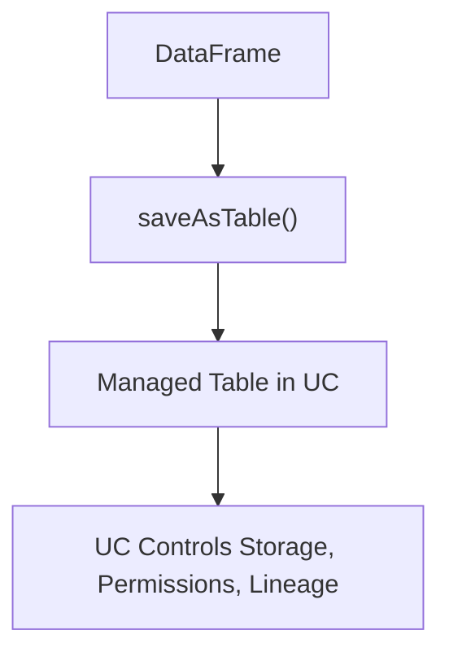
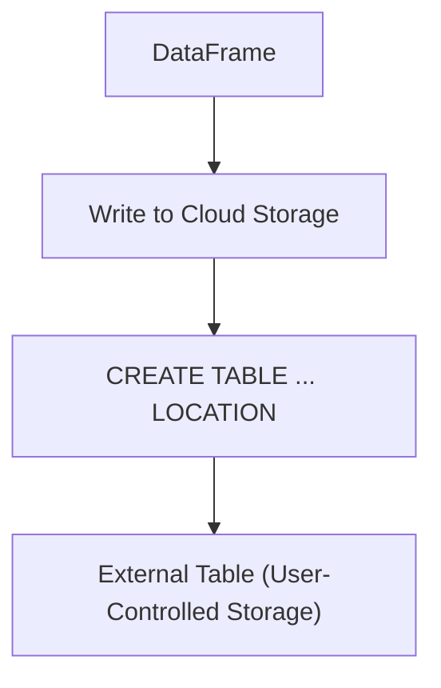
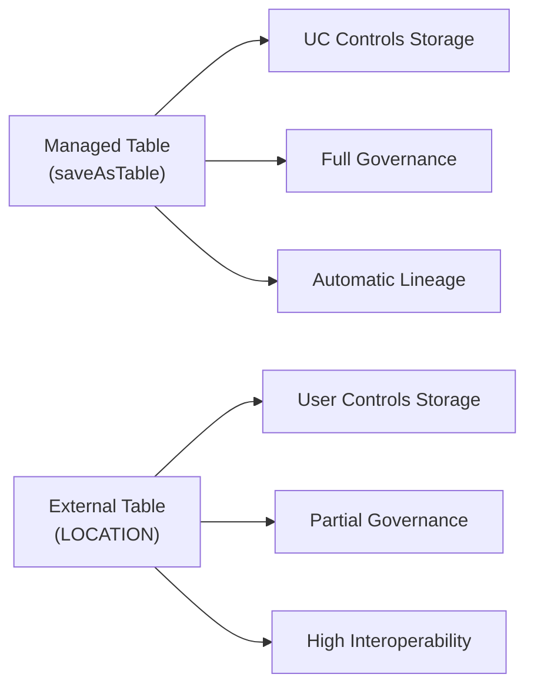
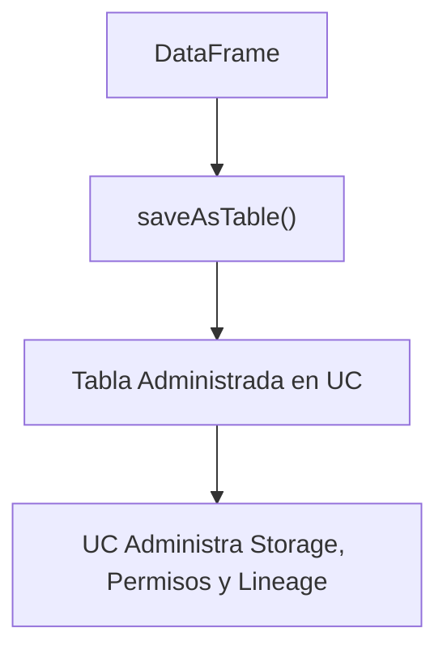
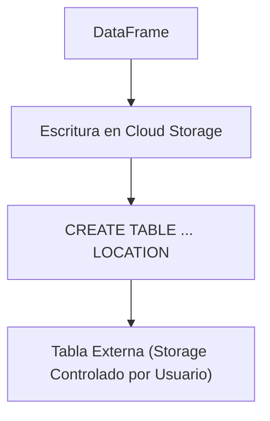
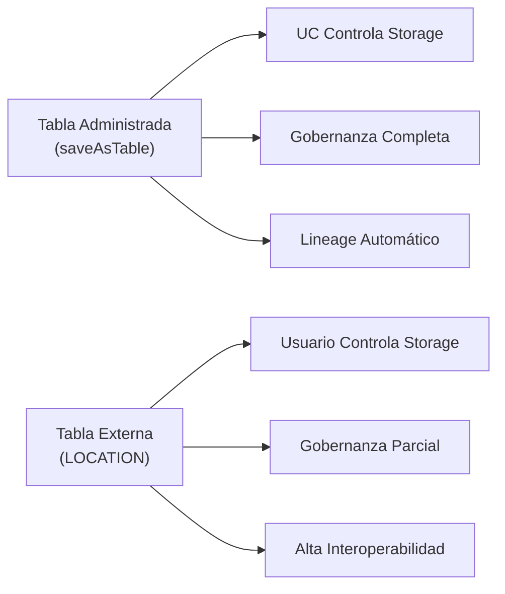

# 🏛️ Delta Lake & Unity Catalog — Managed vs External Tables  


This document explains the difference between **managed tables** (`saveAsTable`) and **external tables** (`CREATE TABLE ... LOCATION`) in Databricks Enterprise.  

---

# 🇺🇸 ENGLISH VERSION

# 1. Overview

In Databricks Enterprise, you can create Delta tables in two main ways:

- **Managed tables** → created with `saveAsTable()`
- **External tables** → created with `CREATE TABLE ... LOCATION`

Both are valid, but they serve different architectural purposes.

---

# 2. Managed Tables (`saveAsTable`)

## ✔ What they are  
Tables fully managed by Unity Catalog.  
UC controls:

- Storage location  
- Permissions  
- Lineage  
- Governance  
- Lifecycle  

## ✔ How to create one

```python
df.write.format("delta").saveAsTable("catalog.schema.table")
```

## ✔ When to use  
- Internal Lakehouse tables  
- Pipelines fully inside Databricks  
- When you want UC to manage storage  
- When you want lineage, permissions, and governance  

## ❌ When NOT to use  
- When you need to control the physical storage path  
- When sharing data with external systems  

---

# 3. External Tables (`CREATE TABLE ... LOCATION`)

## ✔ What they are  
Tables where **you control the storage path** (S3, ADLS, GCS).  
UC only stores metadata.

## ✔ How to create one

```sql
CREATE TABLE catalog.schema.table
USING DELTA
LOCATION 's3://bucket/path'
```

## ✔ When to use  
- BYO-storage (Bring Your Own Storage)  
- Interoperability with other engines (Athena, Trino, Snowflake, BigQuery)  
- Sharing data across platforms  
- When you need full control of the folder  

## ❌ When NOT to use  
- When you want UC to manage everything  
- When you want lineage and governance automatically  

---

# 4. Comparison Table

| Feature | Managed Table (`saveAsTable`) | External Table (`LOCATION`) |
|--------|-------------------------------|------------------------------|
| Storage controlled by | Unity Catalog | You |
| Governance | Full | Partial |
| Lineage | Automatic | Limited |
| Interoperability | Lower | High |
| Ideal for | Internal pipelines | Cross-platform sharing |

---

# 5. Diagrams

## 🔷 Managed Table Flow



---

## 🔷 External Table Flow



---

## 🔷 Side-by-Side Comparison



---

# 🇲🇽 VERSIÓN EN ESPAÑOL

# 1. Panorama General

En Databricks Enterprise existen dos formas principales de crear tablas Delta:

- **Tablas administradas** → creadas con `saveAsTable()`
- **Tablas externas** → creadas con `CREATE TABLE ... LOCATION`

Ambas son válidas, pero sirven para propósitos distintos.

---

# 2. Tablas Administradas (`saveAsTable`)

## ✔ Qué son  
Tablas totalmente administradas por Unity Catalog.  
UC controla:

- Ubicación del almacenamiento  
- Permisos  
- Lineage  
- Gobernanza  
- Ciclo de vida  

## ✔ Cómo se crean

```python
df.write.format("delta").saveAsTable("catalog.schema.table")
```

## ✔ Cuándo usarlas  
- Tablas internas del Lakehouse  
- Pipelines dentro de Databricks  
- Cuando quieres que UC administre el storage  
- Cuando necesitas lineage y permisos centralizados  

## ❌ Cuándo NO usarlas  
- Cuando necesitas controlar la ruta física  
- Cuando compartes datos con sistemas externos  

---

# 3. Tablas Externas (`CREATE TABLE ... LOCATION`)

## ✔ Qué son  
Tablas donde **tú controlas la ruta física** (S3, ADLS, GCS).  
UC solo registra metadata.

## ✔ Cómo se crean

```sql
CREATE TABLE catalog.schema.table
USING DELTA
LOCATION 's3://bucket/path'
```

## ✔ Cuándo usarlas  
- BYO-storage  
- Interoperabilidad con otros motores  
- Compartir datos entre plataformas  
- Control total del folder Delta  

## ❌ Cuándo NO usarlas  
- Cuando quieres gobernanza completa  
- Cuando quieres lineage automático  

---

# 4. Tabla Comparativa

| Característica | Tabla Administrada | Tabla Externa |
|----------------|--------------------|----------------|
| Control del storage | Unity Catalog | Usuario |
| Gobernanza | Completa | Parcial |
| Lineage | Automático | Limitado |
| Interoperabilidad | Baja | Alta |
| Ideal para | Pipelines internos | Integración externa |

---

# 5. Diagramas

## 🔷 Flujo de Tabla Administrada



---

## 🔷 Flujo de Tabla Externa



---

## 🔷 Comparación Lado a Lado



---

# 🏁 Conclusión

- **saveAsTable()** = simplicidad, gobernanza, lineage, seguridad.  
- **LOCATION** = control total del storage, interoperabilidad, BYO-storage.  
- No es cuál es “mejor”, sino cuál se ajusta a tu arquitectura.

---
