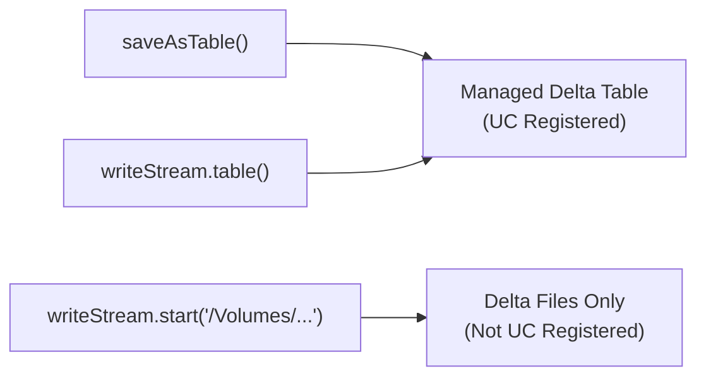
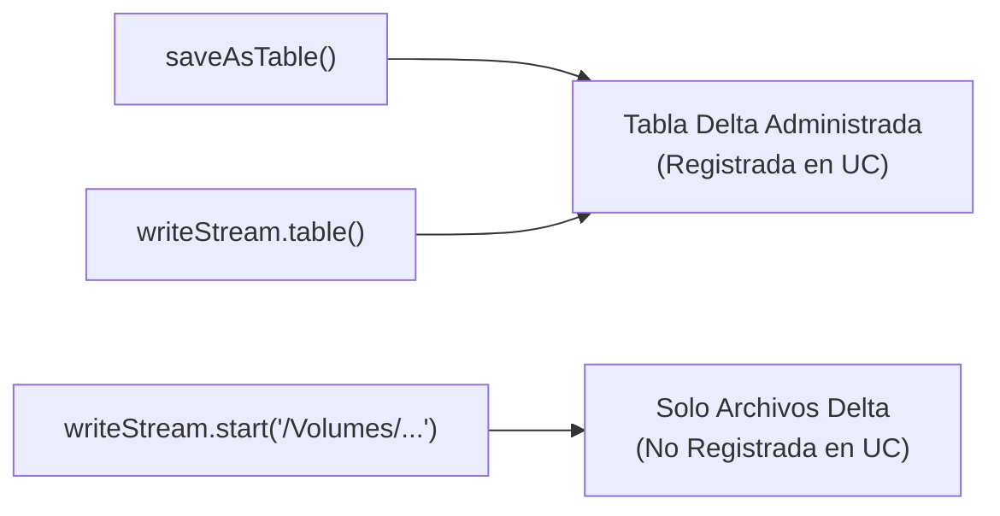

# 🗂️ `.saveAsTable()` vs `.table()` en Databricks  
## Bilingual (English + Spanish)  
## GitHub‑Safe Mermaid Diagrams

This document explains the relationship between `.saveAsTable()` and `.table()` in Databricks, especially in **Free Edition**, and how both methods create **managed Delta tables** in Unity Catalog.

English version first, Spanish version after.

---

# 🇺🇸 ENGLISH VERSION

# 1. Overview

Databricks provides two main ways to create tables programmatically:

- `.saveAsTable()` — batch write  
- `.table()` — streaming write  

Although they work differently internally, **both create a managed Delta table in Unity Catalog** when used with a fully qualified name such as:

```
workspace.default.my_table
```

This means:

- Unity Catalog controls the storage  
- The table supports OPTIMIZE, ZORDER, VACUUM, HISTORY  
- The table is discoverable via `SHOW TABLES` and `DESCRIBE DETAIL`  

---

# 2. `.saveAsTable()` — Batch Write

Example:

```python
df.write.format("delta").saveAsTable("workspace.default.my_table")
```

This method:

- Writes the data once (batch)  
- Creates a **managed Delta table**  
- Registers it in Unity Catalog  
- Allows all Delta maintenance commands  

It is the traditional way to create tables.

---

# 3. `.table()` — Streaming Write

Example:

```python
df.writeStream \
  .format("delta") \
  .table("workspace.default.streaming_demo")
```

This method:

- Creates the table if it does not exist  
- Registers it in Unity Catalog  
- Writes data continuously (streaming)  
- Produces a **managed Delta table**, same as `.saveAsTable()`  

This is the modern way to write streaming data directly into a UC table.

---

# 4. Are They Equivalent?

### ✔ In the final result: **YES**

Both produce:

- A managed Delta table  
- Registered in Unity Catalog  
- Fully compatible with OPTIMIZE, ZORDER, VACUUM, HISTORY  

### ❌ Internally: **NO**

| Method | Type | Creates UC Table | Streaming | Batch |
|--------|------|------------------|-----------|--------|
| `.saveAsTable()` | Batch | ✔ Yes | ❌ No | ✔ Yes |
| `.table()` | Streaming | ✔ Yes | ✔ Yes | ❌ No |

---

# 5. Why Your Table `streaming_demo` Supports OPTIMIZE

Because you used:

```python
.writeStream.table("workspace.default.streaming_demo")
```

This automatically:

- Registered the table in Unity Catalog  
- Made it a managed table  
- Enabled OPTIMIZE, ZORDER, VACUUM, HISTORY  

If you had used:

```python
.writeStream.start("/Volumes/.../path")
```

Then:

- The table would NOT be registered  
- You could NOT use OPTIMIZE  
- It would only be a folder of Delta files  

---

# 6. Mermaid Diagram — Behavior Comparison



---

# 🇲🇽 VERSIÓN EN ESPAÑOL

# 1. Panorama General

Databricks ofrece dos formas principales de crear tablas:

- `.saveAsTable()` — escritura batch  
- `.table()` — escritura streaming  

Aunque funcionan distinto internamente, **ambos crean una tabla Delta administrada por Unity Catalog** cuando se usa un nombre completo como:

```
workspace.default.mi_tabla
```

Esto significa:

- Unity Catalog controla el almacenamiento  
- La tabla soporta OPTIMIZE, ZORDER, VACUUM, HISTORY  
- La tabla aparece en `SHOW TABLES` y `DESCRIBE DETAIL`  

---

# 2. `.saveAsTable()` — Escritura Batch

Ejemplo:

```python
df.write.format("delta").saveAsTable("workspace.default.mi_tabla")
```

Este método:

- Escribe los datos una sola vez  
- Crea una **tabla Delta administrada**  
- La registra en Unity Catalog  
- Permite todos los comandos de mantenimiento Delta  

---

# 3. `.table()` — Escritura Streaming

Ejemplo:

```python
df.writeStream \
  .format("delta") \
  .table("workspace.default.streaming_demo")
```

Este método:

- Crea la tabla si no existe  
- La registra en Unity Catalog  
- Escribe datos de forma continua  
- Produce una **tabla Delta administrada**, igual que `.saveAsTable()`  

---

# 4. ¿Son equivalentes?

### ✔ En el resultado final: **SÍ**

Ambos producen:

- Una tabla Delta administrada  
- Registrada en Unity Catalog  
- Compatible con OPTIMIZE, ZORDER, VACUUM, HISTORY  

### ❌ Internamente: **NO**

| Método | Tipo | Crea tabla UC | Streaming | Batch |
|--------|------|----------------|-----------|--------|
| `.saveAsTable()` | Batch | ✔ Sí | ❌ No | ✔ Sí |
| `.table()` | Streaming | ✔ Sí | ✔ Sí | ❌ No |

---

# 5. Por qué tu tabla `streaming_demo` sí soporta OPTIMIZE

Porque usaste:

```python
.writeStream.table("workspace.default.streaming_demo")
```

Esto:

- Registró la tabla en Unity Catalog  
- La convirtió en tabla administrada  
- Habilitó OPTIMIZE, ZORDER, VACUUM, HISTORY  

Si hubieras usado:

```python
.writeStream.start("/Volumes/.../path")
```

Entonces:

- La tabla NO estaría registrada  
- NO podrías usar OPTIMIZE  
- Solo existirían archivos Delta en una carpeta  

---

# 6. Diagrama Mermaid — Comparación de Comportamiento



---

# 🏁 Conclusion

- `.saveAsTable()` and `.table()` both create **managed Delta tables** in Unity Catalog.  
- `.saveAsTable()` is for **batch** writes.  
- `.table()` is for **streaming** writes.  
- Both support OPTIMIZE, ZORDER, VACUUM, and HISTORY.  
- Writing to a path with `.start()` does **not** register a table.


---
