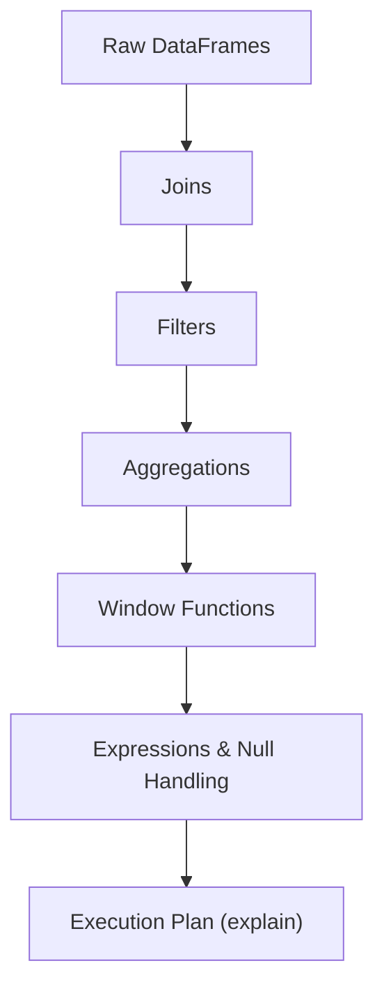
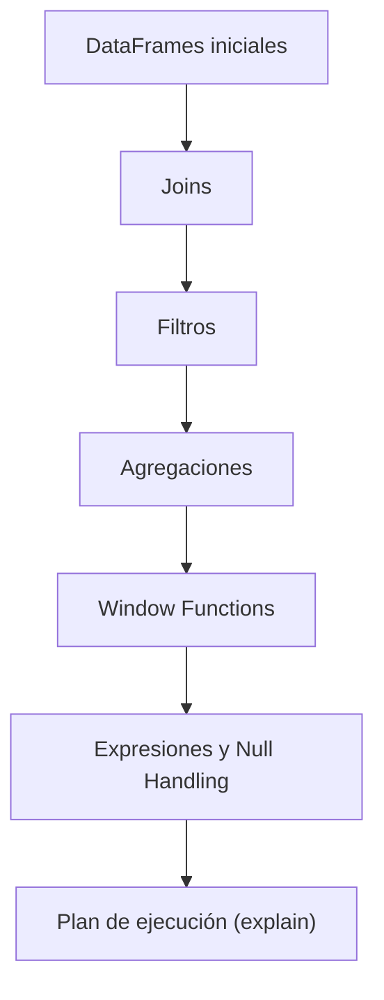

---

# 🧩 Exercise 7 — Spark DataFrame API (Extended Version)  
## Bilingual (English + Spanish)

This exercise demonstrates the core capabilities of the Spark DataFrame API:  
joins, filters, aggregations, window functions, expressions, null handling, and execution plans.

---

# 🇺🇸 ENGLISH VERSION

# 1. Overview

This extended version of Exercise 7 showcases Spark’s distributed processing capabilities:

- Distributed joins  
- Broadcast optimization  
- Filters and expressions  
- Aggregations  
- Window functions  
- Null handling  
- Execution plan analysis with `explain()`  

These are essential skills for any Data Engineer working with Spark.

---

# 2. Create Example DataFrames

```python
from pyspark.sql import functions as F
from pyspark.sql.window import Window

df_users = spark.createDataFrame([
    (1, "Axel", "MX"),
    (2, "Luis", "MX"),
    (3, "Ana", "CO"),
    (4, "Maria", None),
], ["user_id", "name", "country"])

df_sales = spark.createDataFrame([
    (1, "2024-01-01", 100),
    (1, "2024-01-05", 250),
    (2, "2024-01-03", 300),
    (5, "2024-01-02", 500),
], ["user_id", "date", "amount"])

df_countries = spark.createDataFrame([
    ("MX", "Mexico"),
    ("CO", "Colombia"),
], ["country", "country_name"])
```

---

# 3. Joins

## 3.1 Left Join (users with sales)

```python
df_left = df_users.join(df_sales, "user_id", "left")
df_left.show()
```

## 3.2 Full Outer Join

```python
df_full = df_users.join(df_sales, "user_id", "full")
df_full.show()
```

## 3.3 Broadcast Join (optimization)

```python
df_opt = df_left.join(F.broadcast(df_countries), "country", "left")
df_opt.show()
```

---

# 4. Filters

```python
df_filtered = df_opt.filter(
    (F.col("amount") > 100) |
    (F.col("country").isNull())
)
df_filtered.show()
```

---

# 5. Aggregations

```python
df_agg = df_opt.groupBy("user_id").agg(
    F.count("*").alias("transactions"),
    F.sum("amount").alias("total_sales"),
    F.avg("amount").alias("avg_sale")
)
df_agg.show()
```

---

# 6. Window Functions

```python
window_user = Window.partitionBy("user_id").orderBy(F.col("amount").desc())

df_window = df_opt.withColumn(
    "sale_rank", F.rank().over(window_user)
)
df_window.show()
```

---

# 7. Column Expressions

```python
df_classified = df_opt.withColumn(
    "category",
    F.when(F.col("amount") >= 300, "HIGH")
     .when(F.col("amount") >= 150, "MEDIUM")
     .otherwise("LOW")
)
df_classified.show()
```

---

# 8. Null Handling

```python
df_nulls = df_opt.fillna({"country": "UNKNOWN"})
df_nulls.show()
```

---

# 9. Execution Plan

```python
df_opt.explain(True)
```

This displays:

- Logical plan  
- Optimized logical plan  
- Physical plan  
- Join strategies  
- Shuffle stages  
- Broadcast hints  

---

# 10. Visual Diagram — DataFrame API Flow



---

# 🇲🇽 VERSIÓN EN ESPAÑOL

# 1. Panorama general

Esta versión extendida del Ejercicio 7 demuestra las capacidades del API de DataFrames de Spark:

- Joins distribuidos  
- Optimización con broadcast  
- Filtros y expresiones  
- Agregaciones  
- Window functions  
- Manejo de nulls  
- Análisis del plan de ejecución con `explain()`  

---

# 2. Crear DataFrames de ejemplo

```python
from pyspark.sql import functions as F
from pyspark.sql.window import Window

df_users = spark.createDataFrame([
    (1, "Axel", "MX"),
    (2, "Luis", "MX"),
    (3, "Ana", "CO"),
    (4, "Maria", None),
], ["user_id", "nombre", "pais"])

df_sales = spark.createDataFrame([
    (1, "2024-01-01", 100),
    (1, "2024-01-05", 250),
    (2, "2024-01-03", 300),
    (5, "2024-01-02", 500),
], ["user_id", "fecha", "monto"])

df_countries = spark.createDataFrame([
    ("MX", "México"),
    ("CO", "Colombia"),
], ["pais", "pais_nombre"])
```

---

# 3. Joins

## 3.1 Left Join (usuarios con ventas)

```python
df_left = df_users.join(df_sales, "user_id", "left")
df_left.show()
```

## 3.2 Full Outer Join

```python
df_full = df_users.join(df_sales, "user_id", "full")
df_full.show()
```

## 3.3 Broadcast Join (optimización)

```python
df_opt = df_left.join(F.broadcast(df_countries), "pais", "left")
df_opt.show()
```

---

# 4. Filtros

```python
df_filtrado = df_opt.filter(
    (F.col("monto") > 100) |
    (F.col("pais").isNull())
)
df_filtrado.show()
```

---

# 5. Agregaciones

```python
df_agg = df_opt.groupBy("user_id").agg(
    F.count("*").alias("num_transacciones"),
    F.sum("monto").alias("total_ventas"),
    F.avg("monto").alias("promedio_venta")
)
df_agg.show()
```

---

# 6. Window Functions

```python
window_user = Window.partitionBy("user_id").orderBy(F.col("monto").desc())

df_window = df_opt.withColumn(
    "rank_venta", F.rank().over(window_user)
)
df_window.show()
```

---

# 7. Expresiones de columna

```python
df_clasificado = df_opt.withColumn(
    "categoria",
    F.when(F.col("monto") >= 300, "ALTA")
     .when(F.col("monto") >= 150, "MEDIA")
     .otherwise("BAJA")
)
df_clasificado.show()
```

---

# 8. Manejo de nulls

```python
df_nulls = df_opt.fillna({"pais": "DESCONOCIDO"})
df_nulls.show()
```

---

# 9. Plan de ejecución

```python
df_opt.explain(True)
```

Esto muestra:

- Plan lógico  
- Plan lógico optimizado  
- Plan físico  
- Estrategias de join  
- Etapas de shuffle  
- Broadcast  

---

# 10. Diagrama visual — Flujo del API de DataFrames



---

# 🏁 Conclusion

This extended exercise demonstrates the full power of the Spark DataFrame API:

- Distributed joins  
- Broadcast optimization  
- Filtering and expressions  
- Aggregations  
- Window functions  
- Execution plan analysis  

A core skillset for Databricks Data Engineers.


---
